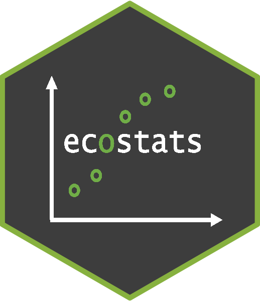

# ecostats 
### Code and Data Accompanying the Eco-Stats Text
[](https://github.com/dwarton/ecostats/actions?query=workflow%3Aci)
[](http://www.gnu.org/licenses/gpl-2.0.html) <br />
[](https://CRAN.R-project.org/package=ecostats) 
[](https://www.r-pkg.org/pkg/ecostats)
  [](https://github.com/fontikar/ecostats/actions/workflows/R-CMD-check.yaml)


#### Author

David Warton

#### License

LGPL (>= 2.1)

##### Installation

You can get the latest version of `ecostats` from CRAN:
``` r
install.packages("ecostats")
library(ecostats)
```

But if you want access to this development version, with the latest bells and whistles (where applicable), it can be installed from GitHub using the `devtools` package:

``` r
devtools::install_github('dwarton/ecostats', ref='main')
library(ecostats)
```
