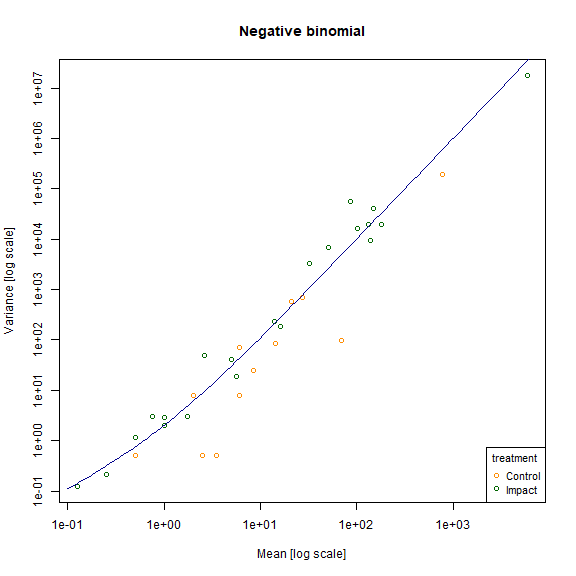
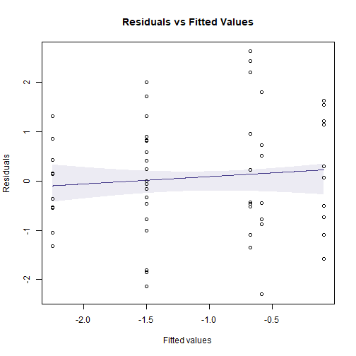
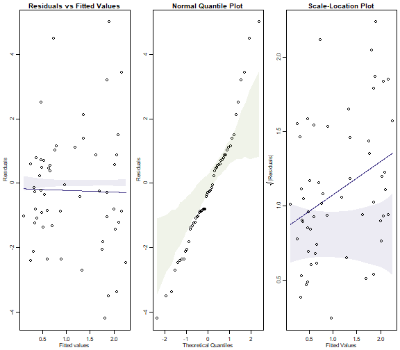
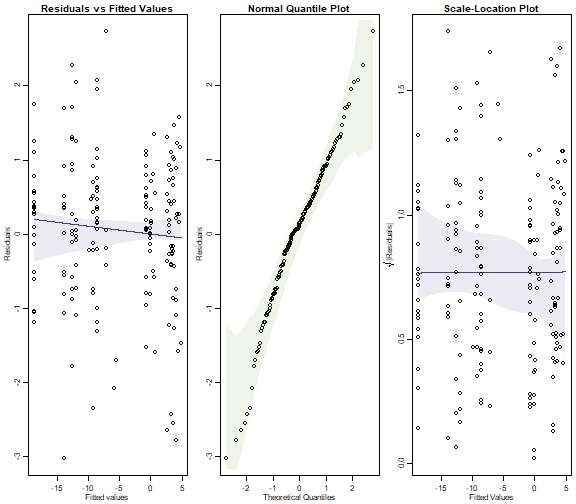
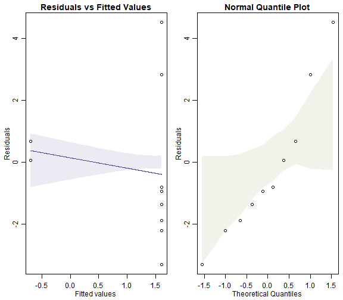
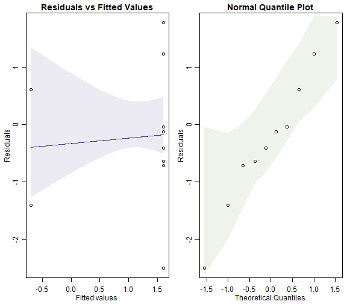
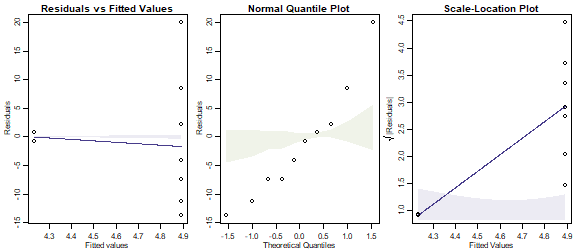
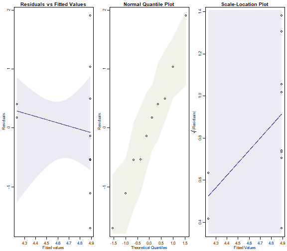

## Exercise 10.1: Crabs on seaweed
*David and Alistair... observed the following presence (`+`) / absence (`-`)} patterns for crabs (across 10 replicates):*

Time       Distance (m)         Crabs
---------  -------------        ----------
5          0                    -
5          0                    +
5          0                    +
5          0                    -
5          0                    -
5          2                    -
5          2                    -
5          2                    +
5          2                    -
5          2                    -
...        ...                  ...
10         10                   +

*They would like to know if there is any evidence of a difference in crab presence patterns with Distance of Isolation. How should they analyse the data?*

They are looking for evidence of a difference at different values of `Dist` so will be wanting to do a hypothesis test. Because they have presence-absence data they should be thinking of a generalised linear model with binomial response, as in Code Box 10.1.


## Exercise 10.2: Do offshore wind farms affect fish communities?
*Lena and colleagues... [were] collecting paired data before and after wind farm construction, at 36 stations in each of three zones (`Wind Farm`, `North`, or `South`):*

Zone         Impact    Station    Abundance
----------   -------   --------   ----------
Wind Farm    Before    WF1        0
Wind Farm    After     WF1        0
South        Before    S1         5
South        After     S1         0
North        Before    N1         0
North        After     N1         0
Wind Farm    Before    WF2        1
Wind Farm    After     WF2        1
...          ...       ...        ...
North        After     N36        0
---------    -------   --------   ----------

*Lena wants to know if there is any evidence of a change in eel abundance at wind farm stations, as compared to others, following construction of the wind farm. How should she analyse the data?*

She is looking for evidence of a difference across different values of `Zone` when `Impact=After` so will be wanting to do a hypothesis test. This is a BACI design, so she would be particularly interested in the `Zone:Impact` interaction. Because she has count data with plenty of zeros, this should be analysed using a generalised linear model (assuming a negative binomial or Poisson response, as in Code Box 10.1).


## Exercise 10.3: Invertebrate response to bush regeneration}
*Anthony wants to evaluate how well invertebrate communities are re-establishing following bush regeneration efforts.*

 Treatment |    Count
 --------- |  -------
 C         |        0
 R         |        3
 R         |        1
 R         |        3
 C         |        1
 R         |        2
 R         |       12
 R         |        1
 R         |       18
 R         |        0

*He wants to know if there is any evidence that bush regeneration is working. How should he analyse the data?*

He is looking for evidence of an effect of revegetation so will be wanting to do a hypothesis test for a `Treatment` effect. Because he has count data, with zeros, this should be analysed using a generalised linear model (assuming a negative binomial or Poisson response, as in Code Box 10.1).


## Code Box 10.1: Example GLM fits for Exercises 10.1-3.}
For Exercise 10.1:

```r
library(ecostats)
data(seaweed)
seaweed$CrabPres = seaweed$Crab>0
ft_crab = glm(CrabPres~Time*Dist, family=binomial("cloglog"),
             data=seaweed)
```

For Exercise 10.2:
\begin{verbatim}

```r
data(windFarms)
eels = windFarms$abund[,16]
ft_eels = glm(eels~Station+Year*Zone,family="poisson",
             data=windFarms$X)
#> Warning: glm.fit: fitted rates numerically 0 occurred
```

For Exercise 10.3:

```r
data(reveg)
Haplotaxida=reveg$abund[,12]
library(mvabund)
worms = reveg$abund$Haplotaxida
ft_worms = manyglm(worms~treatment,family="negative.binomial", data=reveg)
```

## Code for Fig. 10.5

```r
data(reveg)
library(mvabund)
revegMV=mvabund(reveg$abund)
treatment=reveg$treatment
meanvar.plot(revegMV~treatment,legend=T,col=c("darkorange","darkgreen"),main="Poisson")
#> START SECTION 2 
#> Plotting if overlay is TRUE
#> using grouping variable Poisson 7 mean values were 0 and could 
#> 										not be included in the log-plot
#> using grouping variable Poisson 10 variance values were 0 and could not 
#> 										be included in the log-plot
#> FINISHED SECTION 2
x=10^(seq(-1,3.8,length=100))
lines(x,x,type="l",col="red")
```


```r

meanvar.plot(revegMV~treatment,legend=T,col=c("darkorange","darkgreen"), main="Negative binomial")
#> START SECTION 2 
#> Plotting if overlay is TRUE
#> using grouping variable Negative binomial 7 mean values were 0 and could 
#> 										not be included in the log-plot
#> using grouping variable Negative binomial 10 variance values were 0 and could not 
#> 										be included in the log-plot
#> FINISHED SECTION 2
x=10^(seq(-1,3.8,length=100))
points(x,x+x^2,type="l",col="darkblue")
```



## Code Box 10.2: A summary of a GLM fit to the crab presence-absence data of Exercise 10.1


```r
seaweed$Dist = as.factor(seaweed$Dist)
ft_crab = glm(CrabPres~Time*Dist, family=binomial("cloglog"),
             data=seaweed)
summary(ft_crab)
#> 
#> Call:
#> glm(formula = CrabPres ~ Time * Dist, family = binomial("cloglog"), 
#>     data = seaweed)
#> 
#> Deviance Residuals: 
#>     Min       1Q   Median       3Q      Max  
#> -1.3537  -0.6681  -0.6681   1.0108   2.1460  
#> 
#> Coefficients:
#>             Estimate Std. Error z value Pr(>|z|)
#> (Intercept)  -2.3282     1.5046  -1.547    0.122
#> Time          0.1656     0.1741   0.952    0.341
#> Dist2        -1.5921     2.5709  -0.619    0.536
#> Dist10       -0.5843     2.1097  -0.277    0.782
#> Time:Dist2    0.1683     0.2899   0.581    0.561
#> Time:Dist10   0.1169     0.2399   0.487    0.626
#> 
#> (Dispersion parameter for binomial family taken to be 1)
#> 
#>     Null deviance: 71.097  on 56  degrees of freedom
#> Residual deviance: 62.999  on 51  degrees of freedom
#> AIC: 74.999
#> 
#> Number of Fisher Scoring iterations: 5
```


## Code Box 10.3: Dunn-Smyth residual plots for the crab data, using the `mvabund` package

```r
library(mvabund)
ftMany_crab = manyglm(CrabPres~Time*Dist,family=binomial("cloglog"),
             data=seaweed)
plotenvelope(ftMany_crab, which=1)
```


## Code for Figure 10.8

```r
plotenvelope(ftMany_crab, which=1, n.sim=39)
```


```r
plotenvelope(ftMany_crab, which=1, n.sim=39)
```



(Note that `plotenvelope` was run with just `39` iterations, to speed up computation time.)

## Exercise 10.4: Counts of Ostracods in habitat configuration experiment.

*What sort of model would you use for Ostracod counts?*


```r
with(seaweed,boxplot(Ost~Dist))
```


As this is a count variable with plenty of small counts (and zeros in each category), I am thinking a GLM. To start with we could consider a Poisson regression, if there were no overdispersion, or negative binomial regression.

The terms to add to the model I guess are `Time` and `Dist`, as orthogonal factors. As previously `Wmass` might also be useful.

*How would you check assumptions?*

Look for a fan-shape on a residual plot to check the mean-variance assumption, as in Code Box 10.4.


## Code Box 10.4: Assumption checking for Ostracod counts of Exercise 10.4.}


```r
seaweed$logWmass = log(seaweed$Wmass)
ft_countOst=manyglm(Ost~logWmass+Time*Dist,data=seaweed,
             family="poisson")
par(mfrow=c(1,3),mar=c(3,3,1.5,0.5),mgp=c(1.75,0.75,0))
plotenvelope(ft_countOst, which=1:3, n.sim=99) # for a scale-location plot as well
```


(Note that `plotenvelope` was run with just `99` iterations, to speed up computation time.)


```r
library(MASS) #this line is currently needed to deal with a bug but prob redundant soon
par(mfrow=c(1,3),mar=c(3,3,1.5,0.5),mgp=c(1.75,0.75,0))
ft.countOstNB=manyglm(Ost~logWmass+Time*Dist,data=seaweed)
plotenvelope(ft.countOstNB, which=1:3, n.sim=99)
```


## Exercise 10.5: Checking the Poisson assumption on the wind farm data.

*Refit the model using the `manyglm` function, and hence construct a residual plot*


```r
data(windFarms)
eels = windFarms$abund[,16]
ft_eels = manyglm(eels~Station+Year*Zone,family="poisson",
             data=windFarms$X)
par(mfrow=c(1,3),mar=c(3,3,1.5,0.5),mgp=c(1.75,0.75,0))
plotenvelope(ft_eels, which=1:3, n.sim=99)
#> Error in glm.fit(x = structure(c(1, 1, 1, 1, 1, 1, 1, 1, 1, 1, 1, 1, 1,  : 
#>   NA/NaN/Inf in 'x'
```



*Does the Poisson assumption look reasonable?*

There is no evidence of a fan shape, residuals are close to a straight line on the normal quantile plot, so it looks pretty good to me.


## Exercise 10.6: Checking the Poisson assumption for the worm counts.}\label{ex:revegResids}

*Refit the model using the `manyglm` function under the Poisson assumption, and hence construct a residual plot.*


```r
data(reveg)
Haplotaxida=reveg$abund[,12]
worms = reveg$abund$Haplotaxida
ft_worms = manyglm(worms~treatment,family=poisson(), data=reveg)
par(mfrow=c(1,2),mar=c(3,3,1.5,0.5),mgp=c(1.75,0.75,0))
plotenvelope(ft_worms, which=1:2, n.sim=99)
```



*Also fit a negative binomial to the data and construct a residual plot.*

```r
ft_wormsNB = manyglm(worms~treatment,family="negative.binomial", data=reveg)
par(mfrow=c(1,2),mar=c(3,3,1.5,0.5),mgp=c(1.75,0.75,0))
plotenvelope(ft_wormsNB, which=1:2, n.sim=99)
#> Warning in predict.lm(gam.yxi, newdata = data.frame(xiSim = xPred)): prediction from a rank-deficient fit may be
#> misleading
```



*Can you see any differences between plots?*

The Poisson model fans out more and has a couple of residuals that are unusually large (see normal quantile plot). It also may have a trend line on the residual vs fits plots that slips outside its simulation envelope.

*Compare BIC for the two models, using the `BIC` function.*


```r
BIC(ft_worms, ft_wormsNB)
#>            df      BIC
#> ft_worms    2 80.55508
#> ft_wormsNB  3 53.93523
```

*Which model has the better fit to the worm counts?*

Well BIC suggests the negative binomial model is way better, corroborating the result from the normal quantile plots.

## Code Box 10.5: `R` code using the `anova` function to test the key hypotheses of interest to David and Alistair in Exercise 10.1.

```r
anova(ft_crab, test="Chisq")
#> Analysis of Deviance Table
#> 
#> Model: binomial, link: cloglog
#> 
#> Response: CrabPres
#> 
#> Terms added sequentially (first to last)
#> 
#> 
#>           Df Deviance Resid. Df Resid. Dev Pr(>Chi)   
#> NULL                         56     71.097            
#> Time       1   6.6701        55     64.427 0.009804 **
#> Dist       2   1.0265        53     63.400 0.598553   
#> Time:Dist  2   0.4012        51     62.999 0.818257   
#> ---
#> Signif. codes:  0 '***' 0.001 '**' 0.01 '*' 0.05 '.' 0.1 ' ' 1
```

*Any evidence of an effect of Isolation distance on crabs?*

Nope :(

*Note the `Time` effect is significant here but not in Code Box 10.2.  Why do you think that might be?*

Code Box 10.2 uses a Wald test, which is known to give wacky answers for separable models, see Maths Box 10.6 for details.

## Exercise 10.7: Testing if there a wind farm effect

*What model should be fitted, to handle the pairing structure?*

We can fit a `glm` as previously but need to include `Station` as one of the predictors, to handle station-to-station variation in eel abundance:


```r
ft_eelsSt = glm(eels~Station+Year+Year:Zone,family="poisson",
             data=windFarms$X)
#> Warning: glm.fit: fitted rates numerically 0 occurred
```
It would be OK to write `Year*Zone` but the `Zone` main effect is redundant because of the `Station` main effect. You could also use a mixed model with a random intercept for `Station`.

*Fit the appropriate model and test for an effect of wind farm.*


```r
anova(ft_eelsSt,test='Chisq')
#> Analysis of Deviance Table
#> 
#> Model: poisson, link: log
#> 
#> Response: eels
#> 
#> Terms added sequentially (first to last)
#> 
#> 
#>            Df Deviance Resid. Df Resid. Dev  Pr(>Chi)    
#> NULL                         178    246.714              
#> Station   107  169.443        71     77.270 0.0001145 ***
#> Year        1    1.906        70     75.365 0.1674431    
#> Year:Zone   2    4.821        68     70.544 0.0897813 .  
#> ---
#> Signif. codes:  0 '***' 0.001 '**' 0.01 '*' 0.05 '.' 0.1 ' ' 1
```

There is marginal evidence of a Year-Zone interaction.

## Code Box 10.6: Model-based inference for Anthony's worm counts from Exercise 10.3.

```r
ftmany_Hap=manyglm(Haplotaxida~treatment,family="negative.binomial",
              data=reveg)
anova(ftmany_Hap)
#> Time elapsed: 0 hr 0 min 0 sec
#> Analysis of Deviance Table
#> 
#> Model: Haplotaxida ~ treatment
#> 
#> Multivariate test:
#>             Res.Df Df.diff   Dev Pr(>Dev)
#> (Intercept)      9                       
#> treatment        8       1 2.811    0.156
#> Arguments: P-value calculated using 999 iterations via PIT-trap resampling.
```

## Code Box 10.7: Design-based inference for David's and Alistair's crab data using `mvabund`.


```r
ftMany_crab = manyglm(CrabPres~Time*Dist, family=binomial("cloglog"),
                 data=seaweed)
anova(ftMany_crab)
#> Time elapsed: 0 hr 0 min 2 sec
#> Analysis of Deviance Table
#> 
#> Model: CrabPres ~ Time * Dist
#> 
#> Multivariate test:
#>             Res.Df Df.diff   Dev Pr(>Dev)  
#> (Intercept)     56                         
#> Time            55       1 6.670    0.016 *
#> Dist            53       2 1.026    0.614  
#> Time:Dist       51       2 0.401    0.857  
#> ---
#> Signif. codes:  0 '***' 0.001 '**' 0.01 '*' 0.05 '.' 0.1 ' ' 1
#> Arguments: P-value calculated using 999 iterations via PIT-trap resampling.
```

*Any important differences from results David and Alistair previously obtained in Code Box 10.5?*

Nope, looks very similar actually! I guess the `Time` effect is slightly less significant now but the conclusion doesn't really change, there is still reasonable evidence of a `Time` effect.


## Code Box 10.8: Getting the wrong answer by ignoring overdispersion in Anthony's worm counts from Exercise 10.3.


```r
ft_wormPois = glm(Haplotaxida~treatment, family="poisson", data=reveg)
anova(ft_wormPois,test="Chisq")
#> Analysis of Deviance Table
#> 
#> Model: poisson, link: log
#> 
#> Response: Haplotaxida
#> 
#> Terms added sequentially (first to last)
#> 
#> 
#>           Df Deviance Resid. Df Resid. Dev  Pr(>Chi)    
#> NULL                          9     63.946              
#> treatment  1   11.668         8     52.278 0.0006359 ***
#> ---
#> Signif. codes:  0 '***' 0.001 '**' 0.01 '*' 0.05 '.' 0.1 ' ' 1
```


```r
ft_wormmanyPois = manyglm(Haplotaxida~treatment,family="poisson",
                     data=reveg)
anova(ft_wormmanyPois)
#> Time elapsed: 0 hr 0 min 0 sec
#> Analysis of Deviance Table
#> 
#> Model: Haplotaxida ~ treatment
#> 
#> Multivariate test:
#>             Res.Df Df.diff   Dev Pr(>Dev)
#> (Intercept)      9                       
#> treatment        8       1 11.67    0.224
#> Arguments: P-value calculated using 999 iterations via PIT-trap resampling.
```

## Code Box 10.9: Using an observation-level random effect for a binomial response

```r
data(seedsTemp)
seedsTemp$propGerm = seedsTemp$NumGerm / seedsTemp$NumSown
plot(propGerm/(1-propGerm)~Test.Temp,data=seedsTemp,log="y")
#> Warning in xy.coords(x, y, xlabel, ylabel, log): 5 y values <= 0 omitted from logarithmic plot
```


```r
library(lme4)
seedsTemp$ID = 1:length(seedsTemp$NumGerm)
ft_temp = glmer(cbind(NumGerm,NumSown-NumGerm)~poly(Test.Temp,2)+
               (1|ID),data=seedsTemp,family="binomial")
summary(ft_temp)
#> Generalized linear mixed model fit by maximum likelihood (Laplace Approximation) ['glmerMod']
#>  Family: binomial  ( logit )
#> Formula: cbind(NumGerm, NumSown - NumGerm) ~ poly(Test.Temp, 2) + (1 |      ID)
#>    Data: seedsTemp
#> 
#>      AIC      BIC   logLik deviance df.resid 
#>    212.7    218.1   -102.3    204.7       25 
#> 
#> Scaled residuals: 
#>      Min       1Q   Median       3Q      Max 
#> -1.10831 -0.00896  0.06063  0.13519  0.33025 
#> 
#> Random effects:
#>  Groups Name        Variance Std.Dev.
#>  ID     (Intercept) 2.961    1.721   
#> Number of obs: 29, groups:  ID, 29
#> 
#> Fixed effects:
#>                     Estimate Std. Error z value Pr(>|z|)  
#> (Intercept)          -0.5896     0.3428  -1.720   0.0854 .
#> poly(Test.Temp, 2)1   2.8770     1.9395   1.483   0.1380  
#> poly(Test.Temp, 2)2  -3.6910     1.9227  -1.920   0.0549 .
#> ---
#> Signif. codes:  0 '***' 0.001 '**' 0.01 '*' 0.05 '.' 0.1 ' ' 1
#> 
#> Correlation of Fixed Effects:
#>             (Intr) p(T.T,2)1
#> ply(T.T,2)1 -0.060          
#> ply(T.T,2)2  0.066 -0.147
```


## Exercise 10.8: Anthony's ant data.
*Which model do you think is more appropriate for this dataset -- a Poisson or negative binomial?*

This is a hard question to answer without fitting a model.

```r
ants = reveg$abund$Formicidae
ants_Poisson = glm(ants~treatment,data=reveg,family=poisson())
par(mfrow=c(1,3),mar=c(3,3,1.5,0.5),mgp=c(1.75,0.75,0))
plotenvelope(ants_Poisson, which=1:3, n.sim=99)
```



OK so a Poisson fit is **spectacularly** bad. Neither smoother stays in its envelope, and the data on the normal quantile plot do not stay anywhere near their envelope.

*Plot the data -- does there seem to be evidence of a treatment effect?*

```r
with(reveg,boxplot(abund$Formicidae~treatment))
```


Not really! The ant counts in the control sites are similar to the middle of those from the revegetated sites.


*Use the `glm` function to fit a Poisson log-linear model, and use this to test for a treatment effect. Did you get what you expected?*


```r
anova(ants_Poisson,test='Chisq')
#> Analysis of Deviance Table
#> 
#> Model: poisson, link: log
#> 
#> Response: ants
#> 
#> Terms added sequentially (first to last)
#> 
#> 
#>           Df Deviance Resid. Df Resid. Dev  Pr(>Chi)    
#> NULL                          9     985.74              
#> treatment  1   62.345         8     923.39 2.882e-15 ***
#> ---
#> Signif. codes:  0 '***' 0.001 '**' 0.01 '*' 0.05 '.' 0.1 ' ' 1
```

Whoah we are being told there is strongly significant evidence of a treatment effect, a claim that should be treated with suspicion (no such evidence on the boxplot above!)

*Now use negative binomial regression to test for a treatment effect.*


```r
ants = reveg$abund$Formicidae
ants_NB = manyglm(ants~treatment,data=reveg,family="negative.binomial")
anova(ants_NB)
#> Time elapsed: 0 hr 0 min 0 sec
#> Analysis of Deviance Table
#> 
#> Model: ants ~ treatment
#> 
#> Multivariate test:
#>             Res.Df Df.diff   Dev Pr(>Dev)
#> (Intercept)      9                       
#> treatment        8       1 0.765     0.56
#> Arguments: P-value calculated using 999 iterations via PIT-trap resampling.
```

*Notice you have got a very different answer.* 

Yeah, like completely the opposite!!!

*Which answer is more likely to be correct in this case?*


```r
par(mfrow=c(1,3),mar=c(3,3,1.5,0.5),mgp=c(1.75,0.75,0))
plotenvelope(ants_NB,which=1:3, n.sim=99)
```



Whereas the diagnostic plots for the Poisson model showed serious problems, we have no such issues here. So the negative binomial regression is a much better fit to the data.  It produced (much!) larger $P$-values because there is a lot of overdispersion in the data, which a Poisson model is unable to account for.

(Note that the simulation envelopes cover a broad range!  This is because of the small sample size. When comparing these plots to those for the Poisson fit, notice that the y-axis scale on the negative binomial plot is much smaller -- the envelopes actually have similar width in both sets of plots, they look different mostly because the axes have different scales.)


## Exercise 10.9: Worm counts with different numbers of pitfall traps

*How can we account for the different sampling effort at different sites in our model?*

Use an offset for `log(pitfalls)` as in Code Box 10.9.

## Code Box 10.10: Adding an offset to the model for worm counts.

```r
ftmany_hapoffset = manyglm(Haplotaxida~treatment+offset(log(pitfalls)),
                            family="negative.binomial", data=reveg)
anova(ftmany_hapoffset)
#> Time elapsed: 0 hr 0 min 0 sec
#> Analysis of Deviance Table
#> 
#> Model: Haplotaxida ~ treatment + offset(log(pitfalls))
#> 
#> Multivariate test:
#>             Res.Df Df.diff   Dev Pr(>Dev)
#> (Intercept)      9                       
#> treatment        8       1 2.889    0.157
#> Arguments: P-value calculated using 999 iterations via PIT-trap resampling.
```


## Exercise 10.10: Anthony's cockroaches

*How should he analyse the data?*

This looks like Exercise 10.9 and so could be analysed a similar way, assuming assumptions are all satisfied. The main difference here is that we have many zeros in the dataset (70%)...


```r
roaches = reveg$abund$Blattodea
ftMany_roaches = manyglm(roaches~treatment,offset=log(pitfalls), family="poisson", data=reveg)
par(mfrow=c(1,3),mar=c(3,3,1.5,0.5),mgp=c(1.75,0.75,0))
plotenvelope(ftMany_roaches, which=1:3, n.sim=99)
```


```r
anova(ftMany_roaches)
#> Time elapsed: 0 hr 0 min 0 sec
#> Analysis of Deviance Table
#> 
#> Model: roaches ~ treatment
#> 
#> Multivariate test:
#>             Res.Df Df.diff   Dev Pr(>Dev)   
#> (Intercept)      9                          
#> treatment        8       1 16.68    0.006 **
#> ---
#> Signif. codes:  0 '***' 0.001 '**' 0.01 '*' 0.05 '.' 0.1 ' ' 1
#> Arguments: P-value calculated using 999 iterations via PIT-trap resampling.
```

Although we have many zeros in the dataset, they are all in the treatment group, meaning that our observed predictor explains these well. A Poisson model seems to fit the reasonably data well, and we can conclude that there is very strong evidence of an effect of revegetation on cockroaches (they disappeared from revegetated plots).


