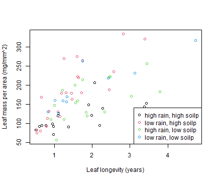
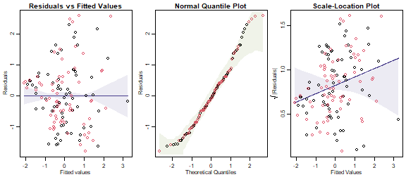
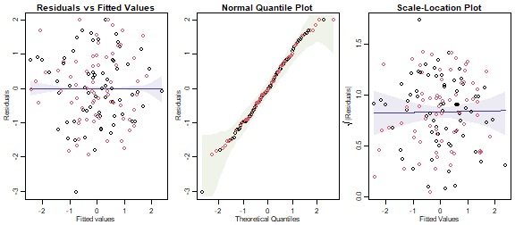
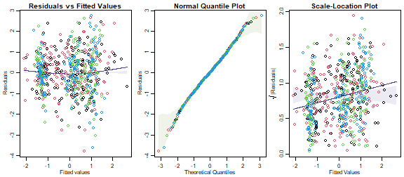
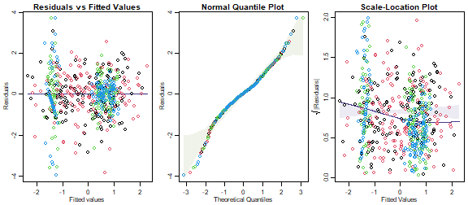

## Exercise 11.1: Leaf economics and environment
Ian likes studying leaves. He is especially interested in "leaf economics" -- things like construction costs per unit area (`lma`), how long-lived leaves are (`longev`) and how they vary with environment. In particular:

*Is there evidence that leaves vary (in their "economics" traits) across sites with different levels of rainfall and soil nutrients?*

*What are the response variables?  What sort of analysis is appropriate here?*

The response is leaf economics traits, collectively, which includes:

* `lma` (leaf construction costs per unit area)
* `longev` (how long leaves live for)

Both of these are quantitative variables.

A multivariate analysis would seem appropriate.


## Exercise 11.2: Flower size and shape

*What are the response variables?  What sort of analysis is appropriate here?*

The response variables are the flower size and shape variables. These are:

* length of petals
* width of petals
* length of sepals
* width of sepals

A multivariate analysis would be the way to go here.

## Exercise 11.3: Hunting spiders and their environment

*What are the response variables?  What type of analysis is appropriate here?*

The response variables are abundance of the three most abundant genera of hunting spider. Some sort of multivariate analyis would be appropriate, but given that we are dealing with abundances, something that accounts for the mean-variance relationship might be needed.

## Code Box 11.1: Sample variance-covariance matrices on `R`


```r
library(smatr)
data(leaflife)
Yleaf=cbind(leaflife$lma,leaflife$longev)
colnames(Yleaf)=c("lma","longev")
var(Yleaf)
#>              lma     longev
#> lma    4186.0264 36.7905011
#> longev   36.7905  0.8232901
```


```r
data("iris")
var(iris[,1:4])
#>              Sepal.Length Sepal.Width Petal.Length Petal.Width
#> Sepal.Length    0.6856935  -0.0424340    1.2743154   0.5162707
#> Sepal.Width    -0.0424340   0.1899794   -0.3296564  -0.1216394
#> Petal.Length    1.2743154  -0.3296564    3.1162779   1.2956094
#> Petal.Width     0.5162707  -0.1216394    1.2956094   0.5810063
```

## Code Box 11.2: Fitting a multivariate linear model to the leaf economics data.

```r
library(smatr)
data(leaflife)
Yleaf = cbind(leaflife$lma,leaflife$longev)
ft_leaf = lm(Yleaf~rain*soilp, data=leaflife)
anova(ft_leaf, test="Wilks")
#> Analysis of Variance Table
#> 
#>             Df   Wilks approx F num Df den Df    Pr(>F)    
#> (Intercept)  1 0.11107  248.096      2     62 < 2.2e-16 ***
#> rain         1 0.68723   14.108      2     62 8.917e-06 ***
#> soilp        1 0.93478    2.163      2     62    0.1236    
#> rain:soilp   1 0.95093    1.600      2     62    0.2102    
#> Residuals   63                                             
#> ---
#> Signif. codes:  0 '***' 0.001 '**' 0.01 '*' 0.05 '.' 0.1 ' ' 1
```


```r
plot(leaflife$lma~leaflife$longev, xlab="Leaf longevity (years)",
                     ylab="Leaf mass per area (mg/mm^2)",
                     col=interaction(leaflife$rain,leaflife$soilp))
legend("bottomright",legend=c("high rain, high soilp",
         "low rain, high soilp", "high rain, low soilp",
         "low rain, low soilp"), col=1:4, pch=1)
```



*What is the nature of the rainfall effect?*

The red dots look to be higher than the black dots, and the blue dots look to be higher than the green dots.  This suggests that at low rainfall, thicker leaves (larger mass per unit area) are needed to achieve the same longevity. Or equivalently, at low rainfall, leaves of a given LMA don't live as long.


## Code Box 11.3: Checking multivariate linear model assumptions for leaf economics data

```r
par(mfrow=c(1,3),mar=c(3,3,1.5,0.5),mgp=c(1.75,0.75,0))
library(ecostats)
plotenvelope(ft_leaf,which=1:3,n.sim=99)
```



(Note that `plotenvelope` was run with just `99` iterations, to speed up computation time.)

*What do you think about the model assumptions made here?*

They aren't looking great -- the residual vs fits plot has a bit of a fan shape, confirmed by the scale-location plot, which has an increasing trend that does not stay inside its simulation envelope.  This suggests that variability increases as the mean increases, so maybe we should be transforming data.


## Code Box 11.4: A multivariate linear model for the leaf economics data using `mvabund`

```r
library(mvabund)
ftmany_leaf = manylm(Yleaf~rain*soilp, data=leaflife)
anova(ftmany_leaf,cor.type="R",test="LR")
#> Analysis of Variance Table
#> 
#> Model: manylm(formula = Yleaf ~ rain * soilp, data = leaflife)
#> 
#> Overall test for all response variables
#> Test statistics:
#>             Res.Df Df.diff val(LR) Pr(>LR)   
#> (Intercept)     66                           
#> rain            65       1  23.941   0.002 **
#> soilp           64       1   4.475   0.117   
#> rain:soilp      63       1   3.371   0.231   
#> ---
#> Signif. codes:  0 '***' 0.001 '**' 0.01 '*' 0.05 '.' 0.1 ' ' 1
#> Arguments:
#>  Test statistics calculated assuming unconstrained correlation response 
#>  P-value calculated using 999 iterations via residual (without replacement) resampling.
```

## Exercise 11.4: Transforming Ian's leaf economics data

*Repeat the analyses and assumption checks of Code Boxes 11.2-11.3 on log-transformed data. Do assumptions look more reasonable here? Are results any different?*


```r
YleafLog = log(Yleaf)
ft_leafLog = lm(YleafLog~rain*soilp, data=leaflife)
anova(ft_leafLog, test="Wilks")
#> Analysis of Variance Table
#> 
#>             Df   Wilks approx F num Df den Df    Pr(>F)    
#> (Intercept)  1 0.00239  12947.3      2     62 < 2.2e-16 ***
#> rain         1 0.65969     16.0      2     62 2.509e-06 ***
#> soilp        1 0.91520      2.9      2     62   0.06413 .  
#> rain:soilp   1 0.96231      1.2      2     62   0.30389    
#> Residuals   63                                             
#> ---
#> Signif. codes:  0 '***' 0.001 '**' 0.01 '*' 0.05 '.' 0.1 ' ' 1
par(mfrow=c(1,3),mar=c(3,3,1.5,0.5),mgp=c(1.75,0.75,0))
plotenvelope(ft_leafLog,which=1:3,n.sim=99)
```



*Is this what you expected to happen?*

Assumptions are looking more reasonable now, there is no longer a fan-shape nor appreciable right-skew in the data. This is what I expected because (as mentioned in the question) size variables tend to make more sense when viewed on a proportional scale. MANOVA results were generally similar, although test statistics (`approx F`) for main effects were slightly larger, in keeping with the general result that you can see signals more clearly when reducing skew in data (procedures tend to be more *efficient* when their underlying assumptions are more reasonable).


## Exercise 11.5: Transforming Edgar's data?

*Fit a linear model to predict petal length from the remaining flower variables and check assumptions. Is there any evidence of lack-of-fit? (This would imply a problem with the multivariate normality assumptions.)*


```r
data(iris)
iris$Yflower = as.matrix(iris[,1:4])
ft_iris = lm(Yflower~Species,data=iris)
par(mfrow=c(1,3),mar=c(3,3,1.5,0.5),mgp=c(1.75,0.75,0))
plotenvelope(ft_iris,which=1:3,n.sim=99)
```



This doesn't look too bad, but there is a moderate fan-shape, evident in an increasing trend in the scale-location plot, which drifts outside its simulation envelope. The trend is not strong however, with the y-axis predictions ranging from 0.6 to 1 (varying over a factor of about 1.5).

*Does a log-transformation help at all?*

```r
iris$YfLog = as.matrix(log(iris[,1:4]))
ft_irisLog = lm(YfLog~Species,data=iris)
par(mfrow=c(1,3),mar=c(3,3,1.5,0.5),mgp=c(1.75,0.75,0))
plotenvelope(ft_irisLog,which=1:3,n.sim=99)
```



Oh well that's disappointing! The log-transformation hasn't made things much better, reversing the fan-shape and the trend in the scale-location plot (although again it is not a strong trend).  Residuals now appear quite non-normal with some long tails, especially at the lower end.  The issue is largely with petal variables (blue/green), we would get a slightly better plot if we only log-transformed sepal measurements.  The main issue we saw previously - an increasing trend on the scale-location plot - is however less of an issue now (note the trend line covers a smaller range of values, from about 0.7 to 0.9).

## Code Box 11.5: Preparing spider data for analysis on `lme4` or `glmmTMB`
Petrus’s data from Exercise 11.3 are available in the `mvabund` package, but with abundances for 12 different species. First we will calculate the abundance of the three most abundant genera:

```r
library(mvabund)
library(reshape2)
data(spider)
Alop=apply(spider$abund[,1:3],1,sum)
Pard=apply(spider$abund[,7:10],1,sum)
Troc = spider$abund[,11]
spidGeneraWide = data.frame(rows=1:28,scale(spider$x[,c(1,4)]), Alop,Pard,Troc)
head(spidGeneraWide)
#>   rows   soil.dry       moss Alop Pard Troc
#> 1    1 -0.1720862  0.6289186   35  117   57
#> 2    2  0.7146218 -0.6870394    2   54   65
#> 3    3  0.1062154  0.1916410   37   93   66
#> 4    4  0.2507444  0.1916410    8  131   86
#> 5    5  0.6728333 -1.4299919   21  214   91
#> 6    6  1.1247181  0.1916410    6   62   63
```


```r
spiderGeneraLong = melt(spidGeneraWide,id=c("rows","soil.dry","moss"))
names(spiderGeneraLong)[4:5] = c("genus","abundance")
head(spiderGeneraLong)
#>   rows   soil.dry       moss genus abundance
#> 1    1 -0.1720862  0.6289186  Alop        35
#> 2    2  0.7146218 -0.6870394  Alop         2
#> 3    3  0.1062154  0.1916410  Alop        37
#> 4    4  0.2507444  0.1916410  Alop         8
#> 5    5  0.6728333 -1.4299919  Alop        21
#> 6    6  1.1247181  0.1916410  Alop         6
```

## Code Box 11.6: Fitting a hierarchical GLM to spider data on `glmmTMB`

```r
library(glmmTMB)
spid_glmm = glmmTMB(abundance~genus+soil.dry:genus+moss:genus
 +(0+genus|rows), family="poisson",data=spiderGeneraLong)
summary(spid_glmm)
#>  Family: poisson  ( log )
#> Formula:          abundance ~ genus + soil.dry:genus + moss:genus + (0 + genus |      rows)
#> Data: spiderGeneraLong
#> 
#>      AIC      BIC   logLik deviance df.resid 
#>    681.1    717.5   -325.5    651.1       69 
#> 
#> Random effects:
#> 
#> Conditional model:
#>  Groups Name      Variance Std.Dev. Corr      
#>  rows   genusAlop 1.3576   1.1652             
#>         genusPard 1.5900   1.2610   0.75      
#>         genusTroc 0.7682   0.8765   0.59 0.82 
#> Number of obs: 84, groups:  rows, 28
#> 
#> Conditional model:
#>                    Estimate Std. Error z value Pr(>|z|)    
#> (Intercept)          1.9843     0.2463   8.058 7.76e-16 ***
#> genusPard            1.0846     0.2100   5.165 2.41e-07 ***
#> genusTroc            0.6072     0.2335   2.600  0.00932 ** 
#> genusAlop:soil.dry  -0.6012     0.3284  -1.831  0.06716 .  
#> genusPard:soil.dry   1.4041     0.3704   3.791  0.00015 ***
#> genusTroc:soil.dry   1.4108     0.2950   4.782 1.74e-06 ***
#> genusAlop:moss       0.3435     0.3322   1.034  0.30103    
#> genusPard:moss       0.7361     0.3547   2.075  0.03796 *  
#> genusTroc:moss      -0.2033     0.2648  -0.768  0.44264    
#> ---
#> Signif. codes:  0 '***' 0.001 '**' 0.01 '*' 0.05 '.' 0.1 ' ' 1
```

_Can you see any differences in response of different spider genera to environmental conditions?_

`Pard` and `Trop` seem to increase in response to `soil.dry`, significantly so, whereas `Alop` decreases. There is a suggestion of a difference in `moss` response as well, with a difference of 0.93 in slope between `Pard` and `Troc`, which is reasonably large compared to standard errors.


## Code Box 11.7: MCMCglmm fit to Petrus’s spider genus data

```r
library(MCMCglmm)
set.seed(1)
ft_MCMC = MCMCglmm(cbind(Alop,Pard,Troc)~trait+soil.dry:trait+moss:trait,
   rcov=~us(trait):units,data=spidGeneraWide, family=rep("poisson",3))
#> 
#>                        MCMC iteration = 0
#> 
#>  Acceptance ratio for liability set 1 = 0.000214
#> 
#>                        MCMC iteration = 1000
#> 
#>  Acceptance ratio for liability set 1 = 0.186036
#> 
#>                        MCMC iteration = 2000
#> 
#>  Acceptance ratio for liability set 1 = 0.207750
#> 
#>                        MCMC iteration = 3000
#> 
#>  Acceptance ratio for liability set 1 = 0.214000
#> 
#>                        MCMC iteration = 4000
#> 
#>  Acceptance ratio for liability set 1 = 0.214607
#> 
#>                        MCMC iteration = 5000
#> 
#>  Acceptance ratio for liability set 1 = 0.219536
#> 
#>                        MCMC iteration = 6000
#> 
#>  Acceptance ratio for liability set 1 = 0.220250
#> 
#>                        MCMC iteration = 7000
#> 
#>  Acceptance ratio for liability set 1 = 0.222143
#> 
#>                        MCMC iteration = 8000
#> 
#>  Acceptance ratio for liability set 1 = 0.221500
#> 
#>                        MCMC iteration = 9000
#> 
#>  Acceptance ratio for liability set 1 = 0.221071
#> 
#>                        MCMC iteration = 10000
#> 
#>  Acceptance ratio for liability set 1 = 0.222321
#> 
#>                        MCMC iteration = 11000
#> 
#>  Acceptance ratio for liability set 1 = 0.219536
#> 
#>                        MCMC iteration = 12000
#> 
#>  Acceptance ratio for liability set 1 = 0.217964
#> 
#>                        MCMC iteration = 13000
#> 
#>  Acceptance ratio for liability set 1 = 0.218321
summary(ft_MCMC)
#> 
#>  Iterations = 3001:12991
#>  Thinning interval  = 10
#>  Sample size  = 1000 
#> 
#>  DIC: 515.7024 
#> 
#>  R-structure:  ~us(trait):units
#> 
#>                           post.mean l-95% CI u-95% CI eff.samp
#> traitAlop:traitAlop.units    1.9674   0.6896    3.396    171.9
#> traitPard:traitAlop.units    1.5216   0.5111    2.619    750.4
#> traitTroc:traitAlop.units    0.8476   0.1973    1.620    735.5
#> traitAlop:traitPard.units    1.5216   0.5111    2.619    750.4
#> traitPard:traitPard.units    2.1081   1.0427    3.557    624.8
#> traitTroc:traitPard.units    1.2399   0.5337    2.169    738.7
#> traitAlop:traitTroc.units    0.8476   0.1973    1.620    735.5
#> traitPard:traitTroc.units    1.2399   0.5337    2.169    738.7
#> traitTroc:traitTroc.units    1.0877   0.4375    1.837    545.8
#> 
#>  Location effects: cbind(Alop, Pard, Troc) ~ trait + soil.dry:trait + moss:trait 
#> 
#>                    post.mean l-95% CI u-95% CI eff.samp  pMCMC    
#> (Intercept)          1.96106  1.40677  2.56137    564.0 <0.001 ***
#> traitPard            1.10316  0.62128  1.55902    307.0 <0.001 ***
#> traitTroc            0.60433  0.07406  1.12209    314.2  0.028 *  
#> traitAlop:soil.dry  -0.60527 -1.38983  0.14573    797.5  0.102    
#> traitPard:soil.dry   1.44406  0.61769  2.22122    741.5 <0.001 ***
#> traitTroc:soil.dry   1.46411  0.76420  2.04801    353.2 <0.001 ***
#> traitAlop:moss       0.35515 -0.34662  1.14501    683.7  0.332    
#> traitPard:moss       0.76450 -0.01952  1.60829    902.7  0.064 .  
#> traitTroc:moss      -0.19314 -0.76568  0.37943    646.0  0.498    
#> ---
#> Signif. codes:  0 '***' 0.001 '**' 0.01 '*' 0.05 '.' 0.1 ' ' 1
```

_How do results compare to the model fitted using `glmmTMB`?_

Estimates of parameters in the mean model (intercepts, slopes) are quite similar and seem to have similar levels of significance also. Variance-covariance parameters for the random effects are presented in a different format however -- `MCMCglmm` directly reports values of $\boldsymbol{\Sigma}$, whereas `glmmTMB` reports variances and correlations. We can convert `MCMCglmm` values to correlations, which is best done by taking the MCMC samples, transforming each individual one, then finding the posterior mean:

```r
mean(ft_MCMC$VCV[,2]/sqrt(ft_MCMC$VCV[,1]*ft_MCMC$VCV[,5]))
#> [1] 0.7483585
```
which returns a value very similar to the correlation in the `glmmTMB` output. Note however that the variances are quite different, _e.g._ for `Alop` we have a posterior mean of 1.97 for `MCMCglmm` but an estimate of 1.38 for `glmmTMB`. The reason for this is that `glmmTMB` uses maximum likelihood, and its point estimate corresponds more closely to a posterior mode than a posterior mean. Estimating these posterior densities using histograms:


```r
par(mfrow=c(1,3),mgp=c(1.75,0.75,0),mar=c(3,3,1,1))
hist(ft_MCMC$VCV[,1],breaks=15,xlab="Alop variance",main="")
abline(v=summary(spid_glmm)$varcor$cond$rows[1,1],col="red")
hist(ft_MCMC$VCV[,5],breaks=15,xlab="Pard variance",main="")
abline(v=summary(spid_glmm)$varcor$cond$rows[2,2],col="red")
hist(ft_MCMC$VCV[,9],breaks=15,xlab="Troc variance",main="")
abline(v=summary(spid_glmm)$varcor$cond$rows[3,3],col="red")
```


The posterior modes show much closer agreement to the `glmmTMB` variance estimates, although still tending to be slightly larger.

## Exercise 11.6: Different effects on different spider genera?
_Use `spiderGeneraLong` to fit a model that assumes all spiders respond in the same way to their environment._

```r
spid_sameResponse = glmmTMB(abundance~genus+soil.dry+moss
 +(0+genus|rows), family="poisson",data=spiderGeneraLong)
summary(spid_sameResponse)
#>  Family: poisson  ( log )
#> Formula:          abundance ~ genus + soil.dry + moss + (0 + genus | rows)
#> Data: spiderGeneraLong
#> 
#>      AIC      BIC   logLik deviance df.resid 
#>    736.6    763.3   -357.3    714.6       73 
#> 
#> Random effects:
#> 
#> Conditional model:
#>  Groups Name      Variance Std.Dev. Corr      
#>  rows   genusAlop 6.6327   2.5754             
#>         genusPard 2.3031   1.5176   0.63      
#>         genusTroc 0.7952   0.8917   0.10 0.67 
#> Number of obs: 84, groups:  rows, 28
#> 
#> Conditional model:
#>             Estimate Std. Error z value Pr(>|z|)    
#> (Intercept)   1.8623     0.5123   3.635 0.000278 ***
#> genusPard     1.2207     0.4187   2.915 0.003553 ** 
#> genusTroc     0.7931     0.5335   1.487 0.137088    
#> soil.dry      0.9635     0.5288   1.822 0.068451 .  
#> moss         -0.3894     0.2991  -1.302 0.192993    
#> ---
#> Signif. codes:  0 '***' 0.001 '**' 0.01 '*' 0.05 '.' 0.1 ' ' 1
```

_Now use `anova` to compare this model to `spid_glmm`._

```r
anova(spid_sameResponse,spid_glmm)
#> Data: spiderGeneraLong
#> Models:
#> spid_sameResponse: abundance ~ genus + soil.dry + moss + (0 + genus | rows), zi=~0, disp=~1
#> spid_glmm: abundance ~ genus + soil.dry:genus + moss:genus + (0 + genus | , zi=~0, disp=~1
#> spid_glmm:     rows), zi=~0, disp=~1
#>                   Df    AIC    BIC  logLik deviance  Chisq Chi Df Pr(>Chisq)    
#> spid_sameResponse 11 736.58 763.32 -357.29   714.58                             
#> spid_glmm         15 681.08 717.54 -325.54   651.08 63.505      4  5.313e-13 ***
#> ---
#> Signif. codes:  0 '***' 0.001 '**' 0.01 '*' 0.05 '.' 0.1 ' ' 1
```

_Is there evidence that different spider genera respond in different ways to their environment?_

Yes!


## Code for Figure 11.4

To simplify referencing of parameters let's refit with no intercept in the model

```r
  spid_glmm0 = glmmTMB(abundance~0+genus+soil.dry:genus+moss:genus
   +(0+genus|rows), family="poisson",data=spiderGeneraLong)

  par(mgp=c(2,0.75,0),mar=c(3,3,0.5,0.5))
  plot(log(abundance)~soil.dry,data=spiderGeneraLong,type="n",yaxt="n",
       ylab="Abundance[log scale]",xlab="Soil dryness [standardised]")
  yTicks = c(1,2,5,10,20,50,100)
  axis(2,at=log(yTicks),labels=yTicks)
  for(iVar in 1:nlevels(spiderGeneraLong$genus))
  {
    points(log(abundance)~soil.dry,
           data=spiderGeneraLong[spiderGeneraLong$genus==levels(spiderGeneraLong$genus)[iVar],],col=iVar)
    abline(spid_glmm0$fit$par[iVar], spid_glmm0$fit$par[3+iVar],col=iVar)
  }
  legend("topleft",levels(spiderGeneraLong$genus),col=1:3,pch=1,cex=0.9,y.intersp=1.0)
```


But note this plot excludes absences... there are only a few for these taxa. But in other situations with many zeros, a lot of data would be missing from a plot constructed in this way, unless you get creative!


## Code Box 11.8: Diagnostic plots for a hierarchical GLM of Petrus’s spider data

```r
par(mfrow=c(1,2),mgp=c(2,0.75,0),mar=c(3,3,1,1))
library(DHARMa)
spidFits = predict(spid_glmm,re.form=NA)
res_spid = qnorm( simulateResiduals(spid_glmm)$scaledResiduals )
plot(spidFits,res_spid,col=spiderGeneraLong$genus, xlab="Fitted values", ylab="Dunn-Smyth residuals")
abline(h=0,col="olivedrab")
addSmooth(spidFits,res_spid) # a function in ecostats package to add smoother and confidence band
qqenvelope(res_spid,col=spiderGeneraLong$genus)
```


_What do these plots tell us about model assumptions?_

There is no evidence in these plots of violations of model assumptions.

## Code Box 11.9: Diagnosing convergence in a MCMCglmm fit

```r
set.seed(2)
ft_MCMC2=MCMCglmm(cbind(Alop,Pard,Troc)~trait+soil.dry:trait+moss:trait,
rcov=~us(trait):units,data=spidGeneraWide, family=rep("poisson",3))
#> 
#>                        MCMC iteration = 0
#> 
#>  Acceptance ratio for liability set 1 = 0.000286
#> 
#>                        MCMC iteration = 1000
#> 
#>  Acceptance ratio for liability set 1 = 0.185036
#> 
#>                        MCMC iteration = 2000
#> 
#>  Acceptance ratio for liability set 1 = 0.205036
#> 
#>                        MCMC iteration = 3000
#> 
#>  Acceptance ratio for liability set 1 = 0.213000
#> 
#>                        MCMC iteration = 4000
#> 
#>  Acceptance ratio for liability set 1 = 0.229357
#> 
#>                        MCMC iteration = 5000
#> 
#>  Acceptance ratio for liability set 1 = 0.230929
#> 
#>                        MCMC iteration = 6000
#> 
#>  Acceptance ratio for liability set 1 = 0.236750
#> 
#>                        MCMC iteration = 7000
#> 
#>  Acceptance ratio for liability set 1 = 0.238821
#> 
#>                        MCMC iteration = 8000
#> 
#>  Acceptance ratio for liability set 1 = 0.231536
#> 
#>                        MCMC iteration = 9000
#> 
#>  Acceptance ratio for liability set 1 = 0.233607
#> 
#>                        MCMC iteration = 10000
#> 
#>  Acceptance ratio for liability set 1 = 0.229786
#> 
#>                        MCMC iteration = 11000
#> 
#>  Acceptance ratio for liability set 1 = 0.237571
#> 
#>                        MCMC iteration = 12000
#> 
#>  Acceptance ratio for liability set 1 = 0.237393
#> 
#>                        MCMC iteration = 13000
#> 
#>  Acceptance ratio for liability set 1 = 0.233786
set.seed(3)
ft_MCMC3=MCMCglmm(cbind(Alop,Pard,Troc)~trait+soil.dry:trait+moss:trait,
rcov=~us(trait):units,data=spidGeneraWide, family=rep("poisson",3))
#> 
#>                        MCMC iteration = 0
#> 
#>  Acceptance ratio for liability set 1 = 0.000321
#> 
#>                        MCMC iteration = 1000
#> 
#>  Acceptance ratio for liability set 1 = 0.181964
#> 
#>                        MCMC iteration = 2000
#> 
#>  Acceptance ratio for liability set 1 = 0.210643
#> 
#>                        MCMC iteration = 3000
#> 
#>  Acceptance ratio for liability set 1 = 0.214429
#> 
#>                        MCMC iteration = 4000
#> 
#>  Acceptance ratio for liability set 1 = 0.236429
#> 
#>                        MCMC iteration = 5000
#> 
#>  Acceptance ratio for liability set 1 = 0.243071
#> 
#>                        MCMC iteration = 6000
#> 
#>  Acceptance ratio for liability set 1 = 0.238143
#> 
#>                        MCMC iteration = 7000
#> 
#>  Acceptance ratio for liability set 1 = 0.238464
#> 
#>                        MCMC iteration = 8000
#> 
#>  Acceptance ratio for liability set 1 = 0.244143
#> 
#>                        MCMC iteration = 9000
#> 
#>  Acceptance ratio for liability set 1 = 0.242000
#> 
#>                        MCMC iteration = 10000
#> 
#>  Acceptance ratio for liability set 1 = 0.235464
#> 
#>                        MCMC iteration = 11000
#> 
#>  Acceptance ratio for liability set 1 = 0.238321
#> 
#>                        MCMC iteration = 12000
#> 
#>  Acceptance ratio for liability set 1 = 0.245214
#> 
#>                        MCMC iteration = 13000
#> 
#>  Acceptance ratio for liability set 1 = 0.238143
whichPlot=c(1:3,5:6,9) # indices of unique variance-covariance parameters
par(mfrow=c(length(whichPlot),1),mar=c(2,0.5,1.5,0))
for(iPlot in whichPlot)
{
plot.default(ft_MCMC$VCV[,iPlot],type="l",lwd=0.3,yaxt="n")
lines(ft_MCMC2$VCV[,iPlot],col=2,lwd=0.3)
lines(ft_MCMC3$VCV[,iPlot],col=3,lwd=0.3)
mtext(colnames(ft_MCMC$VCV)[iPlot])
}
```


```r
gelman.diag(mcmc.list(ft_MCMC$VCV[,whichPlot],ft_MCMC2$VCV[,whichPlot],
ft_MCMC3$VCV[,whichPlot]))
#> Potential scale reduction factors:
#> 
#>                           Point est. Upper C.I.
#> traitAlop:traitAlop.units       1.00       1.00
#> traitPard:traitAlop.units       1.00       1.01
#> traitTroc:traitAlop.units       1.00       1.00
#> traitPard:traitPard.units       1.01       1.02
#> traitTroc:traitPard.units       1.00       1.01
#> traitTroc:traitTroc.units       1.00       1.01
#> 
#> Multivariate psrf
#> 
#> 1.02
```

## Exercise 11.7: Non-converging model for Petrus’s Alopecosa species
*Try to fit a hierarchical GLM, along the lines of Code Boxes 11.6 and 11.7,
to the three Alopecosa species.*

First try using `glmmTMB`:

```r
spider3Wide = data.frame(rows=1:28, scale(spider$x[,c(1,4)]), spider$abund[,1:3])
spider3Long = melt(spider3Wide,id=c("rows","soil.dry","moss"))
names(spider3Long)[4:5] = c("species","abundance")
head(spider3Long)
#>   rows   soil.dry       moss  species abundance
#> 1    1 -0.1720862  0.6289186 Alopacce        25
#> 2    2  0.7146218 -0.6870394 Alopacce         0
#> 3    3  0.1062154  0.1916410 Alopacce        15
#> 4    4  0.2507444  0.1916410 Alopacce         2
#> 5    5  0.6728333 -1.4299919 Alopacce         1
#> 6    6  1.1247181  0.1916410 Alopacce         0

spid_glmm3 = glmmTMB(abundance~species+soil.dry:species+moss:species
   +(0+species|rows), family="poisson",data=spider3Long)
#> Warning in fitTMB(TMBStruc): Model convergence problem; non-positive-definite Hessian matrix. See
#> vignette('troubleshooting')
#> Warning in fitTMB(TMBStruc): Model convergence problem; singular convergence (7). See vignette('troubleshooting')
```

Uh oh, non-convergence.  Try using `MCMCglmm`:


```r
set.seed(1)
ft_MCMC2=try(MCMCglmm(cbind(Alopacce,Alopcune,Alopfabr)~trait+soil.dry:trait+moss:trait,
rcov=~us(trait):units,data=spider3Wide, family=rep("poisson",3))) #this one returns an error
#> 
#>                        MCMC iteration = 0
#> 
#>  Acceptance ratio for liability set 1 = 0.000214
#> 
#>                        MCMC iteration = 1000
#> 
#>  Acceptance ratio for liability set 1 = 0.182714
#> 
#>                        MCMC iteration = 2000
#> 
#>  Acceptance ratio for liability set 1 = 0.018536
#> 
#>                        MCMC iteration = 3000
#> 
#>  Acceptance ratio for liability set 1 = 0.009429
#> 
#>                        MCMC iteration = 4000
#> 
#>  Acceptance ratio for liability set 1 = 0.014821
#> 
#>                        MCMC iteration = 5000
#> 
#>  Acceptance ratio for liability set 1 = 0.013643
#> 
#>                        MCMC iteration = 6000
#> 
#>  Acceptance ratio for liability set 1 = 0.008107
#> 
#>                        MCMC iteration = 7000
#> 
#>  Acceptance ratio for liability set 1 = 0.005179
#> 
#>                        MCMC iteration = 8000
#> 
#>  Acceptance ratio for liability set 1 = 0.007893
#> 
#>                        MCMC iteration = 9000
#> 
#>  Acceptance ratio for liability set 1 = 0.003679
#> 
#>                        MCMC iteration = 10000
#> 
#>  Acceptance ratio for liability set 1 = 0.002143
#> Error in MCMCglmm(cbind(Alopacce, Alopcune, Alopfabr) ~ trait + soil.dry:trait +  : 
#>   ill-conditioned G/R structure (CN = 35410684926832716.000000): use proper priors if you haven't or rescale data if you have
set.seed(3)
ft_MCMC=MCMCglmm(cbind(Alopacce,Alopcune,Alopfabr)~trait+soil.dry:trait+moss:trait,
rcov=~us(trait):units,data=spider3Wide, family=rep("poisson",3))
#> 
#>                        MCMC iteration = 0
#> 
#>  Acceptance ratio for liability set 1 = 0.000250
#> 
#>                        MCMC iteration = 1000
#> 
#>  Acceptance ratio for liability set 1 = 0.182607
#> 
#>                        MCMC iteration = 2000
#> 
#>  Acceptance ratio for liability set 1 = 0.062679
#> 
#>                        MCMC iteration = 3000
#> 
#>  Acceptance ratio for liability set 1 = 0.035679
#> 
#>                        MCMC iteration = 4000
#> 
#>  Acceptance ratio for liability set 1 = 0.018500
#> 
#>                        MCMC iteration = 5000
#> 
#>  Acceptance ratio for liability set 1 = 0.011643
#> 
#>                        MCMC iteration = 6000
#> 
#>  Acceptance ratio for liability set 1 = 0.009071
#> 
#>                        MCMC iteration = 7000
#> 
#>  Acceptance ratio for liability set 1 = 0.004071
#> 
#>                        MCMC iteration = 8000
#> 
#>  Acceptance ratio for liability set 1 = 0.002714
#> 
#>                        MCMC iteration = 9000
#> 
#>  Acceptance ratio for liability set 1 = 0.001750
#> 
#>                        MCMC iteration = 10000
#> 
#>  Acceptance ratio for liability set 1 = 0.002179
#> 
#>                        MCMC iteration = 11000
#> 
#>  Acceptance ratio for liability set 1 = 0.001571
#> 
#>                        MCMC iteration = 12000
#> 
#>  Acceptance ratio for liability set 1 = 0.002036
#> 
#>                        MCMC iteration = 13000
#> 
#>  Acceptance ratio for liability set 1 = 0.002321
set.seed(5)
ft_MCMC2=MCMCglmm(cbind(Alopacce,Alopcune,Alopfabr)~trait+soil.dry:trait+moss:trait,
rcov=~us(trait):units,data=spider3Wide, family=rep("poisson",3))
#> 
#>                        MCMC iteration = 0
#> 
#>  Acceptance ratio for liability set 1 = 0.000143
#> 
#>                        MCMC iteration = 1000
#> 
#>  Acceptance ratio for liability set 1 = 0.237036
#> 
#>                        MCMC iteration = 2000
#> 
#>  Acceptance ratio for liability set 1 = 0.054286
#> 
#>                        MCMC iteration = 3000
#> 
#>  Acceptance ratio for liability set 1 = 0.045607
#> 
#>                        MCMC iteration = 4000
#> 
#>  Acceptance ratio for liability set 1 = 0.013393
#> 
#>                        MCMC iteration = 5000
#> 
#>  Acceptance ratio for liability set 1 = 0.012286
#> 
#>                        MCMC iteration = 6000
#> 
#>  Acceptance ratio for liability set 1 = 0.010893
#> 
#>                        MCMC iteration = 7000
#> 
#>  Acceptance ratio for liability set 1 = 0.005464
#> 
#>                        MCMC iteration = 8000
#> 
#>  Acceptance ratio for liability set 1 = 0.004714
#> 
#>                        MCMC iteration = 9000
#> 
#>  Acceptance ratio for liability set 1 = 0.003929
#> 
#>                        MCMC iteration = 10000
#> 
#>  Acceptance ratio for liability set 1 = 0.002464
#> 
#>                        MCMC iteration = 11000
#> 
#>  Acceptance ratio for liability set 1 = 0.002179
#> 
#>                        MCMC iteration = 12000
#> 
#>  Acceptance ratio for liability set 1 = 0.003607
#> 
#>                        MCMC iteration = 13000
#> 
#>  Acceptance ratio for liability set 1 = 0.002357
set.seed(6)
ft_MCMC3=MCMCglmm(cbind(Alopacce,Alopcune,Alopfabr)~trait+soil.dry:trait+moss:trait,
rcov=~us(trait):units,data=spider3Wide, family=rep("poisson",3))
#> 
#>                        MCMC iteration = 0
#> 
#>  Acceptance ratio for liability set 1 = 0.000250
#> 
#>                        MCMC iteration = 1000
#> 
#>  Acceptance ratio for liability set 1 = 0.145679
#> 
#>                        MCMC iteration = 2000
#> 
#>  Acceptance ratio for liability set 1 = 0.029393
#> 
#>                        MCMC iteration = 3000
#> 
#>  Acceptance ratio for liability set 1 = 0.039321
#> 
#>                        MCMC iteration = 4000
#> 
#>  Acceptance ratio for liability set 1 = 0.022536
#> 
#>                        MCMC iteration = 5000
#> 
#>  Acceptance ratio for liability set 1 = 0.004929
#> 
#>                        MCMC iteration = 6000
#> 
#>  Acceptance ratio for liability set 1 = 0.004786
#> 
#>                        MCMC iteration = 7000
#> 
#>  Acceptance ratio for liability set 1 = 0.006286
#> 
#>                        MCMC iteration = 8000
#> 
#>  Acceptance ratio for liability set 1 = 0.006536
#> 
#>                        MCMC iteration = 9000
#> 
#>  Acceptance ratio for liability set 1 = 0.004929
#> 
#>                        MCMC iteration = 10000
#> 
#>  Acceptance ratio for liability set 1 = 0.002000
#> 
#>                        MCMC iteration = 11000
#> 
#>  Acceptance ratio for liability set 1 = 0.001393
#> 
#>                        MCMC iteration = 12000
#> 
#>  Acceptance ratio for liability set 1 = 0.001893
#> 
#>                        MCMC iteration = 13000
#> 
#>  Acceptance ratio for liability set 1 = 0.000964
whichPlot=c(1:3,5:6,9) # indices of unique variance-covariance parameters
par(mfrow=c(length(whichPlot),1),mar=c(2,0.5,1.5,0))
for(iPlot in whichPlot)
{
plot.default(ft_MCMC$VCV[,iPlot],type="l",lwd=0.3,yaxt="n")
lines(ft_MCMC2$VCV[,iPlot],col=2,lwd=0.3)
lines(ft_MCMC3$VCV[,iPlot],col=3,lwd=0.3)
mtext(colnames(ft_MCMC$VCV)[iPlot])
}
```


```r
gelman.diag(mcmc.list(ft_MCMC$VCV[,whichPlot],ft_MCMC2$VCV[,whichPlot],
ft_MCMC3$VCV[,whichPlot]))
#> Potential scale reduction factors:
#> 
#>                                   Point est. Upper C.I.
#> traitAlopacce:traitAlopacce.units       1.74       2.97
#> traitAlopcune:traitAlopacce.units       1.31       1.90
#> traitAlopfabr:traitAlopacce.units       2.87       6.04
#> traitAlopcune:traitAlopcune.units       1.45       2.31
#> traitAlopfabr:traitAlopcune.units       2.56       4.96
#> traitAlopfabr:traitAlopfabr.units       3.00       9.29
#> 
#> Multivariate psrf
#> 
#> 4.53
```

Roughly every second run returns an error, but sometimes that doesn't happen. You can see issues however from the trace plot, where the different chains clearly do not mix -- you should not be able to distinguish a trend with colour, but for some parameters, one chain (colour) has values consistently larger than another so is clearly not sampling from the same distribution. The Gelman-Rubin statistics are not close to 1!

