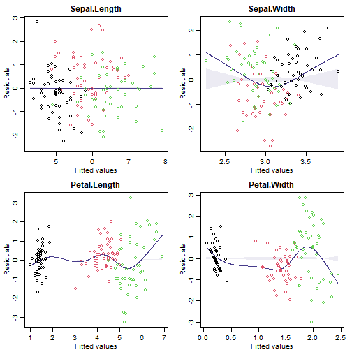
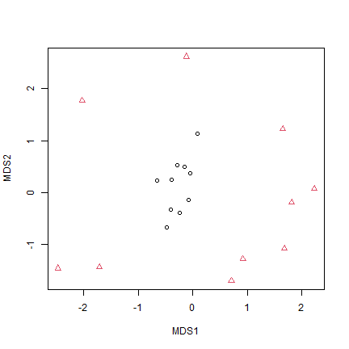
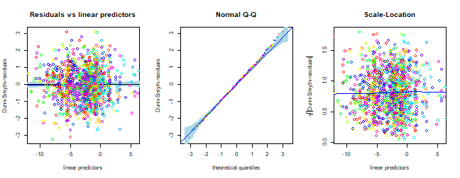

## Exercise 12.1: Flower size and shape
*How do these three species of Iris differ in terms of flower size and shape?*

*What sort of graph should Edgar produce to visualise how species differ in flower size and shape?*

He has more than two response variables so I guess as well as plotting each response one-at-a-time he could try plotting them simultaneously using ordination (factor analysis, for example). In either plot he would want to label different species differently to see variation across species.


## Exercise 12.2: Bush regeneration and invertebrate counts
*Is there evidence of a change in invertebrate communities due to bush regeneration
efforts?*

*What sort of graph should Anthony produce to visualise the effects of bush
regeneration on invertebrate communities?*

Anthony has a bunch of response variables so I guess as well as plotting each response one-at-a-time he could try plotting them simultaneously using ordination. He has counts so will need something that works for non-Gaussian responses like generalised latent variable models. In either plot he would want to label different species differently to see variation between revegetated and control plots.

## Code Box 12.1: Plotting the bush regeneration data of Exercise 12.1 using `mvabund`.

```r
library(mvabund)
library(ecostats)
data(reveg)
reveg$abundMV=mvabund(reveg$abund) #to treat data as multivariate
plot(abundMV~treatment, data=reveg)
#> Overlapping points were shifted along the y-axis to make them visible.
#> 
#>  PIPING TO 2nd MVFACTOR
#> Only the variables Collembola, Acarina, Formicidae, Coleoptera, Diptera, Amphipoda, Isopoda, Larvae, Hemiptera, Soleolifera, Hymenoptera, Araneae were included in the plot 
#> (the variables with highest total abundance).
```

<<<<<<< Updated upstream

=======

>>>>>>> Stashed changes

*Can you see any taxa that seem to be associated with bush regeneration?*

There seem to be less invertebrates in control plots for *Collembola*, *Acarina*, *Coloeptera*, *Amphipoda* and maybe a few Orders.


## Code Box 12.2: A PCA of Edgar's *Iris* data


```r
data("iris")
pc = princomp(iris[,1:4],cor=TRUE)
pc
#> Call:
#> princomp(x = iris[, 1:4], cor = TRUE)
#> 
#> Standard deviations:
#>    Comp.1    Comp.2    Comp.3    Comp.4 
#> 1.7083611 0.9560494 0.3830886 0.1439265 
#> 
#>  4  variables and  150 observations.
loadings(pc)
#> 
#> Loadings:
#>              Comp.1 Comp.2 Comp.3 Comp.4
#> Sepal.Length  0.521  0.377  0.720  0.261
#> Sepal.Width  -0.269  0.923 -0.244 -0.124
#> Petal.Length  0.580        -0.142 -0.801
#> Petal.Width   0.565        -0.634  0.524
#> 
#>                Comp.1 Comp.2 Comp.3 Comp.4
#> SS loadings      1.00   1.00   1.00   1.00
#> Proportion Var   0.25   0.25   0.25   0.25
#> Cumulative Var   0.25   0.50   0.75   1.00
biplot( pc, xlabs=rep("\u00B0",dim(iris)[1]) )
```

<<<<<<< Updated upstream

=======

>>>>>>> Stashed changes


## Code Box 12.3: Factor analysis of the Iris data

```r
library(psych)
fa_iris <- fa(iris[,1:4], nfactors=2, fm="ml", rotate="varimax")
loadings(fa_iris)
#> 
#> Loadings:
#>              ML1    ML2   
#> Sepal.Length  0.997       
#> Sepal.Width  -0.115 -0.665
#> Petal.Length  0.871  0.486
#> Petal.Width   0.818  0.514
#> 
#>                  ML1   ML2
#> SS loadings    2.436 0.942
#> Proportion Var 0.609 0.236
#> Cumulative Var 0.609 0.844
```

*How do results compare to the principal components analysis?*

They look awfully similar. The second factor looks a little different, and is flipped around the other way (so big vlues mean *narrow* sepals), but it also has postive loadings for petal variables. So this could be interpreted as a measure of how large petals are relative to sepal width: big scores for large petals with narrow sepals, low scores for small petals with wide sepals. Recall that previously, the second PC was pretty much just a measure of how wide sepals were, now it is relative to petal size.


## Code Box 12.4: Assumption checking for a factor analysis of the Iris data

```r
par(mfrow=c(2,2),mar=c(3,3,2,1),mgp=c(1.75,0.75,0))
for(iVar in 1:4)
{
  irisIvar = iris[,iVar]
  plotenvelope(lm(irisIvar~fa_iris$scores), which=1, col=iris$Species, main=print(names(iris)[iVar]), n.sim=99)
}
#> [1] "Sepal.Length"
#> Error in matrix(NA, nPred, n.sim): object 'n.sim' not found
```

<<<<<<< Updated upstream


=======
>>>>>>> Stashed changes
```r
plot(iris[,1:4],col=iris$Species)
```

<<<<<<< Updated upstream

=======

>>>>>>> Stashed changes

(Note that `plotenvelope` was run with just `59` iterations, to speed up computation time.)

## Exercise 12.4: A factor analysis for Anthony’s data(?)
*Load Anthony’s revegetation data (stored as `reveg` in the `ecostats` package) and do a factor analysis (with two factors). *


```r
data(reveg)
library(psych)
fa_reveg <- try(fa(reveg$abund, nfactors=2, fm="ml", rotate="varimax"))
#> Warning in cor.smooth(R): Matrix was not positive definite, smoothing was done
#> In smc, smcs < 0 were set to .0
#> Warning in cor.smooth(R): Matrix was not positive definite, smoothing was done
#> In smc, smcs < 0 were set to .0
#> Warning in log(e): NaNs produced
#> Error in optim(start, FAfn, FAgr, method = "L-BFGS-B", lower = 0.005,  : 
#>   L-BFGS-B needs finite values of 'fn'
```

*You might not be able to get a solution when using maximum likelihood estimation (fm="ml"), in which case, try fitting using without specifying the fm argument (which tries to minimise residuals).*


```r
fa_reveg <- fa(reveg$abund, nfactors=2)
#> Warning in cor.smooth(R): Matrix was not positive definite, smoothing was done
#> In smc, smcs < 0 were set to .0
#> Warning in cor.smooth(R): Matrix was not positive definite, smoothing was done
#> In smc, smcs < 0 were set to .0
#> Warning in cor.smooth(R): Matrix was not positive definite, smoothing was done
#> In smc, smcs < 0 were set to .0
#> Warning in cor.smooth(r): Matrix was not positive definite, smoothing was done
#> Warning in fa.stats(r = r, f = f, phi = phi, n.obs = n.obs, np.obs = np.obs, : The estimated weights
#> for the factor scores are probably incorrect. Try a different factor score estimation method.
#> In factor.scores, the correlation matrix is singular, an approximation is used
#> Warning in cor.smooth(r): Matrix was not positive definite, smoothing was done
```

This returned some concerning warnings but did fit the model :)

*Check some assumptions, by fitting a linear model to some of the response variables, as a function of factor scores.*


```r
par(mfrow=c(3,3),mar=c(3,3,2,1),mgp=c(1.75,0.75,0))
for(iVar in 1:9)
{
  y=reveg$abund[,iVar]
  plotenvelope(lm(y~fa_reveg$scores), which=1,main=names(reveg$abund)[iVar], n.sim=99)
}
<<<<<<< Updated upstream
```


```r
=======
#> Error in matrix(NA, nPred, n.sim): object 'n.sim' not found
>>>>>>> Stashed changes
for(iVar in 1:9)
{
  y=reveg$abund[,iVar]
  plotenvelope(lm(y~fa_reveg$scores), which=2,main=names(reveg$abund)[iVar], n.sim=99)
}
```

<<<<<<< Updated upstream

=======

>>>>>>> Stashed changes

*Can you see any issues with factor analysis assumptions?*

With only ten observations it is always hard to see issues, and residual plots have huge error bars on them!  But we have points outside their normal quantile simulation envelopes in several of these plots, and most have a suggestion of right-skew (the occasional large value). Note also that fitted values go below zero for many species which is most concerning considering we are modelling counts!


## Code Box 12.5: Choosing the number of factors for the iris data

```r
plot(fa_iris$values,type="l")
```

<<<<<<< Updated upstream

=======

>>>>>>> Stashed changes


```r
nFactors=3 # to compare models with up to 3 factors
BICs = rep(NA,nFactors) # define the vector that BIC values go in
names(BICs) = 1:nFactors # name its values according to #factors
for(iFactors in 1:nFactors) {
  fa_iris <- fa(iris[,1:4], nfactors=iFactors, fm="ml", rotate="varimax")
  BICs[iFactors] = fa_iris$objective - log(fa_iris$nh) * fa_iris$dof
}
BICs
#>         1         2         3 
#> -9.436629  5.171006 15.031906
```

*How many factors are supported by the data?*

One, this has the smallest BIC.


## Code Box 12.6: A generalised latent variable model for Anthony’s revegetation data

```r
data(reveg)
library(gllvm)
#> 
#> Attaching package: 'gllvm'
#> The following objects are masked from 'package:ecostats':
#> 
#>     coefplot, nobs, predict, simulate, vcov
#> The following objects are masked from 'package:VGAM':
#> 
#>     AICc, nobs, predict, vcov
#> The following objects are masked from 'package:stats4':
#> 
#>     nobs, vcov
#> The following object is masked from 'package:vegan':
#> 
#>     ordiplot
#> The following object is masked from 'package:mvabund':
#> 
#>     coefplot
#> The following objects are masked from 'package:stats':
#> 
#>     nobs, predict, simulate, vcov
reveg_LVM = gllvm(reveg$abund, num.lv=2, family="negative.binomial", trace=TRUE, jitter.var=0.2)
logLik(reveg_LVM)
#> 'log Lik.' -679.9619 (df=95)
```
Repeating this several times usually returns an answer of `-689.3`, so we can be confident this is (close to) the maximum likelihood solution. To get a biplot
of this solution:

```r
ordiplot(reveg_LVM, col=as.numeric(reveg$treatment), biplot=TRUE,
ind.spp=12)
```

<<<<<<< Updated upstream

=======

>>>>>>> Stashed changes


```r
par(mfrow=c(1,3),mar=c(3,3,1,1),mgp=c(1.75,0.75,0))
plot(reveg_LVM,which=c(1,2,5))
```

<<<<<<< Updated upstream

=======

>>>>>>> Stashed changes

## Exercise 12.5: Checking analysis decisions for Anthony’s revegetation data

*In Code Box 12.6, a negative binomial model was fitted, using two latent variables. Are two latent variables needed, or should we use more, or less? Fit a few models varying the number of latent variables. Which model fits the data best, according to BIC?*

```r
reveg_LVM1 = gllvm(reveg$abund, num.lv=1, family="negative.binomial", trace=TRUE, jitter.var=0.2)
reveg_LVM2 = gllvm(reveg$abund, num.lv=2, family="negative.binomial", trace=TRUE, jitter.var=0.2)
reveg_LVM3 = gllvm(reveg$abund, num.lv=3, family="negative.binomial", trace=TRUE, jitter.var=0.2)
reveg_LVM4 = gllvm(reveg$abund, num.lv=4, family="negative.binomial", trace=TRUE, jitter.var=0.2)
reveg_LVM5 = gllvm(reveg$abund, num.lv=5, family="negative.binomial", trace=TRUE, jitter.var=0.2)
BIC(reveg_LVM1,reveg_LVM2,reveg_LVM3,reveg_LVM4,reveg_LVM5)
#>             df      BIC
#> reveg_LVM1  72 1557.821
#> reveg_LVM2  95 1610.781
#> reveg_LVM3 117 1575.276
#> reveg_LVM4 138 1629.856
#> reveg_LVM5 158 1669.682
```

For me two latent variable models was the winner!

*Fit a Poisson model to the data and check assumptions. Are there any signs of overdispersion?*

I'll go with two latent variable models, on account of this looking the best in the above.

```r
reveg_LVM1 = gllvm(reveg$abund, num.lv=2, family="poisson", trace=TRUE, jitter.var=0.2)
par(mfrow=c(1,3))
plot(reveg_LVM1,which=c(1,2,5))
```

<<<<<<< Updated upstream

=======

>>>>>>> Stashed changes

Wow this does not look good! There is a clear fan-shape in the residual vs fits plot, which also shows up as an increasing trend in the scale-location plot. Points on the normal quantile plot are well outside bounds on both sides, frequently falling below -5 or above 5 (when we would expect most values between -3 and 3). These are all strong signs of overdispersion.


## Code Box 12.7: A non-metric multi-dimensional scaling ordination of Anthony’s data

```r
library(vegan)
ord_mds=metaMDS(reveg$abund)
#> Square root transformation
#> Wisconsin double standardization
#> Run 0 stress 0.1611237 
#> Run 1 stress 0.1641162 
#> Run 2 stress 0.1653221 
#> Run 3 stress 0.1687788 
#> Run 4 stress 0.177687 
#> Run 5 stress 0.1805824 
#> Run 6 stress 0.1745439 
#> Run 7 stress 0.1880315 
#> Run 8 stress 0.1611236 
#> ... New best solution
#> ... Procrustes: rmse 0.0001157573  max resid 0.0002073088 
#> ... Similar to previous best
#> Run 9 stress 0.3314815 
#> Run 10 stress 0.1687788 
#> Run 11 stress 0.2244987 
#> Run 12 stress 0.164116 
#> Run 13 stress 0.1641167 
#> Run 14 stress 0.1611236 
#> ... New best solution
#> ... Procrustes: rmse 0.0002265118  max resid 0.0004099737 
#> ... Similar to previous best
#> Run 15 stress 0.1641163 
#> Run 16 stress 0.1653221 
#> Run 17 stress 0.1611236 
#> ... Procrustes: rmse 0.0002056824  max resid 0.0003733336 
#> ... Similar to previous best
#> Run 18 stress 0.2984 
#> Run 19 stress 0.1611236 
#> ... Procrustes: rmse 0.0001213268  max resid 0.0002138302 
#> ... Similar to previous best
#> Run 20 stress 0.1611236 
#> ... New best solution
#> ... Procrustes: rmse 5.352512e-05  max resid 9.438702e-05 
#> ... Similar to previous best
#> *** Solution reached
plot(ord_mds$points,pch=as.numeric(reveg$treatment),col=reveg$treatment)
```

<<<<<<< Updated upstream

=======

>>>>>>> Stashed changes

## Exercise 12.6: MDS ordinations of coral data


```r
library(mvabund)
data(tikus)
tikusAbund = tikus$abund[1:20,] # for 1981 and 1983 data only
tikusAbund = tikusAbund[,apply(tikusAbund,2,sum)>0] # remove zerotons
```

*Construct an MDS plot of the data, using the Bray-Curtis distance (default), and colour-code symbols by year of sampling.*

```r
tikus_mds=metaMDS(tikusAbund)
#> Square root transformation
#> Wisconsin double standardization
#> Run 0 stress 0.09863027 
#> Run 1 stress 0.1318005 
#> Run 2 stress 0.1323406 
#> Run 3 stress 0.109769 
#> Run 4 stress 0.1086391 
#> Run 5 stress 0.1410027 
#> Run 6 stress 0.1068254 
#> Run 7 stress 0.1024098 
#> Run 8 stress 0.1165249 
#> Run 9 stress 0.09862977 
#> ... New best solution
#> ... Procrustes: rmse 0.0003897009  max resid 0.0009384022 
#> ... Similar to previous best
#> Run 10 stress 0.09863026 
#> ... Procrustes: rmse 0.001910785  max resid 0.004769176 
#> ... Similar to previous best
#> Run 11 stress 0.1120024 
#> Run 12 stress 0.1215337 
#> Run 13 stress 0.1042514 
#> Run 14 stress 0.1063168 
#> Run 15 stress 0.1024098 
#> Run 16 stress 0.1024096 
#> Run 17 stress 0.1097838 
#> Run 18 stress 0.1209392 
#> Run 19 stress 0.1010801 
#> Run 20 stress 0.1100804 
#> *** Solution reached
plot(tikus_mds$points,pch=as.numeric(tikus$x$time),col=tikus$x$time)
```

<<<<<<< Updated upstream

=======

>>>>>>> Stashed changes

*Does this plot agree with the Warwick et al. (1990) interpretation? [Warwick et al. (1990) used this dataset and MDS ordinations to argue that stress increases dispersion in coral communities]*

Yes it does, 1981 (before El Niño disturbance) the points are close together in the middle of the ordination, 1983 (post disturbance) they are spread out around the same point but way further apart, suggesting a change in dispersion.

*Construct another MDS plot using the Euclidean distance on `log(y+1)`-transformed data.*


```r
tikus_mdsEuc=metaMDS(log(tikusAbund+1),distance="euclidean")
#> Run 0 stress 0.05741195 
#> Run 1 stress 0.05741186 
#> ... New best solution
#> ... Procrustes: rmse 0.0007236973  max resid 0.002122405 
#> ... Similar to previous best
#> Run 2 stress 0.05741181 
#> ... New best solution
#> ... Procrustes: rmse 0.0006510492  max resid 0.001915565 
#> ... Similar to previous best
#> Run 3 stress 0.0574116 
#> ... New best solution
#> ... Procrustes: rmse 0.000209974  max resid 0.0006023444 
#> ... Similar to previous best
#> Run 4 stress 0.05741188 
#> ... Procrustes: rmse 0.0002484388  max resid 0.0007128858 
#> ... Similar to previous best
#> Run 5 stress 0.05741183 
#> ... Procrustes: rmse 0.0002121153  max resid 0.0006080952 
#> ... Similar to previous best
#> Run 6 stress 0.05741178 
#> ... Procrustes: rmse 0.0003856582  max resid 0.001167658 
#> ... Similar to previous best
#> Run 7 stress 0.05741211 
#> ... Procrustes: rmse 0.000576628  max resid 0.001741823 
#> ... Similar to previous best
#> Run 8 stress 0.05741227 
#> ... Procrustes: rmse 0.0006196617  max resid 0.001878622 
#> ... Similar to previous best
#> Run 9 stress 0.05741165 
#> ... Procrustes: rmse 7.097593e-05  max resid 0.0002030925 
#> ... Similar to previous best
#> Run 10 stress 0.05741164 
#> ... Procrustes: rmse 0.0002544858  max resid 0.0007717277 
#> ... Similar to previous best
#> Run 11 stress 0.05741192 
#> ... Procrustes: rmse 0.0004851852  max resid 0.001463452 
#> ... Similar to previous best
#> Run 12 stress 0.07425305 
#> Run 13 stress 0.05741202 
#> ... Procrustes: rmse 0.000318195  max resid 0.0009133398 
#> ... Similar to previous best
#> Run 14 stress 0.05741167 
#> ... Procrustes: rmse 0.0003011839  max resid 0.0009098946 
#> ... Similar to previous best
#> Run 15 stress 0.05741182 
#> ... Procrustes: rmse 0.0002108956  max resid 0.0006049422 
#> ... Similar to previous best
#> Run 16 stress 0.0574122 
#> ... Procrustes: rmse 0.000557587  max resid 0.001671816 
#> ... Similar to previous best
#> Run 17 stress 0.05741172 
#> ... Procrustes: rmse 0.0003450418  max resid 0.001041247 
#> ... Similar to previous best
#> Run 18 stress 0.05741177 
#> ... Procrustes: rmse 0.0003800631  max resid 0.001149431 
#> ... Similar to previous best
#> Run 19 stress 0.07425315 
#> Run 20 stress 0.05741199 
#> ... Procrustes: rmse 0.0004999004  max resid 0.001515361 
#> ... Similar to previous best
#> *** Solution reached
plot(tikus_mdsEuc$points,pch=as.numeric(tikus$x$time),col=tikus$x$time)
```

<<<<<<< Updated upstream

=======

>>>>>>> Stashed changes

*Does this plot agree with the Warwick et al. (1990) interpretation?*

Nope -- this says the opposite, with much lower dispersion post disturbance. It is suggestive of a location effect as well, that is, a change in mean abundance not just variability.

*Use the `plot.mvabund` function to plot each coral response variable as a function of time. What is the main pattern that you see?*


```r
tikusMV = mvabund(tikusAbund)
plot(tikusMV~tikus$x$time[1:20])
#> Overlapping points were shifted along the y-axis to make them visible.
#> 
#>  PIPING TO 2nd MVFACTOR
#> Only the variables Heliopora.coerulea, Montipora.digitata, Favites.abdita, Favites.chinensis, Platygyra.daedalea, Montipora.foliosa, Pocillopora.damicornis, Acropora.cytherea, Acropora.hyacinthus, Acropora.formosa, Pocillopora.verrucosa, Acropora.pulchra were included in the plot 
#> (the variables with highest total abundance).
```

<<<<<<< Updated upstream

=======

>>>>>>> Stashed changes

*Convert the data into presence-absence and use the gllvm package to construct an ordination*

```r
tikusPA = tikusAbund
tikusPA[tikusPA>1]=1
tikus_LVM = gllvm(tikusPA, num.lv=2, family="binomial", trace=TRUE, jitter.var=0.2)
ordiplot.gllvm(tikus_LVM, s.col=as.numeric(tikus$x$time), biplot=TRUE, ind.spp=12)
```

<<<<<<< Updated upstream

=======

>>>>>>> Stashed changes

*Do assumptions appear reasonable? How would you interpret this plot?*

```r
par(mfrow=c(1,3))
plot(tikus_LVM,which=c(1,2,5))
```

<<<<<<< Updated upstream

=======

>>>>>>> Stashed changes

## Code Box 12.8: Studying each observation separately for the Iris data

```r
by(iris, iris$Species, function(dat){ apply(dat[,1:4],2,mean) } )
#> iris$Species: setosa
#> Sepal.Length  Sepal.Width Petal.Length  Petal.Width 
#>        5.006        3.428        1.462        0.246 
#> --------------------------------------------------------------------------- 
#> iris$Species: versicolor
#> Sepal.Length  Sepal.Width Petal.Length  Petal.Width 
#>        5.936        2.770        4.260        1.326 
#> --------------------------------------------------------------------------- 
#> iris$Species: virginica
#> Sepal.Length  Sepal.Width Petal.Length  Petal.Width 
#>        6.588        2.974        5.552        2.026
par(mfrow=c(2,2),mar=c(3,3,1,1),mgp=c(1.75,0.75,0))
plot(Sepal.Length~Species,data=iris,xlab="")
plot(Sepal.Width~Species,data=iris,xlab="")
plot(Petal.Length~Species,data=iris,xlab="")
plot(Petal.Width~Species,data=iris,xlab="")
```

<<<<<<< Updated upstream

=======

>>>>>>> Stashed changes

#remove this chunk once gllvm has been updated on CRAN:

