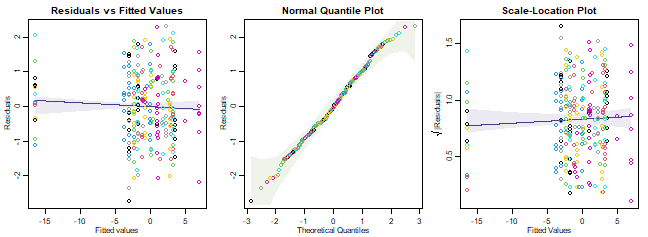
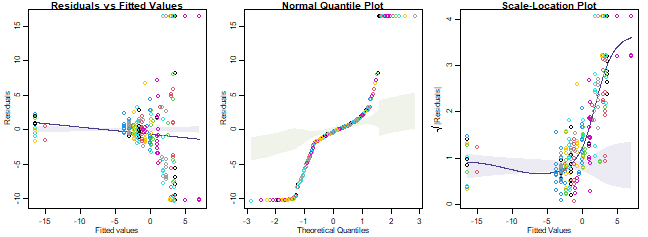
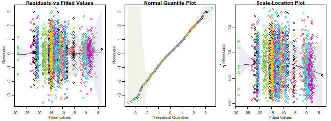

## Exercise 14.1: Revegetation and invertebrate counts
*In Anthony’s revegetation study (Exercise 10.3), he classified anything that fell into his pitfall traps to Order, and thus counted the abundance of each of 24 invertebrate Orders across ten sites. He wants to know: Is there evidence of a change in invertebrate communities due to revegetation efforts?*

*What type of response variable(s) does he have? How should Anthony analyse his data?*

He has a multivariate abundance dataset, with 24 correlated counts of invertebrates in different Orders. He needs to use some GLM approach that can handle correlation and many responses, like `manyglm` from the `mvabund` package. 


## Exercise 14.2: Invertebrates settling on seaweed
*In Exercise 1.13, David and Alistair looked at invertebrate epifauna settling on algal beds (seaweed) with different levels of isolation (0, 2, or 10 metre buffer) from each other, at two sampling times (5 and 10 weeks). They observed presence/absence patterns of 16 different types of invertebrate (across 10 replicates). They would like to know if there is any evidence of a difference in invertebrate presence/absence patterns with Distance of Isolation.*

*How should they analyse the data?*

They have a multivariate abundance dataset, with 16 correlated presence/absence measurements of invertebrates. They need to use some GLM approach that can handle correlation and many responses, like `manyglm` from the `mvabund` package. 


## Exercise 14.3: Do offshore wind farms affect fish communities?
*As in Exercise 10.2, Lena studied the effects of an offshore wind farm on fish communities, by collecting paired data before and after wind farm construction, at 36 stations in each of three zones (wind farm, North, or South). She counted how many fish were caught at each station, classified into 16 different taxa. Lena wants to know if there is any evidence of a change in fish communities at wind farm stations, as compared to others, following construction of the wind farm.* 

*How should she analyse the data?*

She has a multivariate abundance dataset, with 16 correlated counts of different fish species. She needs to use some GLM approach that can handle correlation and many responses, like `manyglm` from the `mvabund` package. 

## Code Box 14.1: Using mvabund to test for an effect of revegetation in Exercise 12.2

```r
library(ecostats)
library(mvabund)
data(reveg)
reveg$abundMV=mvabund(reveg$abund)
ft_reveg=manyglm(abundMV~treatment+offset(log(pitfalls)),
family="negative.binomial", data=reveg) # offset included as in Exercise 10.9
anova(ft_reveg)
#> Time elapsed: 0 hr 0 min 7 sec
#> Analysis of Deviance Table
#> 
#> Model: abundMV ~ treatment + offset(log(pitfalls))
#> 
#> Multivariate test:
#>             Res.Df Df.diff   Dev Pr(>Dev)  
#> (Intercept)      9                         
#> treatment        8       1 78.25     0.02 *
#> ---
#> Signif. codes:  0 '***' 0.001 '**' 0.01 '*' 0.05 '.' 0.1 ' ' 1
#> Arguments:
#>  Test statistics calculated assuming uncorrelated response (for faster computation) 
#>  P-value calculated using 999 iterations via PIT-trap resampling.
```

## Exercise 14.4: Testing for an effect of isolation on invertebrates in seaweed
*Consider the `seaweed` dataset from David’s and Alistair’s study of invertebrate epifauna settling on algal beds with different levels of isolation (0, 2 or 10 metre buffer) at different sampling times (5 and 10 weeks), with varying seaweed biomass in each patch.*

*What sort of model is appropriate for this dataset? Fit this model and call it `ft_epiAlt` and run `anova(ft_epiAlt)`. (This might take a couple of minutes to run.)*

Previous experience suggests anything beyond second-order interactions does not seem to matter -- you could fit more but it would take longer. Because of the warning that this will take a long time to run I will set `nBoot=99` for a quicker, rough answer:


```r
data(seaweed)
seaweed$Dist = as.factor(seaweed$Dist)
# set up presence-absence response:
seaweed$PA = mvabund(seaweed[,6:21])
seaweed$PA[seaweed$PA>1] = 1

#fit model
ft_epiAlt = manyglm(PA~(Wmass+Size+Time)*Dist,family="cloglog", data=seaweed)
anova(ft_epiAlt,nBoot=99)
#> Time elapsed: 0 hr 0 min 13 sec
#> Analysis of Deviance Table
#> 
#> Model: PA ~ (Wmass + Size + Time) * Dist
#> 
#> Multivariate test:
#>             Res.Df Df.diff   Dev Pr(>Dev)  
#> (Intercept)     56                         
#> Wmass           55       1  6.66     0.93  
#> Size            54       1 36.98     0.02 *
#> Time            53       1 32.35     0.04 *
#> Dist            51       2 28.26     0.79  
#> Wmass:Dist      49       2 33.29     0.25  
#> Size:Dist       47       2 26.77     0.10 .
#> Time:Dist       45       2 32.56     0.07 .
#> ---
#> Signif. codes:  0 '***' 0.001 '**' 0.01 '*' 0.05 '.' 0.1 ' ' 1
#> Arguments:
#>  Test statistics calculated assuming uncorrelated response (for faster computation) 
#>  P-value calculated using 99 iterations via PIT-trap resampling.
```

*Now fit a model under the null hypothesis that there is no effect of Distance of isolation, and call it `ft_epiNull`. Run `anova(ft_epiNull, ft_epiAlt)`. This second anova took much less time to fit – why? Is there evidence of an effect of distance of isolation on presence/absence patterns in the invertebrate community?*

To see if there is an effect of `Dist` I guess we could remove it from the model entirely and see if that does anything:

```r
ft_epiNull = manyglm(PA~Wmass+Size+Time,family="cloglog", data=seaweed)
anova(ft_epiNull, ft_epiAlt, nBoot=99)
#> Time elapsed: 0 hr 0 min 2 sec
#> Analysis of Deviance Table
#> 
#> ft_epiNull: PA ~ Wmass + Size + Time
#> ft_epiAlt: PA ~ (Wmass + Size + Time) * Dist
#> 
#> Multivariate test:
#>            Res.Df Df.diff   Dev Pr(>Dev)
#> ft_epiNull     53                       
#> ft_epiAlt      45       8 115.2     0.41
#> Arguments:
#>  Test statistics calculated assuming uncorrelated response (for faster computation) 
#>  P-value calculated using 99 iterations via PIT-trap resampling.
```

*This second `anova` took much less time to fit – why?*

Because it only has to test one hypothesis, not seven, so took about a seventh of the time!

*Is there evidence of an effect of distance of isolation on presence/absence patterns in the invertebrate community?*

No :(

## Code Box 14.2: Checking assumptions for the revegetation model of Code Box 14.1


```r
par(mfrow=c(1,3),mar=c(3,3,2,1),mgp=c(1.75,0.75,0))
ft_reveg=manyglm(abundMV~treatment,offset=log(pitfalls),family="negative.binomial", data=reveg)
plotenvelope(ft_reveg, which=1:3)
```



*What do you reckon?*

Assumptions seem reasonable here.


## Code Box 14.3: Checking mean-variance assumptions for a Poisson revegetation model

```r
ft_revegP=manyglm(abundMV~treatment, offset=log(pitfalls), family="poisson", data=reveg)
par(mfrow=c(1,3),mar=c(3,3,1,1),mgp=c(1.75,0.75,0))
plotenvelope(ft_revegP, which=1:3, sim.method="stand.norm")
```




```r
meanvar.plot(reveg$abundMV~reveg$treatment)
#> START SECTION 2 
#> Plotting if overlay is TRUE
#> using grouping variable reveg$treatment 7 mean values were 0 and could 
#> 										not be included in the log-plot
#> using grouping variable reveg$treatment 10 variance values were 0 and could not 
#> 										be included in the log-plot
#> FINISHED SECTION 2
abline(a=0,b=1,col="darkgreen")
```


*How's the Poisson assumption looking?*

It is in all sorts of trouble, there is a very strong fan-shape on the residuals vs fits plot, points drift well outside the simulation envelope on the nromal quantile plot (with many residuals larger than 5 or less than -5) and a strong increasing trend on the residual vs fits plot. These are all symptomatic of overdispersion, confirmed by the sample mean-variance plot, where points tend to fall above the one-to-one line at large means.


## Exercise 14.5: Checking assumptions for the habitat configuration data
*What assumptions were made?*

We assumed:

* observations are conditionally independent
* data are Bernoulli
* the cloglog of the mean is a linear function of predictors
* residuals have constant correlation

*Where possible, check these assumptions.*


```r
par(mfrow=c(1,3),mar=c(3,3,1,1),mgp=c(1.75,0.75,0))
ft_epiAlt = manyglm(PA~(Wmass+Size+Time)*Dist,family=binomial("cloglog"), data=seaweed)
plotenvelope(ft_epiAlt, which=1:3)
```


*Do assumptions seem reasonable?*

Yes it all looks good to me. This is not unexpected because presence-absence data are by definition Bernoulli, the only potential issues could be if there were higher order interactions or violations of te independence assumption.


## Exercise 14.6: Checking assumptions for the wind farm data
*Consider Lena’s offshore wind farm study (Exercise 14.3). Fit an appropriate model to the data. Make sure you include a Station main effect (to account for the paired sampling design).*


```r
data(windFarms)
ft_wind=manyglm(mvabund(windFarms$abund)~Station+Year+Year:Zone, family="poisson", data=windFarms$X)
```

*What assumptions were made?*

We assumed:

* observations are conditionally independent
* data are Poisson
* the log of the mean is a linear function of predictors
* residuals have constant correlation

*Where possible, check these assumptions.*

Used "stand.norm"  because this model takes a while to fit. 


```r
par(mfrow=c(1,3),mar=c(3,3,1,1),mgp=c(1.75,0.75,0))
plotenvelope(ft_wind, which=1:3, sim.method="stand.norm")
```


*Do assumptions seem reasonable? In particular, think about whether there is evidence that the counts are overdispersed compared to the Poisson.*

Things generally look OK, but there is a downward trend on the scale-location plot, weakly suggestive of under-dispersion. Note the sim envelope was constructed using `"stand.norm"`, meaning we compared the smoother to what would be expected for a bunch of standard normal residuals. But the kink could be a weird artifact of the model being fitted (which has loads of parameters) so let's repeat using `"refit"`, but with a smaller value of `n.sim` so it doesn't take too long (it will take a few minutes though):


```r
par(mfrow=c(1,3),mar=c(3,3,1,1),mgp=c(1.75,0.75,0))
plotenvelope(ft_wind, which=1:3, n.sim=59)
#> Error in glm.fit(x = structure(c(1, 1, 1, 1, 1, 1, 1, 1, 1, 1, 1, 1, 1,  : 
#>   NA/NaN/Inf in 'x'
#> Error in glm.fit(x = structure(c(1, 1, 1, 1, 1, 1, 1, 1, 1, 1, 1, 1, 1,  : 
#>   NA/NaN/Inf in 'x'
#> Error in glm.fit(x = structure(c(1, 1, 1, 1, 1, 1, 1, 1, 1, 1, 1, 1, 1,  : 
#>   NA/NaN/Inf in 'x'
#> Error in glm.fit(x = structure(c(1, 1, 1, 1, 1, 1, 1, 1, 1, 1, 1, 1, 1,  : 
#>   NA/NaN/Inf in 'x'
#> Error in glm.fit(x = structure(c(1, 1, 1, 1, 1, 1, 1, 1, 1, 1, 1, 1, 1,  : 
#>   NA/NaN/Inf in 'x'
#> Error in glm.fit(x = structure(c(1, 1, 1, 1, 1, 1, 1, 1, 1, 1, 1, 1, 1,  : 
#>   NA/NaN/Inf in 'x'
#> Error : inner loop 1; cannot correct step size
#> Error : inner loop 1; cannot correct step size
#> Error in glm.fit(x = structure(c(1, 1, 1, 1, 1, 1, 1, 1, 1, 1, 1, 1, 1,  : 
#>   NA/NaN/Inf in 'x'
#> Error in glm.fit(x = structure(c(1, 1, 1, 1, 1, 1, 1, 1, 1, 1, 1, 1, 1,  : 
#>   NA/NaN/Inf in 'x'
#> Error in glm.fit(x = structure(c(1, 1, 1, 1, 1, 1, 1, 1, 1, 1, 1, 1, 1,  : 
#>   NA/NaN/Inf in 'x'
#> Error in glm.fit(x = structure(c(1, 1, 1, 1, 1, 1, 1, 1, 1, 1, 1, 1, 1,  : 
#>   NA/NaN/Inf in 'x'
#> Error in glm.fit(x = structure(c(1, 1, 1, 1, 1, 1, 1, 1, 1, 1, 1, 1, 1,  : 
#>   NA/NaN/Inf in 'x'
#> Error in glm.fit(x = structure(c(1, 1, 1, 1, 1, 1, 1, 1, 1, 1, 1, 1, 1,  : 
#>   NA/NaN/Inf in 'x'
#> Error in glm.fit(x = structure(c(1, 1, 1, 1, 1, 1, 1, 1, 1, 1, 1, 1, 1,  : 
#>   NA/NaN/Inf in 'x'
#> Error in glm.fit(x = structure(c(1, 1, 1, 1, 1, 1, 1, 1, 1, 1, 1, 1, 1,  : 
#>   NA/NaN/Inf in 'x'
#> Error in glm.fit(x = structure(c(1, 1, 1, 1, 1, 1, 1, 1, 1, 1, 1, 1, 1,  : 
#>   NA/NaN/Inf in 'x'
#> Error in glm.fit(x = structure(c(1, 1, 1, 1, 1, 1, 1, 1, 1, 1, 1, 1, 1,  : 
#>   NA/NaN/Inf in 'x'
#> Error : inner loop 1; cannot correct step size
#> Error in glm.fit(x = structure(c(1, 1, 1, 1, 1, 1, 1, 1, 1, 1, 1, 1, 1,  : 
#>   NA/NaN/Inf in 'x'
#> Error in glm.fit(x = structure(c(1, 1, 1, 1, 1, 1, 1, 1, 1, 1, 1, 1, 1,  : 
#>   NA/NaN/Inf in 'x'
#> Error in glm.fit(x = structure(c(1, 1, 1, 1, 1, 1, 1, 1, 1, 1, 1, 1, 1,  : 
#>   NA/NaN/Inf in 'x'
#> Error in glm.fit(x = structure(c(1, 1, 1, 1, 1, 1, 1, 1, 1, 1, 1, 1, 1,  : 
#>   NA/NaN/Inf in 'x'
#> Error in glm.fit(x = structure(c(1, 1, 1, 1, 1, 1, 1, 1, 1, 1, 1, 1, 1,  : 
#>   NA/NaN/Inf in 'x'
#> Error in glm.fit(x = structure(c(1, 1, 1, 1, 1, 1, 1, 1, 1, 1, 1, 1, 1,  : 
#>   NA/NaN/Inf in 'x'
#> Error in glm.fit(x = structure(c(1, 1, 1, 1, 1, 1, 1, 1, 1, 1, 1, 1, 1,  : 
#>   NA/NaN/Inf in 'x'
#> Error : inner loop 1; cannot correct step size
#> Error in glm.fit(x = structure(c(1, 1, 1, 1, 1, 1, 1, 1, 1, 1, 1, 1, 1,  : 
#>   NA/NaN/Inf in 'x'
#> Error in glm.fit(x = structure(c(1, 1, 1, 1, 1, 1, 1, 1, 1, 1, 1, 1, 1,  : 
#>   NA/NaN/Inf in 'x'
#> Error in glm.fit(x = structure(c(1, 1, 1, 1, 1, 1, 1, 1, 1, 1, 1, 1, 1,  : 
#>   NA/NaN/Inf in 'x'
#> Error in glm.fit(x = structure(c(1, 1, 1, 1, 1, 1, 1, 1, 1, 1, 1, 1, 1,  : 
#>   NA/NaN/Inf in 'x'
#> Error in glm.fit(x = structure(c(1, 1, 1, 1, 1, 1, 1, 1, 1, 1, 1, 1, 1,  : 
#>   NA/NaN/Inf in 'x'
#> Error in glm.fit(x = structure(c(1, 1, 1, 1, 1, 1, 1, 1, 1, 1, 1, 1, 1,  : 
#>   NA/NaN/Inf in 'x'
#> Error in glm.fit(x = structure(c(1, 1, 1, 1, 1, 1, 1, 1, 1, 1, 1, 1, 1,  : 
#>   NA/NaN/Inf in 'x'
#> Error in glm.fit(x = structure(c(1, 1, 1, 1, 1, 1, 1, 1, 1, 1, 1, 1, 1,  : 
#>   NA/NaN/Inf in 'x'
#> Error in glm.fit(x = structure(c(1, 1, 1, 1, 1, 1, 1, 1, 1, 1, 1, 1, 1,  : 
#>   NA/NaN/Inf in 'x'
#> Error in glm.fit(x = structure(c(1, 1, 1, 1, 1, 1, 1, 1, 1, 1, 1, 1, 1,  : 
#>   NA/NaN/Inf in 'x'
#> Error in glm.fit(x = structure(c(1, 1, 1, 1, 1, 1, 1, 1, 1, 1, 1, 1, 1,  : 
#>   NA/NaN/Inf in 'x'
#> Error in glm.fit(x = structure(c(1, 1, 1, 1, 1, 1, 1, 1, 1, 1, 1, 1, 1,  : 
#>   NA/NaN/Inf in 'x'
#> Error in glm.fit(x = structure(c(1, 1, 1, 1, 1, 1, 1, 1, 1, 1, 1, 1, 1,  : 
#>   NA/NaN/Inf in 'x'
#> Error in glm.fit(x = structure(c(1, 1, 1, 1, 1, 1, 1, 1, 1, 1, 1, 1, 1,  : 
#>   NA/NaN/Inf in 'x'
#> Error in glm.fit(x = structure(c(1, 1, 1, 1, 1, 1, 1, 1, 1, 1, 1, 1, 1,  : 
#>   NA/NaN/Inf in 'x'
#> Error in glm.fit(x = structure(c(1, 1, 1, 1, 1, 1, 1, 1, 1, 1, 1, 1, 1,  : 
#>   NA/NaN/Inf in 'x'
#> Error : inner loop 1; cannot correct step size
#> Error in glm.fit(x = structure(c(1, 1, 1, 1, 1, 1, 1, 1, 1, 1, 1, 1, 1,  : 
#>   NA/NaN/Inf in 'x'
#> Error in glm.fit(x = structure(c(1, 1, 1, 1, 1, 1, 1, 1, 1, 1, 1, 1, 1,  : 
#>   NA/NaN/Inf in 'x'
#> Error in glm.fit(x = structure(c(1, 1, 1, 1, 1, 1, 1, 1, 1, 1, 1, 1, 1,  : 
#>   NA/NaN/Inf in 'x'
#> Error in glm.fit(x = structure(c(1, 1, 1, 1, 1, 1, 1, 1, 1, 1, 1, 1, 1,  : 
#>   NA/NaN/Inf in 'x'
```



(You can ignore any error messages - these seem to happen because predicted values were numerically zero.)

Anyway, the downward trend in the scale-location plot happened in simulated data too, so it is nothing really to worry about. It seems to be an artifact, probably because of overfitting of the data by including a `Station` term in the model -- this means that there is a parameter for every two observations in the data! (If a random effect were used instead, this effect would have been weaker. But it isn't really a problem.)


## Code Box 14.4: A manyglm analysis of the revegetation data, using a statistic accounting for correlation

```r
anova(ft_reveg,test="wald",cor.type="shrink")
#> Time elapsed: 0 hr 0 min 6 sec
#> Analysis of Variance Table
#> 
#> Model: abundMV ~ treatment
#> 
#> Multivariate test:
#>             Res.Df Df.diff  wald Pr(>wald)  
#> (Intercept)      9                          
#> treatment        8       1 8.698      0.05 *
#> ---
#> Signif. codes:  0 '***' 0.001 '**' 0.01 '*' 0.05 '.' 0.1 ' ' 1
#> Arguments:
#>  Test statistics calculated assuming correlated response via ridge regularization 
#>  P-value calculated using 999 iterations via PIT-trap resampling.
```

## Exercise 14.7: Testing for an effect of offshore wind farms (slowly)
*Fit models [to Lena's windfarm data] under the null and alternative hypotheses of interest. Run an anova to compare these two models, with just 19 bootstrap resamples, to estimate computation time.*

The null model in this case has no `Year:Zone` term... there could still be year-to-year variation, but it should not affect different Zones in different ways.

```r
windMV = mvabund(windFarms$abund)
ft_wind=manyglm(windMV~Station+Year+Year:Zone, family="poisson", data=windFarms$X)
ft_windNull=manyglm(windMV~Station+Year, family="poisson", data=windFarms$X)
anova(ft_windNull, ft_wind, nBoot=19)
#> Time elapsed: 0 hr 0 min 11 sec
#> Analysis of Deviance Table
#> 
#> ft_windNull: windMV ~ Station + Year
#> ft_wind: windMV ~ Station + Year + Year:Zone
#> 
#> Multivariate test:
#>             Res.Df Df.diff   Dev Pr(>Dev)  
#> ft_windNull     70                         
#> ft_wind         68       2 81.83     0.05 *
#> ---
#> Signif. codes:  0 '***' 0.001 '**' 0.01 '*' 0.05 '.' 0.1 ' ' 1
#> Arguments:
#>  Test statistics calculated assuming uncorrelated response (for faster computation) 
#>  P-value calculated using 19 iterations via PIT-trap resampling.
```
This took 12 seconds for me.

*Remove zerotons and singletons from the dataset using: `windMV = mvabund( windFarms$abund[,colSums(windFarms$abund>0)>1] )` Now fit a model to this new response variable, again with just 19 bootstrap resamples.*


```r
windMV1 = mvabund(windFarms$abund[,colSums(windFarms$abund>0)>1])
ft_wind1=manyglm(windMV1~Station+Year+Year:Zone, family="poisson", data=windFarms$X)
ft_windNull1=manyglm(windMV1~Station+Year, family="poisson", data=windFarms$X)
anova(ft_windNull1, ft_wind1, nBoot=19)
#> Time elapsed: 0 hr 0 min 11 sec
#> Analysis of Deviance Table
#> 
#> ft_windNull1: windMV1 ~ Station + Year
#> ft_wind1: windMV1 ~ Station + Year + Year:Zone
#> 
#> Multivariate test:
#>              Res.Df Df.diff   Dev Pr(>Dev)  
#> ft_windNull1     70                         
#> ft_wind1         68       2 81.83     0.05 *
#> ---
#> Signif. codes:  0 '***' 0.001 '**' 0.01 '*' 0.05 '.' 0.1 ' ' 1
#> Arguments:
#>  Test statistics calculated assuming uncorrelated response (for faster computation) 
#>  P-value calculated using 19 iterations via PIT-trap resampling.
```

*Did this run take less time?*
Yes, but not much less, it took 10 seconds for me.

*How do results compare?*
Results were almost identical, with the same test statistic (to two decimal places).

*How long do you think it would take to fit a model with 999 bootstrap resamples, for an accurate 𝑃-value?*

As a rough estimate, multiply the time you just got by 50. For me this is about 500 seconds, so I would expect it to take about eight minutes.

It is curious that this didn't change computation time all that much. Looking at number of non-zero values in `windMV`:

```r
colSums(windFarms$abund>0)
#>         Bergvar         Oxsimpa         Piggvar      Roodspotta       Rootsimpa 
#>               0              51               1               3              30 
#>     Sandskaadda         Sjurygg   Skrubbskaadda     Skaaggsimpa    Skaarsnultra 
#>               5               6              22               6               4 
#>     Stensnultra Svart.smoorbult           Torsk        Tanglake     Aakta.tunga 
#>              37               3             134             136               0 
#>              AL 
#>              61
```
we see that only three of the 16 species had one or less presence.  A couple more had three counts, removing these as well:


```r
windMV3 = mvabund(windFarms$abund[,colSums(windFarms$abund>0)>3])
ft_wind3=manyglm(windMV3~Station+Year+Year:Zone, family="poisson", data=windFarms$X)
ft_windNull3=manyglm(windMV3~Station+Year, family="poisson", data=windFarms$X)
anova(ft_windNull3, ft_wind3, nBoot=19)
#> Time elapsed: 0 hr 0 min 10 sec
#> Analysis of Deviance Table
#> 
#> ft_windNull3: windMV3 ~ Station + Year
#> ft_wind3: windMV3 ~ Station + Year + Year:Zone
#> 
#> Multivariate test:
#>              Res.Df Df.diff   Dev Pr(>Dev)  
#> ft_windNull3     70                         
#> ft_wind3         68       2 74.19     0.05 *
#> ---
#> Signif. codes:  0 '***' 0.001 '**' 0.01 '*' 0.05 '.' 0.1 ' ' 1
#> Arguments:
#>  Test statistics calculated assuming uncorrelated response (for faster computation) 
#>  P-value calculated using 19 iterations via PIT-trap resampling.
```

This is only slightly quicker, which is a tad surprising. The test statistic is only slightly smaller, so we can see clearly that the action is happening for the more abundant species -- this is not surprising, there is not enough information in any of the rare species to detect an interaction!

## Code Box 14.5: Analysing ordinal data from the habitat configuration study using manyany

```r
habOrd = counts = as.matrix( round(seaweed[,6:21]*seaweed$Wmass))
 habOrd[counts>0 & counts<10] = 1
habOrd[counts>=10] = 2
library(ordinal)
#> 
#> Attaching package: 'ordinal'
#> The following objects are masked from 'package:VGAM':
#> 
#>     dgumbel, dlgamma, pgumbel, plgamma, qgumbel, rgumbel, wine
#> The following objects are masked from 'package:glmmTMB':
#> 
#>     ranef, VarCorr
#> The following objects are masked from 'package:nlme':
#> 
#>     ranef, VarCorr
#> The following objects are masked from 'package:lme4':
#> 
#>     ranef, VarCorr
#> The following object is masked from 'package:dplyr':
#> 
#>     slice
summary(habOrd) # Amphipods are all "2" which would return an error in clm
#>       Amph        Cope            Poly            Anem             Iso            Bival      
#>  Min.   :2   Min.   :0.000   Min.   :0.000   Min.   :0.0000   Min.   :0.000   Min.   :0.000  
#>  1st Qu.:2   1st Qu.:2.000   1st Qu.:2.000   1st Qu.:0.0000   1st Qu.:2.000   1st Qu.:0.000  
#>  Median :2   Median :2.000   Median :2.000   Median :0.0000   Median :2.000   Median :2.000  
#>  Mean   :2   Mean   :1.895   Mean   :1.772   Mean   :0.2456   Mean   :1.877   Mean   :1.351  
#>  3rd Qu.:2   3rd Qu.:2.000   3rd Qu.:2.000   3rd Qu.:0.0000   3rd Qu.:2.000   3rd Qu.:2.000  
#>  Max.   :2   Max.   :2.000   Max.   :2.000   Max.   :2.0000   Max.   :2.000   Max.   :2.000  
#>       Gast            Turb             Prawn            Urchin             Fish       
#>  Min.   :1.000   Min.   :0.00000   Min.   :0.0000   Min.   :0.00000   Min.   :0.0000  
#>  1st Qu.:2.000   1st Qu.:0.00000   1st Qu.:0.0000   1st Qu.:0.00000   1st Qu.:0.0000  
#>  Median :2.000   Median :0.00000   Median :0.0000   Median :0.00000   Median :0.0000  
#>  Mean   :1.947   Mean   :0.08772   Mean   :0.5263   Mean   :0.07018   Mean   :0.1754  
#>  3rd Qu.:2.000   3rd Qu.:0.00000   3rd Qu.:2.0000   3rd Qu.:0.00000   3rd Qu.:0.0000  
#>  Max.   :2.000   Max.   :2.00000   Max.   :2.0000   Max.   :2.00000   Max.   :2.0000  
#>       Crab            Caddis             Opi              Ost            Bstar       
#>  Min.   :0.0000   Min.   :0.00000   Min.   :0.0000   Min.   :0.000   Min.   :0.0000  
#>  1st Qu.:0.0000   1st Qu.:0.00000   1st Qu.:0.0000   1st Qu.:0.000   1st Qu.:0.0000  
#>  Median :0.0000   Median :0.00000   Median :0.0000   Median :2.000   Median :0.0000  
#>  Mean   :0.5965   Mean   :0.03509   Mean   :0.1404   Mean   :1.404   Mean   :0.2105  
#>  3rd Qu.:2.0000   3rd Qu.:0.00000   3rd Qu.:0.0000   3rd Qu.:2.000   3rd Qu.:0.0000  
#>  Max.   :2.0000   Max.   :2.00000   Max.   :2.0000   Max.   :2.000   Max.   :2.0000
habOrd=habOrd[,-1] #remove Amphipods
manyOrd=manyany(habOrd~Dist*Time*Size,"clm",data=seaweed)
manyOrdNull=manyany(habOrd~Time*Size,"clm",data=seaweed)
anova(manyOrdNull, manyOrd)
#> 
#>              LR Pr(>LR)
#> sum-of-LR 101.1    0.17
```

*What hypothesis has been tested here? Is there any evidence against it?*

We tested for an effect of distance on abundance, when classified into a three-level ordinal factor. There is no evidence of a `Dist` effect.

The `ordinal` package has a bug in it (in version 2019.12) so it conflicts with `lme4` (specifically it overwrites the `ranef` function), [issue posted on Github] (https://github.com/runehaubo/ordinal/issues/48). So if you are running analyses using both packages, you need to _detach the `ordinal` package_ before continuing...


```r
detach("package:ordinal", unload=TRUE)
#> Warning: 'ordinal' namespace cannot be unloaded:
#>   namespace 'ordinal' is imported by 'ecoCopula' so cannot be unloaded
```

## Code Box 14.6: A compositional analysis of Anthony’s revegetation
data

```r
ft_comp=manyglm(abundMV~treatment+offset(log(pitfalls)), data=reveg, composition=TRUE)
anova(ft_comp,nBoot=99)
#> Time elapsed: 0 hr 0 min 21 sec
#> Analysis of Deviance Table
#> 
#> Model: abundMV ~ cols + treatment + offset(log(pitfalls)) + rows + cols:(treatment + offset(log(pitfalls)))
#> 
#> Multivariate test:
#>                Res.Df Df.diff   Dev Pr(>Dev)   
#> (Intercept)       239                          
#> cols              216      23 361.2     0.01 **
#> treatment         215       1  14.1     0.01 **
#> rows              206       9  25.5     0.02 * 
#> cols:treatment    184      23  56.7     0.01 **
#> ---
#> Signif. codes:  0 '***' 0.001 '**' 0.01 '*' 0.05 '.' 0.1 ' ' 1
#> Arguments: P-value calculated using 99 iterations via PIT-trap resampling.
```

*Which term measures the effect of treatment on relative abundance? Is there evidence of an effect on relative abundance?*

`cols:treatment`. There is evidence of an effect of relative abundance.


## Code Box 14.7: A faster compositional analysis of Anthony’s revegetation data

```r
ft_null = manyglm(abundMV~cols+rows+offset(log(pitfalls)),
data=ft_comp$data)
ft_alt = manyglm(abundMV~cols+rows+treatment:cols
+offset(log(pitfalls)), data=ft_comp$data)
anova(ft_null,ft_alt,nBoot=99,block=ft_comp$rows)
#> Time elapsed: 0 hr 0 min 5 sec
#> Analysis of Deviance Table
#> 
#> ft_null: abundMV ~ cols + rows + offset(log(pitfalls))
#> ft_alt: abundMV ~ cols + rows + treatment:cols + offset(log(pitfalls))
#> 
#> Multivariate test:
#>         Res.Df Df.diff   Dev Pr(>Dev)   
#> ft_null    207                          
#> ft_alt     184      23 56.74     0.01 **
#> ---
#> Signif. codes:  0 '***' 0.001 '**' 0.01 '*' 0.05 '.' 0.1 ' ' 1
#> Arguments: P-value calculated using 99 iterations via PIT-trap resampling.
```

## Code Box 14.8: Quick-and-dirty compositional analysis of Anthony’s revegetation data

```r
ft_reveg0 = manyglm(abundMV~1+offset(log(pitfalls)), data=reveg)
QDrows0 = log(rowSums(reveg$abundMV)) - log( rowSums(fitted(ft_reveg0)) )
ft_row0=manyglm(abundMV~1+offset(log(pitfalls))+offset(QDrows0), data=reveg)
ft_reveg = manyglm(abundMV~treatment+offset(log(pitfalls)), data=reveg)
QDrows = log(rowSums(reveg$abundMV)) - log( rowSums(fitted(ft_reveg)) )
ft_row=manyglm(abundMV~treatment+offset(log(pitfalls))+offset(QDrows), data=reveg)
anova(ft_row0,ft_row)
#> Time elapsed: 0 hr 0 min 7 sec
#> Analysis of Deviance Table
#> 
#> ft_row0: abundMV ~ 1 + offset(log(pitfalls)) + offset(QDrows0)
#> ft_row: abundMV ~ treatment + offset(log(pitfalls)) + offset(QDrows)
#> 
#> Multivariate test:
#>         Res.Df Df.diff   Dev Pr(>Dev)  
#> ft_row0      9                         
#> ft_row       8       1 50.26    0.073 .
#> ---
#> Signif. codes:  0 '***' 0.001 '**' 0.01 '*' 0.05 '.' 0.1 ' ' 1
#> Arguments:
#>  Test statistics calculated assuming uncorrelated response (for faster computation) 
#>  P-value calculated using 999 iterations via PIT-trap resampling.
```

*This was over ten times quicker than Code Box 14.7 (note that it used ten times as many resamples), but results are slightly different -- the test statistic is slightly smaller, and the $P$-value larger. Why do you think this might be the case?*

The quick-and-dirty offset approach only roughly approximates the row effect, so it would be expected to lose some efficiency (leading to a smaller test statistic and a larger $P$-value).


## Code Box 14.9: Posthoc testing for the bush regeneration data

```r
an_reveg = anova(ft_reveg,p.uni="adjusted")
#> Time elapsed: 0 hr 0 min 6 sec
an_reveg
#> Analysis of Deviance Table
#> 
#> Model: abundMV ~ treatment + offset(log(pitfalls))
#> 
#> Multivariate test:
#>             Res.Df Df.diff   Dev Pr(>Dev)  
#> (Intercept)      9                         
#> treatment        8       1 78.25    0.022 *
#> ---
#> Signif. codes:  0 '***' 0.001 '**' 0.01 '*' 0.05 '.' 0.1 ' ' 1
#> 
#> Univariate Tests:
#>             Acarina          Amphipoda          Araneae          Blattodea         
#>                 Dev Pr(>Dev)       Dev Pr(>Dev)     Dev Pr(>Dev)       Dev Pr(>Dev)
#> (Intercept)                                                                        
#> treatment     8.538    0.183     9.363    0.155   0.493    0.976    10.679    0.118
#>             Coleoptera          Collembola          Dermaptera          Diotocardia         
#>                    Dev Pr(>Dev)        Dev Pr(>Dev)        Dev Pr(>Dev)         Dev Pr(>Dev)
#> (Intercept)                                                                                 
#> treatment        9.741    0.143      6.786    0.297      0.196    0.976           0    0.983
#>             Diplura          Diptera          Formicidae          Haplotaxida         
#>                 Dev Pr(>Dev)     Dev Pr(>Dev)        Dev Pr(>Dev)         Dev Pr(>Dev)
#> (Intercept)                                                                           
#> treatment      2.24    0.840    5.93    0.348      0.831    0.973       2.889    0.766
#>             Hemiptera          Hymenoptera          Isopoda          Larvae         
#>                   Dev Pr(>Dev)         Dev Pr(>Dev)     Dev Pr(>Dev)    Dev Pr(>Dev)
#> (Intercept)                                                                         
#> treatment       1.302    0.967       4.254    0.528   1.096    0.973  0.463    0.976
#>             Lepidoptera          Polydesmida          Pseudoscorpionida         
#>                     Dev Pr(>Dev)         Dev Pr(>Dev)               Dev Pr(>Dev)
#> (Intercept)                                                                     
#> treatment         0.913    0.973       1.451    0.957             1.056    0.973
#>             Scolopendrida          Seolifera          Soleolifera          Thysanoptera
#>                       Dev Pr(>Dev)       Dev Pr(>Dev)         Dev Pr(>Dev)          Dev
#> (Intercept)                                                                            
#> treatment           0.913    0.973      1.03    0.973       4.223    0.528        1.056
#>                      Tricladida         
#>             Pr(>Dev)        Dev Pr(>Dev)
#> (Intercept)                             
#> treatment      0.973      2.804    0.766
#> Arguments:
#>  Test statistics calculated assuming uncorrelated response (for faster computation) 
#> P-value calculated using 999 iterations via PIT-trap resampling.
```

## Code Box 14.10: Exploring indicator taxa most strongly associated with the treatment effect in Anthony’s revegetation data


```r
sortedRevegStats = sort(an_reveg$uni.test[2,],decreasing=T,
index.return=T)
sortedRevegStats$x[1:5]
#>  Blattodea Coleoptera  Amphipoda    Acarina Collembola 
#>  10.679374   9.741038   9.362519   8.537903   6.785946
sum(sortedRevegStats$x[1:5])/an_reveg$table[2,3]
#> [1] 0.5764636
coef(ft_reveg)[,sortedRevegStats$ix[1:5]]
#>                  Blattodea Coleoptera Amphipoda  Acarina Collembola
#> (Intercept)     -0.3566749  -1.609438 -16.42495 1.064711   5.056246
#> treatmentImpact -3.3068867   5.009950  19.42990 2.518570   2.045361
ft_reveg$stderr[,sortedRevegStats$ix[1:5]]
#>                 Blattodea Coleoptera Amphipoda   Acarina Collembola
#> (Intercept)     0.3779645   1.004969  707.1068 0.5171539  0.4879159
#> treatmentImpact 1.0690450   1.066918  707.1069 0.5713194  0.5453801
```

## Exercise 14.8: Indicator species for offshore wind farms?
*Which fish species are most strongly associated with offshore wind farms, in Lena’s study? Reanalyse the data to obtain univariate test statistics and univariate $P$-values that have been adjusted for multiple testing.*


```r
data(windFarms)
windMV1 = mvabund(windFarms$abund[,colSums(windFarms$abund>0)>1])
ft_wind1=manyglm(windMV1~Station+Year+Year:Zone, family="poisson", data=windFarms$X)
an_wind1 = anova(ft_wind1,p.uni="adjusted",nBoot=99)
#> Time elapsed: 0 hr 2 min 48 sec
sortedWindStats = sort(an_wind1$uni.test[4,], decreasing=T, index.return=T)
sortedWindStats$x[1:5]
#>  Tanglake     Torsk   Oxsimpa Rootsimpa        AL 
#> 29.019951 22.296044  6.899955  6.801339  4.819447
an_wind1$uni.p[4,sortedWindStats$ix[1:5]]
#>  Tanglake     Torsk   Oxsimpa Rootsimpa        AL 
#>      0.01      0.01      0.15      0.15      0.23
```

*Is there evidence that any species clearly have a Zone:Year interaction, after adjusting for multiple testing?*

Yes it looks like we have evidence of an effect in `Tanglake` (Viviparous Eelpout) and `Torsk` (cod).

*What proportion of the total `Zone:Year` effect is attributable to these potential indicator species?*

_(These code chunk has not been run as it is reliant on the previous code chunk.)_

```r
sum(sortedWindStats$x[1:2])/an_wind1$table[4,3]
```
So 63\% of the `Zone:Year` effect is just these two species.

*Plot the abundance of each potential indicator species against Zone and Year.*

```r
plot(windMV1~interaction(windFarms$X$Zone,windFarms$X$Year),var.subset=sortedWindStats$ix[1:4])
```

*What is the nature of the wind farm effect for each species? Do you think these species are good indicators of an effect of wind farms?*

It is hard to say. I guess there has been a big increase in Ellpout in 2010, perhaps more so in wind farms than in North Zone. Cod numbers seemed to increase in 2010 for South Zone and not wind farms. Interaction plots might be a better way to see this...

