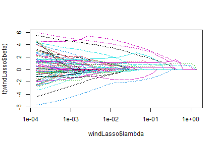
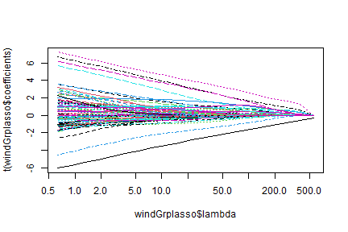
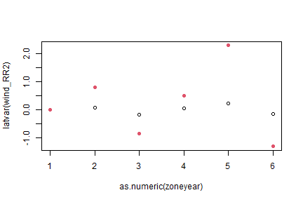
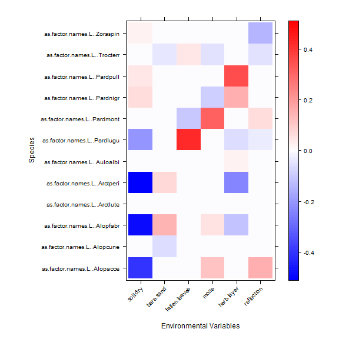

## Exercise 15.1: Predicting fish communities at wind farms?
*Consider again Lena’s wind farm study (Exericise 14.3). She would like to predict what fish occur where. What type of model should she use, to get the best predictions?*

The focus here is prediction so she should be using some model designed to have good predictive performance. One thing that might help is putting random effects on terms, that take different values for different species, to borrow strength across species.

## Exercise 15.2: Which environmental variables predict hunting spider communities?
*Petrus set up 28 pitfall traps on sand dunes, in different environmental conditions (in the open, under shrubs, etc) and classified all hunting spiders that fell into the trap to species. He measured six environmental variables characterising each site. He would like to know: Which environmental variables best predict hunting spider communities?*

*What analysis approach should he use?*

This is a variable selection problem, he should be using multivariate model selection techniques. One approach is to construct models designed to be pretty good for prediction, and choose the one with best predictive performance. For example, he could fit mixed models, with random effects for different species, and use cross-validation to see which set of predictors gives the model has best predictive performance.

## Code Box 15.1: Predictive likelihood for the wind farm data

```r
library(ecostats)
data(windFarms)
set.seed(5) # use this seed to get the same results as below:
nStations = length(levels(as.factor(windFarms$X$Station)))
isTestStn = sample(nStations,nStations/2)
isTest = windFarms$X$Station %in% levels(windFarms$X$Station)[isTestStn]
library(mvabund)
windMV = mvabund(windFarms$abund)
windFt_Train=manyglm(windMV[isTest==FALSE,]~Year+Zone,
      data=windFarms$X[isTest==FALSE,],family="poisson")
windFt_Int_Train=manyglm(windMV[isTest==FALSE,]~Year*Zone,
      data=windFarms$X[isTest==FALSE,],family="poisson")
prWind_Test = predict.manyglm(windFt_Train,newdata=windFarms$X[isTest,], type="response")
prWind_Int_Test = predict.manyglm(windFt_Int_Train, newdata=windFarms$X[isTest,], type="response")
predLogL = dpois(windMV[isTest,],lambda=prWind_Test,log=TRUE)
predLogL_Int = dpois(windMV[isTest,],lambda=prWind_Int_Test,log=TRUE)
c(sum(predLogL),sum(predLogL_Int))
#> [1] -931.5643 -928.3885
```
*What do these results tell us about which model is preferred?*

These results suggest the main effect model is better.


## Exercise 15.3: Cross-validation for wind farm data and rare species
*Repeat the analyses of Code Box 15.1 but after removing rare species (observed less than 10 times), using the following code:*

```r
notRare=colSums(windMV>0)>10
windMVnotRare=mvabund(windFarms$abund[,notRare])
```


```r
windFt_TrainRare=manyglm(windMVnotRare[isTest==FALSE,]~Year+Zone,
      data=windFarms$X[isTest==FALSE,],family="poisson")
windFt_Int_TrainRare=manyglm(windMVnotRare[isTest==FALSE,]~Year*Zone,
      data=windFarms$X[isTest==FALSE,],family="poisson")
prWind_TestRare = predict.manyglm(windFt_TrainRare,newdata=windFarms$X[isTest,], type="response")
prWind_Int_TestRare = predict.manyglm(windFt_Int_TrainRare, newdata=windFarms$X[isTest,], type="response")
predLogLRare = dpois(windMVnotRare[isTest,],lambda=prWind_TestRare,log=TRUE)
predLogL_IntRare = dpois(windMVnotRare[isTest,],lambda=prWind_Int_TestRare,log=TRUE)
c(sum(predLogLRare),sum(predLogL_IntRare))
#> [1] -781.0415 -788.9616
```

*Did you get a similar answer?*

Nope -- now the model with an interaction term looks better!

*Note that so far we have only considered one test sample, and there is randomness in the choice of training/test split. Repeat the analyses of Code Box 15.1 as well as those you have done here, with and without rare species, multiple times (which is a form of cross-validation).*


```r
set.seed(1) # use this seed to get the same results as below:
nStations = length(levels(as.factor(windFarms$X$Station)))
isTestStn = sample(nStations,nStations/2)
isTest = windFarms$X$Station %in% levels(windFarms$X$Station)[isTestStn]
windFt_Train=manyglm(windMV[isTest==FALSE,]~Year+Zone,
      data=windFarms$X[isTest==FALSE,],family="poisson")
windFt_Int_Train=manyglm(windMV[isTest==FALSE,]~Year*Zone,
      data=windFarms$X[isTest==FALSE,],family="poisson")
prWind_Test = predict.manyglm(windFt_Train,newdata=windFarms$X[isTest,], type="response")
prWind_Int_Test = predict.manyglm(windFt_Int_Train, newdata=windFarms$X[isTest,], type="response")
predLogL = dpois(windMV[isTest,],lambda=prWind_Test,log=TRUE)
predLogL_Int = dpois(windMV[isTest,],lambda=prWind_Int_Test,log=TRUE)
c(sum(predLogL),sum(predLogL_Int))
#> [1] -915.8434 -970.8314

windFt_TrainRare=manyglm(windMVnotRare[isTest==FALSE,]~Year+Zone,
      data=windFarms$X[isTest==FALSE,],family="poisson")
windFt_Int_TrainRare=manyglm(windMVnotRare[isTest==FALSE,]~Year*Zone,
      data=windFarms$X[isTest==FALSE,],family="poisson")
prWind_TestRare = predict.manyglm(windFt_TrainRare,newdata=windFarms$X[isTest,], type="response")
prWind_Int_TestRare = predict.manyglm(windFt_Int_TrainRare, newdata=windFarms$X[isTest,], type="response")
predLogLRare = dpois(windMVnotRare[isTest,],lambda=prWind_TestRare,log=TRUE)
predLogL_IntRare = dpois(windMVnotRare[isTest,],lambda=prWind_Int_TestRare,log=TRUE)
c(sum(predLogLRare),sum(predLogL_IntRare))
#> [1] -734.4901 -780.1963
```


```r
set.seed(2) # use this seed to get the same results as below:
nStations = length(levels(as.factor(windFarms$X$Station)))
isTestStn = sample(nStations,nStations/2)
isTest = windFarms$X$Station %in% levels(windFarms$X$Station)[isTestStn]
library(mvabund)
windMV = mvabund(windFarms$abund)
windFt_Train=manyglm(windMV[isTest==FALSE,]~Year+Zone,
      data=windFarms$X[isTest==FALSE,],family="poisson")
windFt_Int_Train=manyglm(windMV[isTest==FALSE,]~Year*Zone,
      data=windFarms$X[isTest==FALSE,],family="poisson")
prWind_Test = predict.manyglm(windFt_Train,newdata=windFarms$X[isTest,], type="response")
prWind_Int_Test = predict.manyglm(windFt_Int_Train, newdata=windFarms$X[isTest,], type="response")
predLogL = dpois(windMV[isTest,],lambda=prWind_Test,log=TRUE)
predLogL_Int = dpois(windMV[isTest,],lambda=prWind_Int_Test,log=TRUE)
c(sum(predLogL),sum(predLogL_Int))
#> [1] -886.4941 -992.3476

windFt_TrainRare=manyglm(windMVnotRare[isTest==FALSE,]~Year+Zone,
      data=windFarms$X[isTest==FALSE,],family="poisson")
windFt_Int_TrainRare=manyglm(windMVnotRare[isTest==FALSE,]~Year*Zone,
      data=windFarms$X[isTest==FALSE,],family="poisson")
prWind_TestRare = predict.manyglm(windFt_TrainRare,newdata=windFarms$X[isTest,], type="response")
prWind_Int_TestRare = predict.manyglm(windFt_Int_TrainRare, newdata=windFarms$X[isTest,], type="response")
predLogLRare = dpois(windMVnotRare[isTest,],lambda=prWind_TestRare,log=TRUE)
predLogL_IntRare = dpois(windMVnotRare[isTest,],lambda=prWind_Int_TestRare,log=TRUE)
c(sum(predLogLRare),sum(predLogL_IntRare))
#> [1] -756.8341 -865.5058
```


```r
set.seed(3) # use this seed to get the same results as below:
nStations = length(levels(as.factor(windFarms$X$Station)))
isTestStn = sample(nStations,nStations/2)
isTest = windFarms$X$Station %in% levels(windFarms$X$Station)[isTestStn]
library(mvabund)
windMV = mvabund(windFarms$abund)
windFt_Train=manyglm(windMV[isTest==FALSE,]~Year+Zone,
      data=windFarms$X[isTest==FALSE,],family="poisson")
windFt_Int_Train=manyglm(windMV[isTest==FALSE,]~Year*Zone,
      data=windFarms$X[isTest==FALSE,],family="poisson")
prWind_Test = predict.manyglm(windFt_Train,newdata=windFarms$X[isTest,], type="response")
prWind_Int_Test = predict.manyglm(windFt_Int_Train, newdata=windFarms$X[isTest,], type="response")
predLogL = dpois(windMV[isTest,],lambda=prWind_Test,log=TRUE)
predLogL_Int = dpois(windMV[isTest,],lambda=prWind_Int_Test,log=TRUE)
c(sum(predLogL),sum(predLogL_Int))
#> [1] -830.5662 -832.3659

windFt_TrainRare=manyglm(windMVnotRare[isTest==FALSE,]~Year+Zone,
      data=windFarms$X[isTest==FALSE,],family="poisson")
windFt_Int_TrainRare=manyglm(windMVnotRare[isTest==FALSE,]~Year*Zone,
      data=windFarms$X[isTest==FALSE,],family="poisson")
prWind_TestRare = predict.manyglm(windFt_TrainRare,newdata=windFarms$X[isTest,], type="response")
prWind_Int_TestRare = predict.manyglm(windFt_Int_TrainRare, newdata=windFarms$X[isTest,], type="response")
predLogLRare = dpois(windMVnotRare[isTest,],lambda=prWind_TestRare,log=TRUE)
predLogL_IntRare = dpois(windMVnotRare[isTest,],lambda=prWind_Int_TestRare,log=TRUE)
c(sum(predLogLRare),sum(predLogL_IntRare))
#> [1] -734.7738 -738.2911
```
*Which set of results tends to be more reliable (less variable) – the ones with or without the rare species? Why do you think this happened?*

Without the rare species, the results are more reliable, with predictive likelihood usually in the mid -700's, and the interaction model consistently performing better (although sometimes narrowly so). With rare species, it bounces around a lot more, with the smaller model (main effects only) sometimes having better predictive performance. This is likely because rare species with all absences in one treatment combination can blow up the predictive likelihood (if they are predicted to have a mean of zero, but have some non-zero cases in test data).

## Code Box 15.2: Fitting a mixed model to the wind farm data

```r
windComp = manyglm(windMV~Zone*Year,data=windFarms$X,composition=TRUE)
library(glmmTMB)
wind_glmm = glmmTMB(windMV~Year*Zone+diag(Year*Zone|cols),
family=poisson(), data=windComp$data)
summary(wind_glmm)
#>  Family: poisson  ( log )
#> Formula:          windMV ~ Year * Zone + diag(Year * Zone | cols)
#> Data: windComp$data
#> 
#>      AIC      BIC   logLik deviance df.resid 
#>   3259.9   3331.4  -1617.9   3235.9     2852 
#> 
#> Random effects:
#> 
#> Conditional model:
#>  Groups Name           Variance Std.Dev. Corr                     
#>  cols   (Intercept)    5.3421   2.3113                            
#>         Year2010       1.6302   1.2768   0.00                     
#>         ZoneN          0.6807   0.8251   0.00 0.00                
#>         ZoneS          3.9012   1.9751   0.00 0.00 0.00           
#>         Year2010:ZoneN 0.8519   0.9230   0.00 0.00 0.00 0.00      
#>         Year2010:ZoneS 0.3777   0.6146   0.00 0.00 0.00 0.00 0.00 
#> Number of obs: 2864, groups:  cols, 16
#> 
#> Conditional model:
#>                Estimate Std. Error z value Pr(>|z|)    
#> (Intercept)    -3.18913    0.65414  -4.875 1.09e-06 ***
#> Year2010       -0.26989    0.45008  -0.600    0.549    
#> ZoneN          -0.15541    0.35209  -0.441    0.659    
#> ZoneS          -0.16619    0.61670  -0.269    0.788    
#> Year2010:ZoneN  0.08998    0.41305   0.218    0.828    
#> Year2010:ZoneS  0.56211    0.37247   1.509    0.131    
#> ---
#> Signif. codes:  0 '***' 0.001 '**' 0.01 '*' 0.05 '.' 0.1 ' ' 1
```

## Exercise 15.4: Predictive likelihood for wind farm mixed model
*Calculate the predictive likelihood for the mixed model fitted to the wind farm data (Code Box 15.2), following the method in Code Box 15.1.*


```r
isTest = windComp$data$Station %in% levels(windComp$data$Station)[isTestStn]
wind_glmm = glmmTMB(windMV~Year*Zone+diag(Year*Zone|cols),
  family=poisson(), data=windComp$data[isTest==FALSE,])
prGLMM_Test = predict(wind_glmm, newdata=windComp$data[isTest==TRUE,], type="response")
predGLMM = sum(dpois(windComp$data$windMV[isTest==TRUE],lambda=prGLMM_Test,log=TRUE))
c(predGLMM,sum(predLogL))
#> [1] -744.1239 -830.5662
```

*Did this have better predictive performance? Why do you think this happened?*

This did waaaay better than `manyglm`. Probably because it was borrowing strength across species to better predict rare ones, not overfitting quite as badly.


## Code Box 15.3: Fitting a LASSO to the wind farm data via glmnet


```r
library(glmnet)
X = model.matrix(windMV~Year*Zone*cols,data=windComp$data)
y = windComp$data$windMV
windLasso = glmnet(X,y, family="poisson")
isTest = windComp$data$Station %in%
levels(windComp$data$Station)[isTestStn]
windLassoTrain = glmnet(X[isTest==FALSE,], y[isTest==FALSE], family="poisson")
prLassoTest = predict(windLassoTrain,X[isTest,],type="response")
predLLlasso=colSums(dpois(windComp$data$windMV[isTest],prLassoTest,
log=TRUE))
plot(windLassoTrain$lambda,predLLlasso,type="l",log="x")
```


```r
isBestLambda = which(predLLlasso==max(predLLlasso))
```


```r
matplot(windLasso$lambda,t(windLasso$beta),type="n", log="x")
matlines(windLasso$lambda,t(windLasso$beta))
```



## Code Box 15.4: Fitting a group-LASSO to the wind farm data

```r
library(grplasso)
windLambdaTrain = lambdamax(windMV~Year*Zone*cols, data=windComp$data,
  subset=isTest==FALSE, model = PoissReg()) * 0.7^(0:19)
windGrplasso = grplasso(windMV~Year*Zone*cols, data=windComp$data,
  lambda=windLambdaTrain, subset=isTest==FALSE, model = PoissReg())
#> Lambda: 556.505  nr.var: 16 
#> Lambda: 389.5535  nr.var: 31 
#> Lambda: 272.6875  nr.var: 61 
#> Lambda: 190.8812  nr.var: 61 
#> Lambda: 133.6169  nr.var: 61 
#> Lambda: 93.5318  nr.var: 61 
#> Lambda: 65.47226  nr.var: 91 
#> Lambda: 45.83058  nr.var: 91 
#> Lambda: 32.08141  nr.var: 91 
#> Lambda: 22.45699  nr.var: 91 
#> Lambda: 15.71989  nr.var: 91 
#> Lambda: 11.00392  nr.var: 91 
#> Lambda: 7.702746  nr.var: 91 
#> Lambda: 5.391922  nr.var: 91 
#> Lambda: 3.774346  nr.var: 91 
#> Lambda: 2.642042  nr.var: 91 
#> Lambda: 1.849429  nr.var: 91 
#> Lambda: 1.294601  nr.var: 91 
#> Lambda: 0.9062204  nr.var: 91 
#> Lambda: 0.6343543  nr.var: 91
prGrpTest = predict(windGrplasso,newdata=windComp$data[isTest,], type="response")
predLLgrplasso = colSums(dpois(windComp$data$windMV[isTest], prGrpTest,log=TRUE))
plot(windGrplasso$lambda,predLLgrplasso,log="x",type="l")
```


```r
isBestLambdaGrplasso = which(predLLgrplasso==max(predLLgrplasso))
```


```r
matplot(windGrplasso$lambda,t(windGrplasso$coefficients),type="n",log="x")
matlines(windGrplasso$lambda,t(windGrplasso$coefficients))
```



## Exercise 15.5: Comparing predictive likelihoods for the wind farm data
*Compare the predictive log-likelihoods from Code Box 15.1 and Figures 15.1c-d. These models were all applied using the same test dataset. Which model seems to fit the data better? Why do you think this is?*


```r
c(sum(predLogL),sum(predLogL_Int), max(predLLlasso), max(predLLgrplasso))
#> [1] -830.5662 -832.3659 -744.2159 -739.6487
```

The LASSO models fit way better, as expected.  These models shrink parameters together, borrowing strength across taxa. The two LASSO fits did about as well as each other.

## Code Box 15.5: Reduced rank regression for the wind farm data

```r
library(VGAM)
#> Loading required package: stats4
#> Loading required package: splines
#> 
#> Attaching package: 'VGAM'
#> The following object is masked from 'package:vegan':
#> 
#>     calibrate
#> The following objects are masked from 'package:psych':
#> 
#>     fisherz, logistic, logit
#> The following object is masked from 'package:coda':
#> 
#>     nvar
#> The following object is masked from 'package:glmmTMB':
#> 
#>     betabinomial
#> The following object is masked from 'package:car':
#> 
#>     logit
wind_RR2=rrvglm(as.matrix(windFarms$abund)~Year*Zone, family=poissonff, data=windFarms$X, Rank=2)
wind_manyglm = manyglm(windMV~Year*Zone, data=windFarms$X, family=poisson())
c( BIC(wind_RR2), sum(BIC(wind_manyglm)))
#> [1] 3318.548 3471.901
zoneyear = interaction(windFarms$X$Zone,windFarms$X$Year)
matplot(as.numeric(zoneyear),latvar(wind_RR2),pch=c(1,19))
```



*Which model fits better, according to BIC?*

The reduced rank approach fits better.

## Code Box 15.6: Using the LASSO for Petrus’s spider data


```r
library(mvabund)
data(spider)
spid.trait = traitglm(spider$abund,spider$x,method="cv.glm1path")
#> No traits matrix entered, so will fit SDMs with different env response for each spp
```


```r
library(lattice)
a = max( abs(spid.trait$fourth.corner) )
colort = colorRampPalette(c("blue","white","red"))
plot.4th = levelplot(t(as.matrix(spid.trait$fourth.corner)),
xlab="Environmental Variables", ylab="Species",
col.regions=colort(100), at=seq(-a, a, length=100),
scales = list( x= list(rot = 45)) )
print(plot.4th)
```



*Which environmental variables seem to have the strongest effect on spider abundances?*

`soil.dry` has some strongly negative coefficients, `fallen.leaves` and `herb.layer` also have some strong (but positive) interactions.

## Code Box 15.7: Mixed model prediction of spider abundances


```r
spidXY = data.frame(scale(spider$x),spider$abund) # scale standardises data!
library(reshape2)
spiderLong = melt(id=1:6,spidXY,variable.name="cols")
Xformula = paste(colnames(spider$x),collapse="+")
fullFormula = formula(paste0("value~cols+",Xformula,"+(",Xformula,"|cols)"))
library(glmmTMB)
spid_glmm = glmmTMB(fullFormula,family=nbinom2(),data=spiderLong)
#> Warning in fitTMB(TMBStruc): Model convergence problem; non-positive-definite Hessian matrix. See vignette('troubleshooting')
#> Warning in fitTMB(TMBStruc): Model convergence problem; false convergence (8). See vignette('troubleshooting')
summary(spid_glmm)
#>  Family: nbinom2  ( log )
#> Formula:          value ~ cols + soil.dry + bare.sand + fallen.leaves + moss +      herb.layer + reflection + (soil.dry + bare.sand + fallen.leaves +  
#>     moss + herb.layer + reflection | cols)
#> Data: spiderLong
#> 
#>      AIC      BIC   logLik deviance df.resid 
#>       NA       NA       NA       NA      289 
#> 
#> Random effects:
#> 
#> Conditional model:
#>  Groups Name          Variance Std.Dev. Corr                                
#>  cols   (Intercept)   0.6198   0.7873                                       
#>         soil.dry      1.8397   1.3564   -0.88                               
#>         bare.sand     0.1567   0.3959   -0.10 -0.08                         
#>         fallen.leaves 0.4022   0.6342    0.67 -0.67 -0.68                   
#>         moss          0.2354   0.4852   -0.70  0.40  0.51 -0.59             
#>         herb.layer    0.6003   0.7748   -0.91  0.82 -0.20 -0.40  0.47       
#>         reflection    0.6677   0.8172    0.15 -0.52  0.33  0.20  0.40 -0.33 
#> Number of obs: 336, groups:  cols, 12
#> 
#> Dispersion parameter for nbinom2 family ():  1.5 
#> 
#> Conditional model:
#>               Estimate Std. Error z value Pr(>|z|)    
#> (Intercept)    0.16776    0.47850   0.351 0.725894    
#> colsAlopcune   0.54986    0.33996   1.617 0.105785    
#> colsAlopfabr  -1.63899    0.58105  -2.821 0.004792 ** 
#> colsArctlute  -1.97278    0.82953  -2.378 0.017398 *  
#> colsArctperi  -4.54237    1.35504  -3.352 0.000802 ***
#> colsAuloalbi   0.07721    0.53723   0.144 0.885718    
#> colsPardlugu  -1.36175    0.81877  -1.663 0.096279 .  
#> colsPardmont   1.70514    0.42854   3.979 6.92e-05 ***
#> colsPardnigr   0.92672    0.65593   1.413 0.157703    
#> colsPardpull   1.12798    0.72752   1.550 0.121034    
#> colsTrocterr   2.26516    0.54456   4.160 3.19e-05 ***
#> colsZoraspin   0.34212    0.69131   0.495 0.620682    
#> soil.dry       0.65262    0.42430   1.538 0.124020    
#> bare.sand      0.06150    0.15994   0.385 0.700601    
#> fallen.leaves -0.35286    0.26457  -1.334 0.182309    
#> moss           0.13402    0.18688   0.717 0.473289    
#> herb.layer     1.10662    0.27995   3.953 7.72e-05 ***
#> reflection    -0.03521    0.29688  -0.119 0.905585    
#> ---
#> Signif. codes:  0 '***' 0.001 '**' 0.01 '*' 0.05 '.' 0.1 ' ' 1
```

There are some convergence warnings here, which is fair enough because there are only 12 species but heaps of correlated terms in this model. Results seem to be reasonably stable on multiple runs, tweaking some settings, so we'll go with this fit.

*Which predictors seem to be most important to spider community composition?*

The largest variance component, by some margin, is for `soil.dry` (about 1.8), followed by `herb.layer` and `reflection`.
