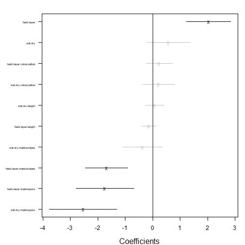

## Exercise 16.1: Understanding how spiders vary in environmental response
*Consider again Petrus’s hunting spider data of Exercise 15.2. He established (e.g. in Code Box 15.7) that different species respond differently to environmental gradients, especially so for soil dryness, herb layer and reflectance. He would like to know what the main types of environmental response were, across species.*

*What approach should he use to answer this question?*

He wants to understand *how* taxa vary in environmental response, so he could use a Species Archetype Model to classify species according to type of environmental response.

## Code Box 16.1: Fitting a Species Archetype Model to Petrus’s spider data

Run the below lines to install `ecomix`:

```r
library(devtools)
install_github("skiptoniam/ecomix")
```

Code to fit `ecomix` will only be run if it is installed (the if statement is included because CRAN policies require vignettes to be able to be run only using packages that can be installed from CRAN)


```r
is_ecomix_installed = requireNamespace("ecomix", quietly = TRUE)
library(mvabund)
data(spider)
SpiderDF=spider$x
SpiderDF$abund=as.matrix(spider$abund)
spiderFormula = abund ~ soil.dry + bare.sand + fallen.leaves + moss +
herb.layer + reflection
if(is_ecomix_installed)
{
  ft_Mix = ecomix::species_mix(spiderFormula, data=SpiderDF, family="negative.binomial", nArchetypes=2, control=list(init_method='kmeans',ecm_refit=5, ecm_steps=2) )
  coef(ft_Mix)$beta
}
#> SAM modelling
#> There are 2 archetypes to group the species into
#> There are 28 site observations for 12 species
#> The model for the archetype (grouping) is ~soil.dry + bare.sand + fallen.leaves + moss + herb.layer + reflection
#> The model for the species is ~1
#> You are implementing a negative.binomial Species Archetype Model.
#> Using ECM algorithm to find starting values; using 5 refits
#> ECM restart 1 of 5
#> Initialising starting values
#> Initial groups parameter estimates by K-means clustering
#> Iteration: 1 | New loglik -1041.731 | Ratio loglik 0
#> Iteration: 2 | New loglik -834.997 | Ratio loglik 0.801548
#> ECM restart 2 of 5
#> Initialising starting values
#> Initial groups parameter estimates by K-means clustering
#> Iteration: 1 | New loglik -1041.731 | Ratio loglik 0
#> Iteration: 2 | New loglik -834.997 | Ratio loglik 0.801548
#> ECM restart 3 of 5
#> Initialising starting values
#> Initial groups parameter estimates by K-means clustering
#> Iteration: 1 | New loglik -1041.731 | Ratio loglik 0
#> Iteration: 2 | New loglik -834.997 | Ratio loglik 0.801548
#> ECM restart 4 of 5
#> Initialising starting values
#> Initial groups parameter estimates by K-means clustering
#> Iteration: 1 | New loglik -1041.731 | Ratio loglik 0
#> Iteration: 2 | New loglik -834.997 | Ratio loglik 0.801548
#> ECM restart 5 of 5
#> Initialising starting values
#> Initial groups parameter estimates by K-means clustering
#> Iteration: 1 | New loglik -1041.731 | Ratio loglik 0
#> Iteration: 2 | New loglik -834.997 | Ratio loglik 0.801548
#> initial  value 834.997322 
#> iter  10 value 822.933991
#> iter  20 value 818.054221
#> iter  30 value 816.602567
#> iter  40 value 812.844421
#> iter  50 value 793.214165
#> iter  60 value 791.057454
#> iter  70 value 786.683339
#> iter  80 value 778.413169
#> iter  90 value 777.956005
#> final  value 777.933344 
#> converged
#>              soil.dry   bare.sand fallen.leaves       moss herb.layer reflection
#> Archetype1  1.5629184 -0.05470042    -0.2784744 -0.1449658  0.7081518 -0.4730736
#> Archetype2 -0.1069941  0.22420728    -0.2855582  0.4186874  0.5894873  0.4759734
```

*Which predictors vary the most across archetypes (hence across taxa)? Is this what you saw in Code Box 15.7?*

`soil.dry` had the biggest change, jumping from `2.15` to `0.10`. The next biggest changes were in `herb.layer` and `reflection`. This is pretty much what was happening in Code Box 15.7 as well.


## Code Box 16.2: Minding your P’s and Q’s for Petrus’s Species Archetype Model

```r
if(is_ecomix_installed)
  plot(ft_Mix, type="link")
#> Infinite residuals removed from residual plots: 82 in total.
```


*Do model assumptions seem reasonable here?*

This generally looks good, no fan-shape in residual vs fits plot, points close(ish) to a straight line on normal quanitle plot.


## Exercise 16.2: Archetypal revegetation response
*Consider again Anthony’s revegetation study. We would like to better characterise how different invertebrate orders respond to the revegetation treatment. Fit a Species Archetype Model with two archetypes.*


```r
library(ecostats)
data(reveg)
revegDF=data.frame(reveg)
revegDF$abundMat=as.matrix(reveg$abund)
if(is_ecomix_installed)
{
  ft_revegMix = ecomix::species_mix(abundMat~treatment, data=revegDF, family="negative.binomial", nArchetypes=2, control=list(init_method='kmeans',ecm_refit=5, ecm_steps=2) )
  coef(ft_revegMix)$beta
}
#> SAM modelling
#> There are 2 archetypes to group the species into
#> There are 10 site observations for 24 species
#> The model for the archetype (grouping) is ~treatment
#> The model for the species is ~1
#> You are implementing a negative.binomial Species Archetype Model.
#> Using ECM algorithm to find starting values; using 5 refits
#> ECM restart 1 of 5
#> Initialising starting values
#> Initial groups parameter estimates by K-means clustering
#> Iteration: 1 | New loglik -932.547 | Ratio loglik 0
#> Iteration: 2 | New loglik -745.016 | Ratio loglik 0.798905
#> ECM restart 2 of 5
#> Initialising starting values
#> Initial groups parameter estimates by K-means clustering
#> Iteration: 1 | New loglik -932.547 | Ratio loglik 0
#> Iteration: 2 | New loglik -745.016 | Ratio loglik 0.798905
#> ECM restart 3 of 5
#> Initialising starting values
#> Initial groups parameter estimates by K-means clustering
#> Iteration: 1 | New loglik -932.547 | Ratio loglik 0
#> Iteration: 2 | New loglik -745.016 | Ratio loglik 0.798905
#> ECM restart 4 of 5
#> Initialising starting values
#> Initial groups parameter estimates by K-means clustering
#> Iteration: 1 | New loglik -932.547 | Ratio loglik 0
#> Iteration: 2 | New loglik -745.016 | Ratio loglik 0.798905
#> ECM restart 5 of 5
#> Initialising starting values
#> Initial groups parameter estimates by K-means clustering
#> Iteration: 1 | New loglik -932.547 | Ratio loglik 0
#> Iteration: 2 | New loglik -745.016 | Ratio loglik 0.798905
#> initial  value 745.015688 
#> final  value 745.015688 
#> converged
#>            treatmentImpact
#> Archetype1        5.350399
#> Archetype2        1.441362
```

*Explain what the main two types of response to revegetation were, across invertebrate taxa.*

Oh that's odd -- the estimated trend is almost identical for these two groups.

*Look at the posterior probabilities for each Order, identify a few taxa that characterise each response type, and plot the raw data for these taxa. Does the Species Archetype Model seem to capture the main trends in response to revegetation treatment?*

This doesn't seem worthwhile when there are no differences in response across these archetypes!!

## Code Box 16.3: Choosing the number of archetypes for Petrus’s spider data

_This code chunk has not been run, as it takes a minute or so to complete_

```r
if(is_ecomix_installed)
{
  nClust=rep(2:6,3)
  bics = rep(NA, length(nClust))
  for(iClust in 1:length(nClust))
  {
    fti_Mix = ecomix::species_mix(spiderFormula, data=SpiderDF,
      family="negative.binomial", nArchetypes=nClust[iClust],
      control=list(init_method='kmeans',ecm_refit=5, ecm_steps=2))
    bics[iClust] = BIC(fti_Mix)
  }
  plot(bics~nClust, ylab="BIC", xlab="# archetypes")
}
```

*How many archetypes would you use?*

I guess I'd go for four archetypes, that looks like the winner here.

*Note that repeat runs didn't always give the same BIC. Why did this happen?*

As in Maths Box 16.1, mixture model likelihoods can be messy with multiple maxima. Hence it's a good idea to run multiple times and keep the best solution.


## Exercise 16.3: How many revegetation archetypes?
*Consider again a Species Archetype Model for Anthony’s revegetation data. In Exercise 16.2 we assumed there were only two archetypes. How many archetypes should be used for Anthony’s data? Answer this question using the model selection technique of your choice.*

OK I'm going for BIC as above.

_This code chunk has not been run, as it takes a minute or so to complete_

```r
if(is_ecomix_installed)
{
  nClust=rep(1:5,3)
  bics = rep(NA, length(nClust))
  for(iClust in 1:length(nClust))
  {
    fti_Mix = ecomix::species_mix(abundMat~treatment, data=revegDF, 
      family="negative.binomial", nArchetypes=nClust[iClust])
    bics[iClust] = BIC(fti_Mix)
  }
  plot(bics~nClust, ylab="BIC", xlab="# archetypes")
}
```

Well it looks like there should be two archetypes (presumably, one of these is increasing with revegetation, the other not).


## Exercise 16.4: Understanding why spiders vary in environmental response
*Consider again Petrus’s hunting spider data of Exercise 15.2... He wants to know the extent to which species traits explain interspecific variation in environmental response. What approach should he use to answer this question?*

He wants to know *why* species vary in their environmental response, so a good idea would be to include predictors on species (species traits) and to use a fourth corner model to understand the extent to which interspecific variation in environmental response can be explained by these traits.

## Code Box 16.4: A fourth corner model for spider data using traitglm

```r
library(gllvm)
#> 
#> Attaching package: 'gllvm'
#> The following objects are masked from 'package:VGAM':
#> 
#>     AICc, nobs, predict, vcov
#> The following objects are masked from 'package:stats4':
#> 
#>     nobs, vcov
#> The following object is masked from 'package:vegan':
#> 
#>     ordiplot
#> The following object is masked from 'package:mvabund':
#> 
#>     coefplot
#> The following objects are masked from 'package:stats':
#> 
#>     nobs, predict, simulate, vcov
data(spider)
X = spider$x[,c("soil.dry","herb.layer")]
ft_trait = gllvm(spider$abund, X, spider$trait, randomX=~soil.dry+herb.layer, family="negative.binomial")
logLik(ft_trait)
#> 'log Lik.' -711.2906 (df=60)
library(lattice)
a = max( abs(ft_trait$fourth.corner) )
colort = colorRampPalette(c("blue","white","red"))
plot.4th = levelplot(ft_trait$fourth.corner, col.regions=colort(100),
           at=seq(-a, a, length=100), scales = list( x=list(rot = 45)) )
print(plot.4th)
```


```r
coefplot(ft_trait)
```



## Exercise 16.5: Heloise’s ants
*Heloise collected counts of 41 species of ants at 30 sites across south-eastern Australia, stored as `antTraits` in the `mvabund` package. She also recorded five environmental variables at each site, and five functional traits for each species. She would like to know if these traits explain why ant species differ in environmental response. Fit a fourth corner model to this dataset.*


```r
data(antTraits)
envMat = as.matrix(antTraits$env)
```

_(The below code chunk takes about a minute to run.)_


```r
ft_anttrait = gllvm(antTraits$abund, envMat, antTraits$traits, randomX=~envMat, family="negative.binomial", starting.val="zero")
logLik(ft_anttrait)
#> 'log Lik.' -1919.352 (df=223)
library(lattice)
a = max( abs(ft_anttrait$fourth.corner) )
colort = colorRampPalette(c("blue","white","red"))
plot_4th = levelplot(t(as.matrix(ft_anttrait$fourth.corner)),
  col.regions=colort(100), at=seq(-a, a, length=100),
  scales = list( x= list(rot = 45)) )
print(plot_4th)
```


```r
coefplot(ft_anttrait)
```


This doesn't always produce a `coefplot` because of infinite values -- this is symptomatic of non-convergence. Make sure you end up with a `logLik` value of about `-2300` or better, if this doesn't happen then re-run. I ended up using `starting.val="zero"` which usually gave better fits (it doesn't always but did this time around).

*What are the key traits that capture why (and how) ants differ in environment response?*

A big one seems to be `Canopy.cover:polymorphism`. `Canopy.cover:Pilosity` also seemed to be very negative in most runs, but with a fairly large standard error.

*Don't forget to check your P's and Q's!*

_The below code chunk has not been evaluated because it is a function of the previous one_

```r
par(mfrow=c(1,2),mgp=c(1.75,0.75,0),mar=c(3,3,1,1))
plot(ft_anttrait, which=1:2)
```

This looks good to me. The points on the normal quantile plot don't all stay in the envelope (which is pointwise not global, so is tighter than it should be), but the violations we have are not of the alarming kind -- residuals are smaller in magnitude than expected, rather than too large. This is often symptomatic of overfitting rather than lack-of-fit -- the model does have a lot of parameters in it!


## Code Box 16.5: A fourth corner interaction plot for Petrus’s spider data


```r
nVars = dim(spider$abund)[2]
newTraits = spider$trait
# set factors not of interest here to be a constant value
newTraits$length= mean(spider$trait$length) #set length to its mean
newTraits$colour=factor(rep(levels(spider$trait$colour)[1],nVars),
   levels=levels(spider$trait$colour)) #set to first level of factor
# set starting rows of ’marks’ to take all possible values
nMarks = nlevels(spider$trait$marks)
newTraits$marks[1:nMarks]=levels(spider$trait$marks)
# create a new env dataset where the only thing that varies is soil:
newEnv = spider$x[1:2,c("soil.dry","herb.layer")]
newEnv[,"soil.dry"]=range(scale(spider$x[,"soil.dry"]))
newEnv[,"herb.layer"]=0
#make predictions and plot:
newPreds = predict(ft_trait,newX=newEnv,newTR=newTraits,type="response", level=0)
matplot(newEnv[,1], newPreds[,1:nMarks],type="l", log="y")
legend("topright",levels(newTraits$marks),lty=1:nMarks,col=1:nMarks)
```


## Exercise 16.6: A fourth corner interaction plot for Heloise’s ants
*Recall that fourth corner model you fitted to Heloise’s data in Exercise 16.5. For an interaction of your choice, construct a plot to visualise how the environment-abundance association changes for different values of the functional trait.*

I'm going with `Canopy.cover:Polymorphism`, as the one with the biggest (and only significant) interaction term:

_The below code chunk has not been evaluated because it is a function of the previous one_


```r
nVars = dim(antTraits$abund)[2]
newTraits = antTraits$traits
#set length vars to their mean
newTraits$Femur.length= mean(antTraits$traits$Femur.length) 
newTraits$Webers.length= mean(antTraits$traits$Webers.length)
# set factors not of interest here to be a constant value
newTraits$No.spines=rep(0,nVars)
newTraits$Pilosity = factor(rep(levels(antTraits$traits$Pilosity)[1],nVars),
# set first few levels of Polymorphism to all possible values
levels=levels(antTraits$traits$Pilosity)) #set to first level of factor
nPoly = nlevels(antTraits$traits$Polymorphism)
newTraits$Polymorphism[1:nPoly]=levels(antTraits$traits$Polymorphism)
# create a new env dataset where the only thing that varies is Canopy.cover:
newEnv = antTraits$env
newEnv$Canopy.cover=range(scale(newEnv$Canopy.cover))
newEnv$Bare.ground = mean(newEnv$Bare.ground)
newEnv$Shrub.cover = mean(newEnv$Shrub.cover)
newEnv$Volume.lying.CWD = mean(newEnv$Volume.lying.CWD)
newEnv$Feral.mammal.dung = mean(newEnv$Feral.mammal.dung)
newEnv=as.matrix(newEnv)
#make predictions and plot:
newPreds = predict(ft_anttrait,newX=newEnv,newTR=newTraits,type="response", level=0)
matplot(newEnv[,"Canopy.cover"], newPreds[,1:nPoly],type="l", ylab="Mean abundance", xlab="Canopy cover", log="y")
legend("topright",levels(newTraits$Polymorphism),lty=1:nPoly,col=1:nPoly)
```

We can see there that when there is no polymorphism, abundance is relatively high with low canopy cover.


## Code Box 16.6: Quantifying how effectively traits explain 𝛽-diversity

```r
ft_spp = gllvm(spider$abund, X, family="negative.binomial")
ft_trait = gllvm(spider$abund, X, spider$trait, family="negative.binomial")
ft_main = gllvm(spider$abund, X, spider$trait, family="negative.binomial", formula=~soil.dry+herb.layer)
an_spider4th = anova(ft_main, ft_trait, ft_spp)
#> Model  1 :  ~ soil.dry + herb.layer 
#> Model  2 :  y ~ soil.dry + herb.layer + (soil.dry + herb.layer):(length + colour + marks) 
#> Model  3 :  y ~ X
an_spider4th
#>   Resid.Df        D Df.diff     P.value
#> 1      287  0.00000       0            
#> 2      279 40.12996       8 3.02999e-06
#> 3      265 76.84430      14 1.08408e-10
an_spider4th$D[2]/sum(an_spider4th$D)
#> [1] 0.3430666
```

## Exercise 16.7: Variation explained by traits for Heloise’s ants
*Consider again Heloise’s ant data. What proportion of the variation in environmental response is explained by the measured species traits?*


```r
ft_antspp = gllvm(antTraits$abund, envMat, family="negative.binomial")
ft_anttrait = gllvm(antTraits$abund, envMat, antTraits$traits, family="negative.binomial")
mainFormula=as.formula(paste("~", paste(colnames(envMat),collapse="+")))
ft_antmain = gllvm(antTraits$abund, envMat, antTraits$traits, family="negative.binomial", formula=mainFormula)
an_ant4th = anova(ft_antmain, ft_anttrait, ft_antspp)
#> Warning in anova.gllvm(ft_antmain, ft_anttrait, ft_antspp): This test was not designed for tests with a df.diff larger than 20 so the P-value should be treated as approximate.
#> Model  1 :  ~ Bare.ground + Canopy.cover + Shrub.cover + Volume.lying.CWD + Feral.mammal.dung 
#> Model  2 :  y ~ Bare.ground + Canopy.cover + Shrub.cover + Volume.lying.CWD + Feral.mammal.dung + (Bare.ground + Canopy.cover + Shrub.cover + Volume.lying.CWD + Feral.mammal.dung):(Femur.length + No.spines + Pilosity + Polymorphism + Webers.length) 
#> Model  3 :  y ~ X
an_ant4th
#>   Resid.Df         D Df.diff     P.value
#> 1     1062   0.00000       0            
#> 2     1022  75.73794      40 0.000548758
#> 3      862 271.85048     160 8.23701e-08
an_ant4th$D[2]/sum(an_ant4th$D)
#> [1] 0.2178955
```

So it looks like about a quarter of interspecific variation can be explained by traits, which is not super, especially considering that the trait model uses a quarter as many parameters. This suggests we are not really onto a winner here...


#remove this chunk once gllvm has been updated on CRAN:

