## Exercise 3.1: Global plant height

*Can latitudinal variation in plant height be explained by climate?*
This is a hypothesis testing question: we want to know if there is a relationship between height and latitude, after controlling for climate.

This research question now involves several variables: *height* (quantitative), *latitude* (quantitative) and *climate*. How climate is measured has not been specified here, but it typically involves quantitative measurements of temperature, precipitation and often related variables.

We will answer this question using multiple regression, a type of linear model, see Code Box 3.2.


## Code Box 3.1: Simple linear regression of global plant height data - predicting
height as a function of latitude only.


```r
 library(ecostats)
 data(globalPlants)
 ft_heightLat=lm(height~lat, data=globalPlants)
 summary(ft_heightLat)
#> 
#> Call:
#> lm(formula = height ~ lat, data = globalPlants)
#> 
#> Residuals:
#>     Min      1Q  Median      3Q     Max 
#> -15.740  -7.905  -5.289   4.409  68.326 
#> 
#> Coefficients:
#>             Estimate Std. Error t value Pr(>|t|)    
#> (Intercept) 17.00815    2.61957   6.493 1.66e-09 ***
#> lat         -0.20759    0.06818  -3.045  0.00282 ** 
#> ---
#> Signif. codes:  0 '***' 0.001 '**' 0.01 '*' 0.05 '.' 0.1 ' ' 1
#> 
#> Residual standard error: 13.59 on 129 degrees of freedom
#> Multiple R-squared:  0.06705,	Adjusted R-squared:  0.05982 
#> F-statistic: 9.271 on 1 and 129 DF,  p-value: 0.002823
```


## Code Box 3.2: Multiple linear regression of global plant height data on R -- predicting
plant height as a function of annual precipitation and latitude.

Note the code is almost the same as for simple linear regression -- just add an extra predictor variable!

```r
 ft_heightRainLat=lm(height~rain+lat, data=globalPlants)
 summary(ft_heightRainLat)
#> 
#> Call:
#> lm(formula = height ~ rain + lat, data = globalPlants)
#> 
#> Residuals:
#>     Min      1Q  Median      3Q     Max 
#> -16.965  -7.144  -3.529   2.317  65.434 
#> 
#> Coefficients:
#>              Estimate Std. Error t value Pr(>|t|)   
#> (Intercept)  5.223135   4.317148   1.210  0.22856   
#> rain         0.005503   0.001637   3.363  0.00102 **
#> lat         -0.052507   0.080197  -0.655  0.51381   
#> ---
#> Signif. codes:  0 '***' 0.001 '**' 0.01 '*' 0.05 '.' 0.1 ' ' 1
#> 
#> Residual standard error: 13.08 on 128 degrees of freedom
#> Multiple R-squared:  0.1428,	Adjusted R-squared:  0.1294 
#> F-statistic: 10.66 on 2 and 128 DF,  p-value: 5.226e-05
```

## Code Box 3.3: R code to produce the plots of Figure 3.1


```r
library(car)
avPlots(ft_heightLat, terms = ~lat, xlab="Latitude", ylab="Height",
grid=FALSE) ##left plot
```

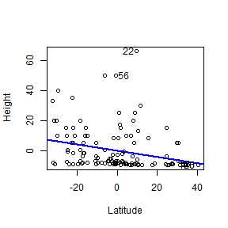

```r
avPlots(ft_heightRainLat, terms = ~lat, xlab="Latitude|rain",
ylab="Height|rain", grid=FALSE) ## right plot
```

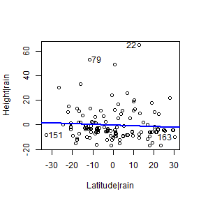

## Code Box 3.4: Tests of multiple parameters on R using the anova function


```r
 ft_Lat=lm(height~lat,data=globalPlants)
 ft_LatClim=lm(height~lat+rain+temp,data=globalPlants)
 anova(ft_Lat,ft_LatClim)
#> Analysis of Variance Table
#> 
#> Model 1: height ~ lat
#> Model 2: height ~ lat + rain + temp
#>   Res.Df   RSS Df Sum of Sq     F   Pr(>F)   
#> 1    129 23818                               
#> 2    127 21794  2    2023.9 5.897 0.003556 **
#> ---
#> Signif. codes:  0 '***' 0.001 '**' 0.01 '*' 0.05 '.' 0.1 ' ' 1
```
 
##  Code Box 3.5: Multi-collinearity example -- adding rainfall in the wettest month (rain.wetm) to a model that already has annual precipitation (rain).

Note that standard errors are larger and suddenly everything is non-significant.


```r
 ft_climproblems=lm(height~rain+rain.wetm+lat,data=globalPlants)
 summary(ft_climproblems)
#> 
#> Call:
#> lm(formula = height ~ rain + rain.wetm + lat, data = globalPlants)
#> 
#> Residuals:
#>     Min      1Q  Median      3Q     Max 
#> -16.868  -7.286  -3.472   2.345  65.196 
#> 
#> Coefficients:
#>              Estimate Std. Error t value Pr(>|t|)
#> (Intercept)  4.907914   4.607746   1.065    0.289
#> rain         0.004911   0.003370   1.457    0.148
#> rain.wetm    0.004686   0.023283   0.201    0.841
#> lat         -0.046927   0.085140  -0.551    0.582
#> 
#> Residual standard error: 13.12 on 127 degrees of freedom
#> Multiple R-squared:  0.143,	Adjusted R-squared:  0.1228 
#> F-statistic: 7.066 on 3 and 127 DF,  p-value: 0.0001977
```


## Exercise 3.2: Plant height data -- transform response?


```r
 par(mfrow=c(1,2),mar=c(3,3,1,1),mgp=c(1.75,0.75,0))
 globalPlants$loght = log(globalPlants$height)
 ft_logheightRainLat=lm(loght~rain+lat, data=globalPlants)
 plotenvelope(ft_logheightRainLat)
#> Registered S3 method overwritten by 'GET':
#>   method       from 
#>   print.fclust e1071
```

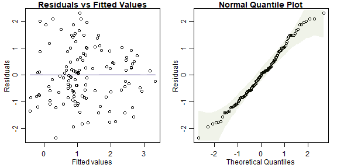

```r
 summary(ft_logheightRainLat)
#> 
#> Call:
#> lm(formula = loght ~ rain + lat, data = globalPlants)
#> 
#> Residuals:
#>     Min      1Q  Median      3Q     Max 
#> -3.3508 -1.0542 -0.0468  0.9755  3.2702 
#> 
#> Coefficients:
#>               Estimate Std. Error t value Pr(>|t|)   
#> (Intercept)  1.4974481  0.4752634   3.151  0.00203 **
#> rain         0.0005400  0.0001802   2.997  0.00328 **
#> lat         -0.0273834  0.0088286  -3.102  0.00237 **
#> ---
#> Signif. codes:  0 '***' 0.001 '**' 0.01 '*' 0.05 '.' 0.1 ' ' 1
#> 
#> Residual standard error: 1.439 on 128 degrees of freedom
#> Multiple R-squared:  0.2548,	Adjusted R-squared:  0.2432 
#> F-statistic: 21.89 on 2 and 128 DF,  p-value: 6.68e-09
```

These diagnostic plots look a lot better.

But now results have changed -- the effect of latitude, after controlling for rainfall, is significant! These results are more trustworthy than the previous ones because assumptions are looking reasonable now, whereas before we had strong right-skew.

Results changing is not entirely unexpected here. Least squares methods have low power when applied to strongly skewed data. What happened here is that there was a (fairly strong)  pattern in the data, with latitudinal effects that are not explained by rainfall, but we couldn't see this before because data were strongly skewed, which makes it hard to see anything.

## Exercise 3.3: Plant height -- skewed rainfall data?

```r
 par(mfrow=c(1,2),mar=c(3,3,1,1),mgp=c(1.75,0.75,0))
 globalPlants$logRain = log(globalPlants$rain)
 hist(globalPlants$rain)
 hist(globalPlants$logRain)
```

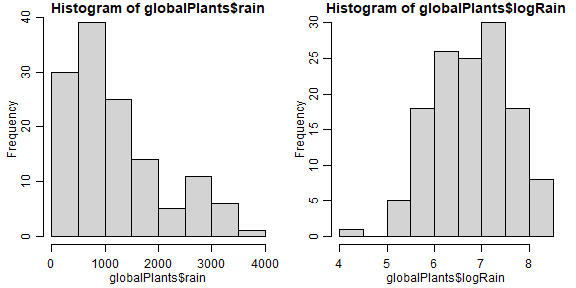

```r
 ft_logheightlogRainLat=lm(loght~logRain+lat, data=globalPlants)
 plotenvelope(ft_logheightlogRainLat)
```

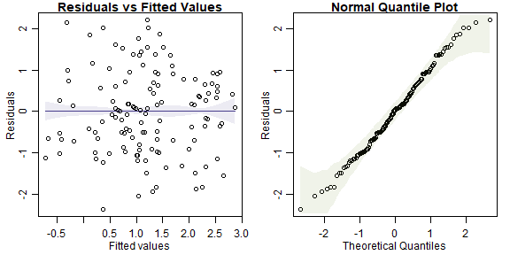

```r
 summary(ft_logheightlogRainLat)
#> 
#> Call:
#> lm(formula = loght ~ logRain + lat, data = globalPlants)
#> 
#> Residuals:
#>     Min      1Q  Median      3Q     Max 
#> -3.3620 -1.0032  0.0473  0.9843  3.1241 
#> 
#> Coefficients:
#>              Estimate Std. Error t value Pr(>|t|)   
#> (Intercept) -1.952796   1.485134  -1.315  0.19090   
#> logRain      0.603392   0.191128   3.157  0.00199 **
#> lat         -0.027740   0.008599  -3.226  0.00160 **
#> ---
#> Signif. codes:  0 '***' 0.001 '**' 0.01 '*' 0.05 '.' 0.1 ' ' 1
#> 
#> Residual standard error: 1.434 on 128 degrees of freedom
#> Multiple R-squared:  0.2601,	Adjusted R-squared:  0.2486 
#> F-statistic:  22.5 on 2 and 128 DF,  p-value: 4.224e-09
```

The histogram for rainfall is slightly right-skewed, although it's not super-scary.
Reanalysing data we still get pretty good-loking diagnostic plots and results look very similar -- $R^2$ is almost the same, $P$-values are still very significant.


## Code Box 3.6: Computing variance inflation factors to check for multi-collinearity.


```r
 require(car)
 vif(ft_heightRainLat)
#>   rain    lat 
#> 1.4942 1.4942
 vif(ft_climproblems)
#>      rain rain.wetm       lat 
#>    6.2878    7.0311    1.6714
```
Clearly adding rain.wetm to the model has done some damage (but to rain only,
not so much to lat).


## Code Box 3.7: Correlations and pairwise scatterplots to look for multi-collinearity.


```r
X = data.frame(globalPlants$lat,globalPlants$rain,globalPlants$rain.wetm)
cor(X)
#>                        globalPlants.lat globalPlants.rain globalPlants.rain.wetm
#> globalPlants.lat              1.0000000        -0.5750884              -0.633621
#> globalPlants.rain            -0.5750884         1.0000000               0.917008
#> globalPlants.rain.wetm       -0.6336210         0.9170080               1.000000
pairs(X)
```

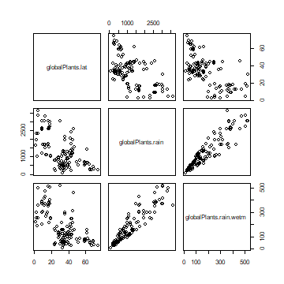

## Exercise 3.4: Snails on seaweed

*Does invertebrate density change with isolation?*
This research question asks for a hypothesis test: is there are relationship between invertebrate density and isolation.

There are two variables -- invertebrate density (quantitative) and distance of isolation, which was set experimentally at 0, 2 or 10 metres (categorical).

So I'm thinking ANOVA.


## Code Box 3.8: Analysis of variance in R for the seaweed data of Exercise 1.13 using
lm.

```r
 data(seaweed)
 seaweed$Dist = factor(seaweed$Dist)
 ft_seaweed=lm(Total~Dist,data=seaweed)
 anova(ft_seaweed)
#> Analysis of Variance Table
#> 
#> Response: Total
#>           Df Sum Sq Mean Sq F value    Pr(>F)    
#> Dist       2 300.25 150.123  8.5596 0.0005902 ***
#> Residuals 54 947.08  17.539                      
#> ---
#> Signif. codes:  0 '***' 0.001 '**' 0.01 '*' 0.05 '.' 0.1 ' ' 1
```
There is strong evidence of a `Dist` effect.

## Code Box 3.9: Running confint on the seaweed data doesn't give us what we
want.

```r
 confint(ft_seaweed)
#>                 2.5 %   97.5 %
#> (Intercept) 2.7785049 6.533423
#> Dist2       2.9211057 8.460686
#> Dist10      0.4107071 5.720963
```

## Code Box 3.10: Analysis of variance of the seaweed data of Exercise 1.13 with Tukey's multiple comparisons via the multcomp package.


```r
 library(multcomp)
 contDist = mcp(Dist="Tukey") # telling R to compare on the Dist factor
 compDist = glht(ft_seaweed, linfct=contDist) # run multiple comparisions
 summary(compDist)
#> 
#> 	 Simultaneous Tests for General Linear Hypotheses
#> 
#> Multiple Comparisons of Means: Tukey Contrasts
#> 
#> 
#> Fit: lm(formula = Total ~ Dist, data = seaweed)
#> 
#> Linear Hypotheses:
#>             Estimate Std. Error t value Pr(>|t|)    
#> 2 - 0 == 0     5.691      1.382   4.119   <0.001 ***
#> 10 - 0 == 0    3.066      1.324   2.315   0.0622 .  
#> 10 - 2 == 0   -2.625      1.382  -1.900   0.1483    
#> ---
#> Signif. codes:  0 '***' 0.001 '**' 0.01 '*' 0.05 '.' 0.1 ' ' 1
#> (Adjusted p values reported -- single-step method)
 plot(compDist)
```

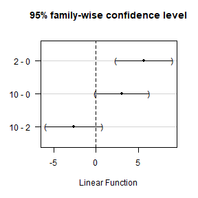

## Exercise 3.5: Plant height -- climate explains patterns?

I will take climate to mean temperature (*temp*) and rainfall (*rain*).

So a good plan here would be to fit a multiple regression model, to appropriately transformed data, and see if latitude explains any variation not captured by climate.


```r
 par(mfrow=c(1,2),mar=c(3,3,1,1),mgp=c(1.75,0.75,0))
 globalPlants$logRain = log(globalPlants$rain)
 globalPlants$logHt = log(globalPlants$height)
 ft_logheightClim=lm(loght~logRain+temp+lat, data=globalPlants)
 plotenvelope(ft_logheightClim)
```

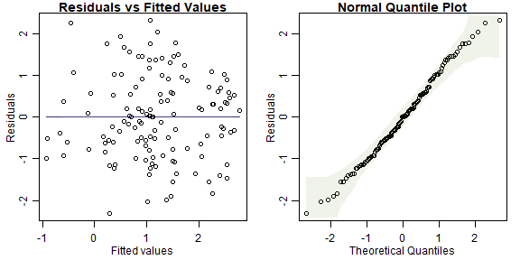

```r
 summary(ft_logheightClim)
#> 
#> Call:
#> lm(formula = loght ~ logRain + temp + lat, data = globalPlants)
#> 
#> Residuals:
#>     Min      1Q  Median      3Q     Max 
#> -3.2777 -1.0191 -0.0016  0.9328  3.2730 
#> 
#> Coefficients:
#>             Estimate Std. Error t value Pr(>|t|)   
#> (Intercept) -3.45043    1.96520  -1.756  0.08154 . 
#> logRain      0.64012    0.19347   3.309  0.00122 **
#> temp         0.03855    0.03319   1.162  0.24760   
#> lat         -0.00753    0.01940  -0.388  0.69859   
#> ---
#> Signif. codes:  0 '***' 0.001 '**' 0.01 '*' 0.05 '.' 0.1 ' ' 1
#> 
#> Residual standard error: 1.432 on 127 degrees of freedom
#> Multiple R-squared:  0.2679,	Adjusted R-squared:  0.2506 
#> F-statistic: 15.49 on 3 and 127 DF,  p-value: 1.2e-08
```

In terms of minding our P's and Q's:

**Q's** our research question suggests we are primarily interested in seeing if there is an effect of latitude after controlling for climate, hence primary interest is in the bottom row of the above summmary table.

**P's**

* *(conditional) independence* requires randomly sampled sites. This wasn't actually done so we are left waving our arms and thinking hard about possible sources of dependence... sites tended to be relatively far apart geographically so are unlikely to exhibit dependence. We could check for this using a spatial correlogram (see Chapter 7).
* *normality* no trend on normal quantile plot suggests no evidence against this assumption
* *equal variance* no fan-shape pattern on residual vs fits plot suggests this looks OK
* *linearity* no U-shape on residual vs fits plots suggests this looks reasonable.

After adding *temp* to the model, there is no longer any evidence of a latitudinal effect. So latitudinal variation in height can be explained by climate, in the sense that there is no evidence of a latitudinal effect after controlling for climate.

The main reason for this is that temperature and latitude are highly correlated (as below), hence we can think of latitude primarily as a surrogate for temperature. It is not immediately obvious however if plants tend to grow taller towards the equator because it is warmer (hence *temp* is driving this relationship) or because of reduced seasonality and more even day lengths (hence *lat* is the driver).

```r
X = data.frame(globalPlants$lat,globalPlants$rain,globalPlants$temp)
cor(X)
#>                   globalPlants.lat globalPlants.rain globalPlants.temp
#> globalPlants.lat         1.0000000        -0.5750884        -0.9158796
#> globalPlants.rain       -0.5750884         1.0000000         0.4786965
#> globalPlants.temp       -0.9158796         0.4786965         1.0000000
pairs(X)
```

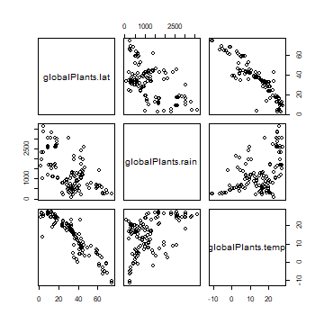

## Exercise 3.6: Habitat conguration study { mind your P's and Q's


```r
 boxplot(Total~Dist,data=seaweed)
```

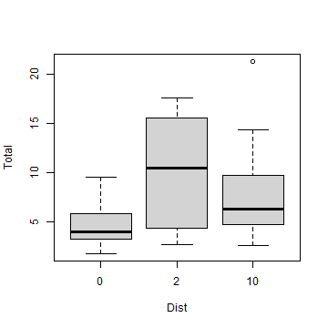

```r
 by(seaweed$Total,seaweed$Dist,sd)
#> seaweed$Dist: 0
#> [1] 2.108063
#> ---------------------------------------------------------------------- 
#> seaweed$Dist: 2
#> [1] 5.507271
#> ---------------------------------------------------------------------- 
#> seaweed$Dist: 10
#> [1] 4.456622
```
Small means have small variances.  There is a boundary at zero and data are being "pushed up" against it, with `Total` tending to take small values near zero for `Dist=0`, with less than half the sd of `Dist=2` or `Dist=10`. 

There is also a suggestion of non-normality when checking assumptions on the fitted ANOVA model:

```r
 par(mfrow=c(1,3),mar=c(3,3,1,1),mgp=c(1.75,0.75,0))
 plotenvelope(ft_seaweed,which=1:3)
```

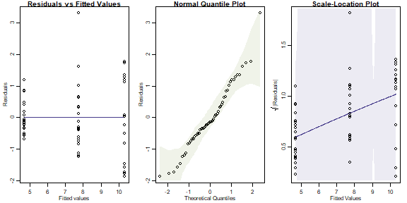

Notice that in the quantile plot that points get close to the lower bound in the middle of the plot and get near the top of it at large values -- this is mildly suggestive of skew. We similarly see an increasing trend in the scale-location plot, although it does stay within its simulation bounds. Notice these are only subtle patterns and not particularly strong.

(As an aside, note there is no envelope visible on the residual vs fits plot. This happens because we are fitting an ANOVA model, which ends up with a residuals mean exactly equal to zero for all treatments, hence no mean trend on the res vs fits plot for all fitted values, just a flat line at zero. Put another way, non-linearity isn't an assumption to worry about in ANOVA models, the fitted model goes exactly through the mean of each treatment.)

We can try to address the suggestion of skew this using log-transformation:


```r
 seaweed$logTot = log(seaweed$Total)
 boxplot(logTot~Dist,data=seaweed)
```

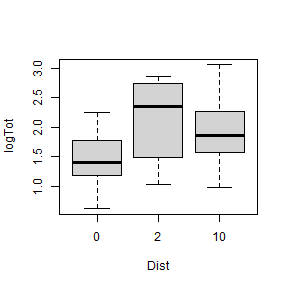

```r
 by(seaweed$logTot,seaweed$Dist,sd)
#> seaweed$Dist: 0
#> [1] 0.4423775
#> ---------------------------------------------------------------------- 
#> seaweed$Dist: 2
#> [1] 0.667999
#> ---------------------------------------------------------------------- 
#> seaweed$Dist: 10
#> [1] 0.5421633
```

This is looking pretty good now, let's run with that.


```r
 par(mfrow=c(1,2),mar=c(3,3,1,1),mgp=c(1.75,0.75,0))
 ft_loghabconf=lm(logTot~Dist,data=seaweed)
 plotenvelope(ft_loghabconf,which=1:2)
```

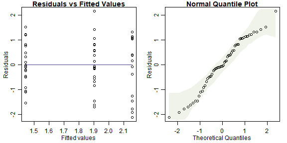

```r
 anova(ft_loghabconf)
#> Analysis of Variance Table
#> 
#> Response: logTot
#>           Df  Sum Sq Mean Sq F value    Pr(>F)    
#> Dist       2  4.8786 2.43929   8.011 0.0008981 ***
#> Residuals 54 16.4427 0.30449                      
#> ---
#> Signif. codes:  0 '***' 0.001 '**' 0.01 '*' 0.05 '.' 0.1 ' ' 1
 library(multcomp)
 contDist = mcp(Dist="Tukey") # telling R to compare on the Dist factor
 compDistlog = glht(ft_loghabconf, linfct=contDist) # run multiple comparisions
 summary(compDistlog)
#> 
#> 	 Simultaneous Tests for General Linear Hypotheses
#> 
#> Multiple Comparisons of Means: Tukey Contrasts
#> 
#> 
#> Fit: lm(formula = logTot ~ Dist, data = seaweed)
#> 
#> Linear Hypotheses:
#>             Estimate Std. Error t value Pr(>|t|)    
#> 2 - 0 == 0    0.7117     0.1820   3.910 0.000796 ***
#> 10 - 0 == 0   0.4584     0.1745   2.627 0.029531 *  
#> 10 - 2 == 0  -0.2533     0.1820  -1.392 0.352272    
#> ---
#> Signif. codes:  0 '***' 0.001 '**' 0.01 '*' 0.05 '.' 0.1 ' ' 1
#> (Adjusted p values reported -- single-step method)
 plot(compDistlog)
```

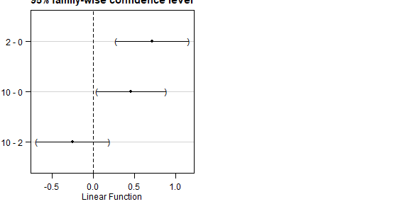

And the main change in results here is that there is now evidence that mean `logTot` is different between `Dist==0` and `Dist==10` now as well as between `Dist==0` and `Dist==2`. Again this is an example of being able to better see patterns when assumptions are closer to being satisfied (in particular, removing right-skew from response when fitting a linear model).


## Exercise 3.7: Habitat conguration study { small plots


```r
 habSmall=seaweed[seaweed$Size=="SMALL",]
 ft_smhabconf=lm(logTot~Dist,data=habSmall)
 plotenvelope(ft_smhabconf,which=1:2)
```

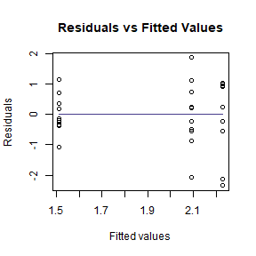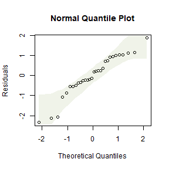

```r
 anova(ft_smhabconf)
#> Analysis of Variance Table
#> 
#> Response: logTot
#>           Df Sum Sq Mean Sq F value Pr(>F)  
#> Dist       2 2.8974 1.44870  4.9358 0.0149 *
#> Residuals 27 7.9247 0.29351                 
#> ---
#> Signif. codes:  0 '***' 0.001 '**' 0.01 '*' 0.05 '.' 0.1 ' ' 1
 library(multcomp)
 contDist = mcp(Dist="Tukey") # telling R to compare on the Dist factor
 compDistsm = glht(ft_smhabconf, linfct=contDist) # run multiple comparisons
 summary(compDistsm)
#> 
#> 	 Simultaneous Tests for General Linear Hypotheses
#> 
#> Multiple Comparisons of Means: Tukey Contrasts
#> 
#> 
#> Fit: lm(formula = logTot ~ Dist, data = habSmall)
#> 
#> Linear Hypotheses:
#>             Estimate Std. Error t value Pr(>|t|)  
#> 2 - 0 == 0    0.7165     0.2423   2.957   0.0168 *
#> 10 - 0 == 0   0.5808     0.2423   2.397   0.0594 .
#> 10 - 2 == 0  -0.1357     0.2423  -0.560   0.8422  
#> ---
#> Signif. codes:  0 '***' 0.001 '**' 0.01 '*' 0.05 '.' 0.1 ' ' 1
#> (Adjusted p values reported -- single-step method)
 plot(compDistsm)
```

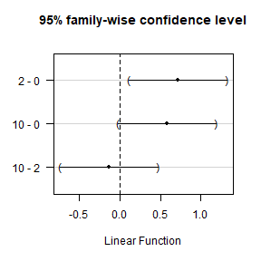

Results are now less significant, with only marginal evidence of a difference in mean `logTot` between `Dist==0` and `Dist==10`. This is expected because we have almost halved our sample size:


```r
dim(seaweed)
#> [1] 57 23
dim(habSmall)
#> [1] 30 23
```

By reducing our sample size, we are less able to see patterns in the data (because there is less data to look for patterns in!).
