## Exercise 4.1: Ravens and gunshots

We assume:

* that we have a random sample of paired differences (most importantly, paired differences are independent of each other)
* the paired differences are approixmately normal.


```r
 library(ecostats)
 data(ravens)
 qqenvelope(ravens$delta[ravens$treatment==1])
```

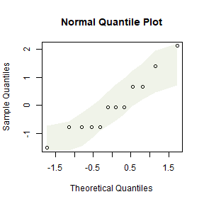

This looks OK, there is no evidence against normality here


## Code Box 4.1: Paired t-test for the ravens data

```r
 data(ravens)
 crowGun = ravens[ravens$treatment == 1,]
 t.test(crowGun$Before, crowGun$After, paired=TRUE, alternative="less")
#> 
#> 	Paired t-test
#> 
#> data:  crowGun$Before and crowGun$After
#> t = -2.6, df = 11, p-value = 0.01235
#> alternative hypothesis: true mean difference is less than 0
#> 95 percent confidence interval:
#>       -Inf -0.335048
#> sample estimates:
#> mean difference 
#>       -1.083333
```
There is some evidence that ravens fly towards the sound of gunshots.


## Exercise 4.2: Ravens, guns and air horns

*Is there evidence that the response to gunshot different to response to other treatments?*

We will use a linear model, with `location` included as a blocking factor to control for differences in raven abundance from one place to another, see Code Box 4.3.


## Code Box 4.2: Paired t-test for the ravens data via a linear model

```r
 library(reshape2)
 crowLong = melt(crowGun,measure.vars = c("Before","After"),
                 variable.name="time",value.name="ravens")
 head(crowLong)
#>   delta    site treatment trees   time ravens
#> 1     2 pilgrim         1     1 Before      0
#> 2     1 pacific         1     1 Before      0
#> 3     4 uhl hil         1     1 Before      0
#> 4     1 wolff r         1     1 Before      0
#> 5     0 teton p         1     1 Before      0
#> 6     3 glacier         1     1 Before      2
 ravenlm = lm(ravens~site+time,data=crowLong)
 anova(ravenlm)
#> Analysis of Variance Table
#> 
#> Response: ravens
#>           Df Sum Sq Mean Sq F value   Pr(>F)   
#> site      11 55.458  5.0417    4.84 0.007294 **
#> time       1  7.042  7.0417    6.76 0.024694 * 
#> Residuals 11 11.458  1.0417                    
#> ---
#> Signif. codes:  0 '***' 0.001 '**' 0.01 '*' 0.05 '.' 0.1 ' ' 1
```


## Code Box 4.3: A linear model for the blocked design given by the raven counts in Exercise 4.2

To analyse, we first subset to the three treatments of interest (1=gunshot, 2=airhorn, 3=whistle):

```r
crowAfter = ravens[ravens$treatment <=3,]
ft_crowAfter = lm(After~site+treatment,data=crowAfter)
anova(ft_crowAfter)
#> Analysis of Variance Table
#> 
#> Response: After
#>           Df Sum Sq Mean Sq F value Pr(>F)
#> site      11 28.667  2.6061  0.9269 0.5327
#> treatment  1  2.667  2.6667  0.9485 0.3402
#> Residuals 23 64.667  2.8116
```
To check assumptions we could look at diagnostic plots:

```r
 par(mfrow=c(1,2),mar=c(3,3,1,1),mgp=c(1.75,0.75,0))
 plotenvelope(ft_crowAfter)
```

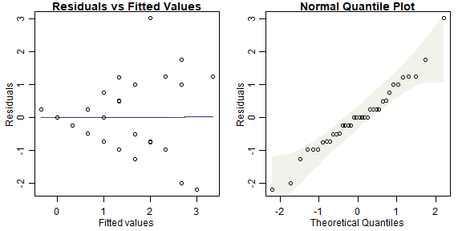

The residual vs fits plot has a fan-shaped pattern, suggesting that transformation might be a good idea here!


## Exercise 4.3: Seaweed, snails and seaweed mass

*Is there an effect of distance of isolation after controlling for wet mass?*

*Q's* -- this is a hypothesis test, for an effect on `Total` of `Dist` after controlling for `Wmass`.

*P's* We have three variables of interest:

* `Total` is the quantitative response
* `Dist` is a factor (0, 2 or 10)
* `Wmass` is a quantitative variable, to be use as a covariate

We can get all three variables onto the same graph using a scatterplot, with different colours for different treatment levels, as in Code Box 4.4.


## Code Box 4.4: Scatterplot of data from Exercise 4.3.

```r
 data(seaweed)
 seaweed$Dist = factor(seaweed$Dist)
 plot(Total~Wmass, data=seaweed, col=Dist, 
      xlab="Wet Mass [log scale]",ylab="Density (per gram) [log scale]")
 legend("topright",levels(seaweed$Dist),col=1:3,pch=1)
```

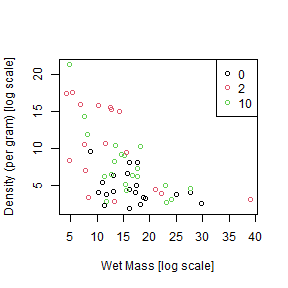


## Code Box 4.5: Analysis of covariance for the seaweed data of Exercise 4.3.

```r
 seaweed$logTot = log(seaweed$Total)
 seaweed$logWmass = log(seaweed$Wmass)
 lmMassDist=lm(logTot~logWmass+Dist,data=seaweed)
  anova(lmMassDist)
#> Analysis of Variance Table
#> 
#> Response: logTot
#>           Df  Sum Sq Mean Sq F value    Pr(>F)    
#> logWmass   1  7.7216  7.7216 35.7165 1.975e-07 ***
#> Dist       2  2.1415  1.0708  4.9528   0.01067 *  
#> Residuals 53 11.4582  0.2162                      
#> ---
#> Signif. codes:  0 '***' 0.001 '**' 0.01 '*' 0.05 '.' 0.1 ' ' 1
```

## Exercise 4.4: Checking ANCOVA assumptions
*Independence* can be guaranteed by randomly allocating `Dist` treatments to plots.

Remaining assumptions can be checked using diagnostic plots.

```r
par(mfrow=c(1,2),mar=c(3,3,1,1),mgp=c(1.75,0.75,0))
plotenvelope(lmMassDist, n.sim=99)
```

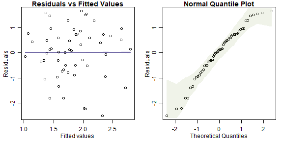

(Note that `plotenvelope` was run with just `99` iterations, to speed up computation time.)

* *normality* - normal quantile plot is close to a straight line so this is OK
* *equal variance* - no fan shape on residual vs fits plot so this seems OK
* *linearity* -- no U-shape on residual vs fits plot so this seems OK


## Code Box 4.6: ANCOVA with the order of terms switched.
Notice that switching the order changes the results in the ANOVA table, and their interpretation.

```r
 lmDistMass=lm(logTot~Dist+logWmass,data=seaweed)
 anova(lmDistMass)
#> Analysis of Variance Table
#> 
#> Response: logTot
#>           Df  Sum Sq Mean Sq F value    Pr(>F)    
#> Dist       2  4.8786  2.4393  11.283 8.273e-05 ***
#> logWmass   1  4.9845  4.9845  23.056 1.329e-05 ***
#> Residuals 53 11.4582  0.2162                      
#> ---
#> Signif. codes:  0 '***' 0.001 '**' 0.01 '*' 0.05 '.' 0.1 ' ' 1
```

## Exercise 4.5: Order of terms in writing out a model for snails and seaweed.
The correct model is `...logWmass+Dist` so we can look for an effect of `Dist` after controlling for `logWmass`.


## Code Box 4.7: "Type II sums of squares" for the ANCOVA of snails and seaweed.

```r
drop1(lmMassDist,test="F")
#> Single term deletions
#> 
#> Model:
#> logTot ~ logWmass + Dist
#>          Df Sum of Sq    RSS     AIC F value    Pr(>F)    
#> <none>                11.458 -83.448                      
#> logWmass  1    4.9845 16.443 -64.861 23.0561 1.329e-05 ***
#> Dist      2    2.1415 13.600 -77.681  4.9528   0.01067 *  
#> ---
#> Signif. codes:  0 '***' 0.001 '**' 0.01 '*' 0.05 '.' 0.1 ' ' 1
```

## Exercise 4.6: Snails, isolation and time

**Q's** -- here is the research question:
*Does invertebrate density change with isolation? Does the isolation effect vary with time period?*

We want to test a specific hypothesis (no effect of `Dist`, no interaction of `Dist` with `Time`).

**P's** There are three variables involved in this research question:

* `Total` is invertebrate density (quantitative)
* `Dist` is a factor (0, 2 or 10)
* `Time` is also a factor (5 or 10 weeks)

Given previous information we could also add `logWmass` as another covariate...

Comparative boxplots would be a good way to start, as in Code Box 4.8.


## Code Box 4.8: A comparative boxplot of snail density at each of the six possible combinations of sampling time and distance of isolation.

```r
plot(Total ~ interaction(Dist,Time), data=seaweed, log="y") ## and as usual use xlabel, ylabel to name axes
```

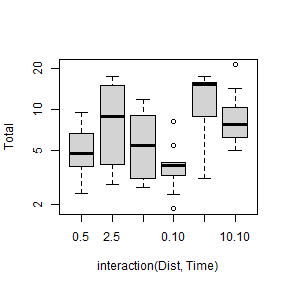


## Exercise 4.7: Factorial ANOVA assumptions


```r
 par(mfrow=c(1,2),mar=c(3,3,1,1),mgp=c(1.75,0.75,0))
 ft_seaweedFact=lm(logTot~Time*Dist, data=seaweed)
 plotenvelope(ft_seaweedFact, n.sim=99)
```

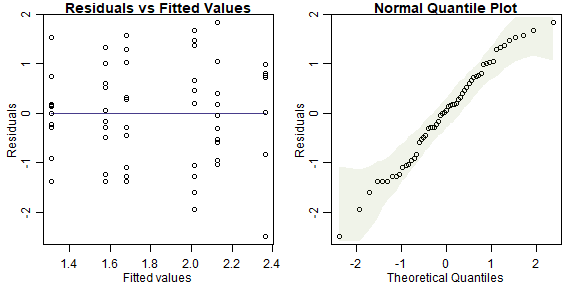

(Note that `plotenvelope` was run with just `99` iterations, to speed up computation time.)

* *independence*: if plots were randomly allocated to treatments then this will be satisfied
* *normality*: the normal quantile plot is close to a straight line so this looks OK
* *equal variance*: no fan-shape on the residual vs fits plot so this looks OK
There is no linearity/additivity assumption in a factorial ANOVA


## Code Box 4.9: Factorial ANOVA of Snails, Isolation, and Time

```r
ft_seaweedFact = lm(logTot~Time*Dist,data=seaweed)
anova(ft_seaweedFact)
#> Analysis of Variance Table
#> 
#> Response: logTot
#>           Df  Sum Sq Mean Sq F value    Pr(>F)    
#> Time       1  0.2433 0.24333  0.8512 0.3605470    
#> Dist       2  5.0323 2.51613  8.8023 0.0005201 ***
#> Time:Dist  2  1.4673 0.73367  2.5666 0.0866804 .  
#> Residuals 51 14.5784 0.28585                      
#> ---
#> Signif. codes:  0 '***' 0.001 '**' 0.01 '*' 0.05 '.' 0.1 ' ' 1
```

There is marginal evidence of an interaction and strong evidence of a `Dist` main effect. So there is an effect of `Dist` and it could potentially vary with `Time`.

Note we used `Time*Dist` because `Time` is not the variable of primary interest, it is `Dist`, and we only include `Time` to control for sampling time effects


## Code Box 4.10: R code for the interaction plot in Figure 4.1.

```r
 library(dplyr)
 seaweed$Time = as.factor(seaweed$Time) 
 by_DistTime = group_by(seaweed,Dist,Time)
 distTimeMeans = summarise(by_DistTime, logTotal=mean(log(Total)))
#> `summarise()` has grouped output by 'Dist'. You can override using the `.groups` argument.
 distTimeMeans
#> # A tibble: 6 × 3
#> # Groups:   Dist [3]
#>   Dist  Time  logTotal
#>   <fct> <fct>    <dbl>
#> 1 0     5         1.58
#> 2 0     10        1.31
#> 3 2     5         2.01
#> 4 2     10        2.36
#> 5 10    5         1.68
#> 6 10    10        2.13
 library(ggplot2)
 library(ggthemes) #loads special themes
 ggplot(seaweed, aes(x = factor(Dist), y = Total, colour = Time)) +
   geom_point() + geom_line(data = distTimeMeans, aes(y = exp(logTotal),
   group = Time)) + theme_few() + xlab("Distance of Isolation") +
   ylab("Total abundance [log scale]") + scale_y_log10(breaks=c(2,5,10,20))
```

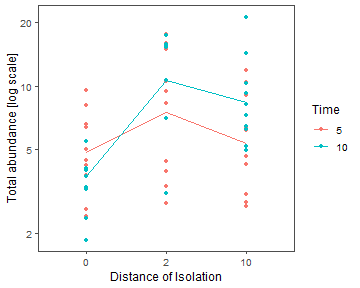

Alternatively, for a simpler plot without the data points on it, try:

```r
interaction.plot(seaweed$Dist, seaweed$Time, ft_seaweedFact$fitted,
      xlab="Isolation of patch", ylab="Total density [log]", trace.label="Time")
```

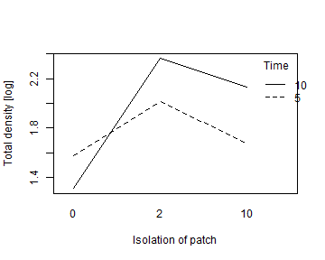

## Code Box 4.11: Uh oh... `anova` gone wrong

```r
data(seaweed)
ft_nofactor=lm(log(Total)~Time*Dist,data=seaweed)
anova(ft_nofactor)
#> Analysis of Variance Table
#> 
#> Response: log(Total)
#>           Df  Sum Sq Mean Sq F value  Pr(>F)  
#> Time       1  0.2433 0.24333  0.6671 0.41771  
#> Dist       1  0.7164 0.71635  1.9640 0.16691  
#> Time:Dist  1  1.0303 1.03031  2.8248 0.09871 .
#> Residuals 53 19.3313 0.36474                  
#> ---
#> Signif. codes:  0 '***' 0.001 '**' 0.01 '*' 0.05 '.' 0.1 ' ' 1
```

## Code Box 4.12: Tukey's comparisons don't work for main eects in an orthogonal design, as seen for Exercise 4.9:


```r
 seaweed$Dist = factor(seaweed$Dist)
 seaweed$Time = factor(seaweed$Time)
 seaweed$logTot = log(seaweed$Total)
 ft_seaweedFact = lm(logTot~Time*Dist, data=seaweed)
 library(multcomp)
 contFact = mcp(Dist="Tukey") # telling R to compare on the Dist factor
 compFact = glht(ft_seaweedFact, linfct=contFact) # run multiple comparisions
#> Warning in mcp2matrix(model, linfct = linfct): covariate interactions found -- default
#> contrast might be inappropriate
```

## Code Box 4.13: Tukey's comparisons for a main eect of Dist for Exercise 4.6, assuming no interaction.

```r
 ft_seaweedMain=lm(logTot~Time+Dist,data=seaweed) # note it is + not *
 contrast = mcp(Dist="Tukey") # telling R to compare on the Dist factor
 compDistMain = glht(ft_seaweedMain, linfct=contrast)
 confint(compDistMain)
#> 
#> 	 Simultaneous Confidence Intervals
#> 
#> Multiple Comparisons of Means: Tukey Contrasts
#> 
#> 
#> Fit: lm(formula = logTot ~ Time + Dist, data = seaweed)
#> 
#> Quantile = 2.4107
#> 95% family-wise confidence level
#>  
#> 
#> Linear Hypotheses:
#>             Estimate lwr      upr     
#> 2 - 0 == 0   0.72650  0.28783  1.16516
#> 10 - 0 == 0  0.45838  0.03893  0.87783
#> 10 - 2 == 0 -0.26812 -0.70678  0.17055
```

## Code Box 4.14: Tukey's comparisons for all possible treatment combinations for Exercise 4.6.
This approach is wasteful as it compares some pairs we are not interested in (e.g. 2.10
vs 0.5).

```r
 td = interaction(seaweed$Dist,seaweed$Time)
 ft_seaweedInt=lm(logTot~td,data=seaweed) # Time*Dist as a single term
 contInt = mcp(td="Tukey") # telling R to compare on all Time*Dist levels
 compDistInt = glht(ft_seaweedInt, linfct=contInt)
 summary(compDistInt)
#> 
#> 	 Simultaneous Tests for General Linear Hypotheses
#> 
#> Multiple Comparisons of Means: Tukey Contrasts
#> 
#> 
#> Fit: lm(formula = logTot ~ td, data = seaweed)
#> 
#> Linear Hypotheses:
#>                   Estimate Std. Error t value Pr(>|t|)   
#> 2.5 - 0.5 == 0      0.4356     0.2391   1.822  0.46054   
#> 10.5 - 0.5 == 0     0.1013     0.2391   0.424  0.99815   
#> 0.10 - 0.5 == 0    -0.2643     0.2391  -1.105  0.87656   
#> 2.10 - 0.5 == 0     0.7852     0.2635   2.980  0.04749 * 
#> 10.10 - 0.5 == 0    0.5512     0.2391   2.305  0.21028   
#> 10.5 - 2.5 == 0    -0.3343     0.2391  -1.398  0.72723   
#> 0.10 - 2.5 == 0    -0.6999     0.2391  -2.927  0.05396 . 
#> 2.10 - 2.5 == 0     0.3496     0.2635   1.327  0.76838   
#> 10.10 - 2.5 == 0    0.1156     0.2391   0.483  0.99654   
#> 0.10 - 10.5 == 0   -0.3656     0.2391  -1.529  0.64681   
#> 2.10 - 10.5 == 0    0.6839     0.2635   2.596  0.11661   
#> 10.10 - 10.5 == 0   0.4499     0.2391   1.882  0.42417   
#> 2.10 - 0.10 == 0    1.0495     0.2635   3.983  0.00279 **
#> 10.10 - 0.10 == 0   0.8155     0.2391   3.411  0.01532 * 
#> 10.10 - 2.10 == 0  -0.2340     0.2635  -0.888  0.94749   
#> ---
#> Signif. codes:  0 '***' 0.001 '**' 0.01 '*' 0.05 '.' 0.1 ' ' 1
#> (Adjusted p values reported -- single-step method)
```


## Code Box 4.15: Tukey's comparisons for Dist within each sampling time, for Exercise 4.6.
This is the best approach to use if you think there is an interaction and are primarily
interested in Dist.

```r
 levels(seaweed$Time) = c("five","ten") #need non-numbers for mcp to work
 levels(seaweed$Dist) = c("Zero","Two","Ten")
 td = interaction(seaweed$Dist,seaweed$Time)
 ft_seaweedInt=lm(log(Total)~td,data=seaweed) # Time*Dist as a single term
 contDistinTime = mcp(td = c("Two.five - Zero.five = 0",
                             "Ten.five - Zero.five = 0",
                             "Ten.five - Two.five = 0",
                             "Two.ten - Zero.ten = 0",
                             "Ten.ten - Zero.ten = 0",
                             "Ten.ten - Two.ten = 0"))
 compDistinTime = glht(ft_seaweedInt, linfct=contDistinTime)
 summary(compDistinTime)
#> 
#> 	 Simultaneous Tests for General Linear Hypotheses
#> 
#> Multiple Comparisons of Means: User-defined Contrasts
#> 
#> 
#> Fit: lm(formula = log(Total) ~ td, data = seaweed)
#> 
#> Linear Hypotheses:
#>                           Estimate Std. Error t value Pr(>|t|)   
#> Two.five - Zero.five == 0   0.4356     0.2391   1.822  0.31175   
#> Ten.five - Zero.five == 0   0.1013     0.2391   0.424  0.99083   
#> Ten.five - Two.five == 0   -0.3343     0.2391  -1.398  0.57118   
#> Two.ten - Zero.ten == 0     1.0495     0.2635   3.983  0.00125 **
#> Ten.ten - Zero.ten == 0     0.8155     0.2391   3.411  0.00710 **
#> Ten.ten - Two.ten == 0     -0.2340     0.2635  -0.888  0.87446   
#> ---
#> Signif. codes:  0 '***' 0.001 '**' 0.01 '*' 0.05 '.' 0.1 ' ' 1
#> (Adjusted p values reported -- single-step method)
```

## Code Box 4.16: Testing for an interaction in an ANCOVA for density of epifauna as a function of Dist and algal wet mass.

```r
 lmMassDistInter=lm(logTot~log(Wmass)*Dist,data=seaweed)
 anova(lmMassDistInter)
#> Analysis of Variance Table
#> 
#> Response: logTot
#>                 Df  Sum Sq Mean Sq F value    Pr(>F)    
#> log(Wmass)       1  7.7216  7.7216 35.3587 2.489e-07 ***
#> Dist             2  2.1415  1.0708  4.9032   0.01128 *  
#> log(Wmass):Dist  2  0.3208  0.1604  0.7345   0.48475    
#> Residuals       51 11.1374  0.2184                      
#> ---
#> Signif. codes:  0 '***' 0.001 '**' 0.01 '*' 0.05 '.' 0.1 ' ' 1
```

## Exercise 4.8: Global plant height
*Do the effects on plant height of latitude and rainfall interact?*

We need an interaction term in the model, but because `lat` and `rain` are both quantitative, this is a quadratic term and other quadratic terms should enter the model too, as in Code Box 4.17. 

## Code Box 4.17: Using R to fit a quadratic model to the plant height data of Exercise 3.1.

```r
 ft_latRain2 = lm(log(height)~poly(rain,lat,degree=2),data=globalPlants)
 summary(ft_latRain2)
#> 
#> Call:
#> lm(formula = log(height) ~ poly(rain, lat, degree = 2), data = globalPlants)
#> 
#> Residuals:
#>     Min      1Q  Median      3Q     Max 
#> -3.3656 -0.9546 -0.0749  0.9775  3.1311 
#> 
#> Coefficients:
#>                                Estimate Std. Error t value Pr(>|t|)    
#> (Intercept)                      1.1675     0.2094   5.577 1.44e-07 ***
#> poly(rain, lat, degree = 2)1.0   5.7178     2.3419   2.441  0.01603 *  
#> poly(rain, lat, degree = 2)2.0  -1.1417     2.0304  -0.562  0.57493    
#> poly(rain, lat, degree = 2)0.1  -5.0623     1.8212  -2.780  0.00628 ** 
#> poly(rain, lat, degree = 2)1.1  -6.1984    38.1037  -0.163  0.87104    
#> poly(rain, lat, degree = 2)0.2  -2.3615     2.5031  -0.943  0.34729    
#> ---
#> Signif. codes:  0 '***' 0.001 '**' 0.01 '*' 0.05 '.' 0.1 ' ' 1
#> 
#> Residual standard error: 1.441 on 125 degrees of freedom
#> Multiple R-squared:  0.2706,	Adjusted R-squared:  0.2415 
#> F-statistic: 9.277 on 5 and 125 DF,  p-value: 1.558e-07
```


## Exercise 4.9: Snowmelt and time to flowering
*Does time from snowmelt to flowering vary with snowmelt date, beyond that explained by
elevation? If so, how does it vary?*

The data are available as snowmelt in the ecostats package, averaged over measurements
taken at three sampling times. Answer the research questions using the
appropriate linear model, being sure to check your assumptions.

```r
 data(snowmelt)
 plot(flow~snow,data=snowmelt)
```

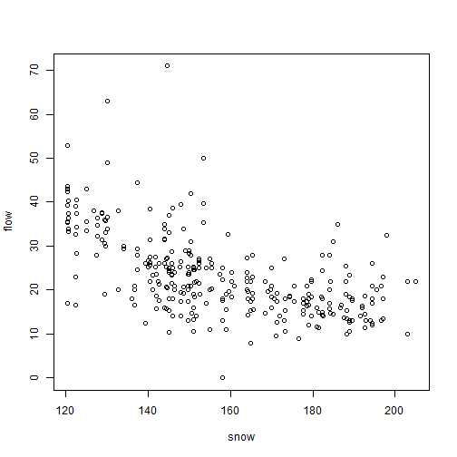

```r
 snowReduced = na.omit(snowmelt[,c("flow","snow","elev")]) #this line not normally needed, lm can handle NA's, but seems needed because of a weird conflict with MCMCglmm
 ft_snow = lm(flow~elev+snow, data=snowReduced)
 plotenvelope(ft_snow, n.sim=99)
```

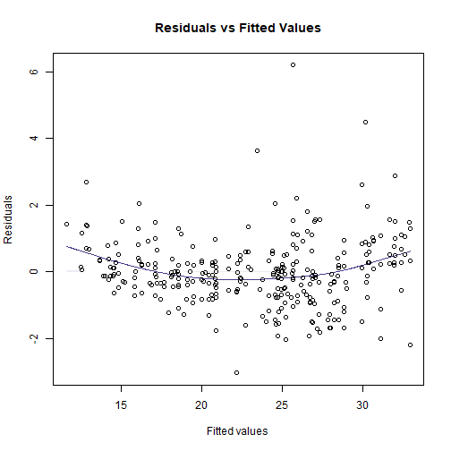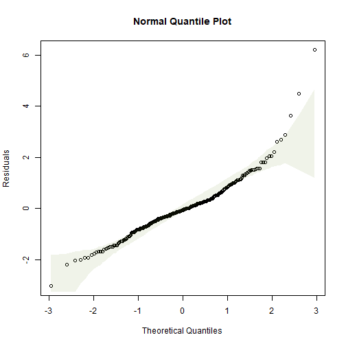

(Note that `plotenvelope` was run with just `99` iterations, to speed up computation time.)

This doesn't look great, there is the occasional large value for flowering time, and a suggestion of non-linearity (note from the scatterplot that at early snowmelt dates there is a strong decreasing relationship, but it can't continue to increase at the same rate because then flowering time would become negative). Try log-transforming flowering time...


```r
 plot(flow~snow,data=snowmelt,log="y")
#> Warning in xy.coords(x, y, xlabel, ylabel, log): 1 y value <= 0 omitted from logarithmic plot
```

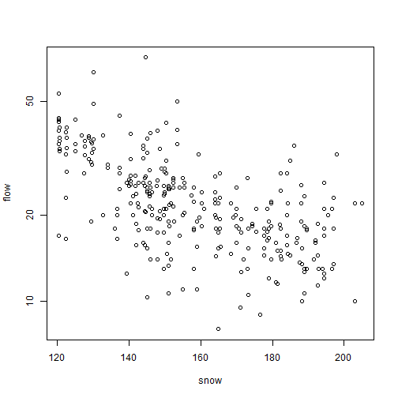

```r
 snowReduced$logFlow = log(snowReduced$flow)
 snowReduced2 = snowReduced[snowReduced$logFlow>-Inf,] # look it's a bit naughty, removing the infinite value, but no biggie as only one value
 ft_logsnow = lm(logFlow~elev+snow, data=snowReduced2)
 plotenvelope(ft_logsnow, n.sim=99)
```

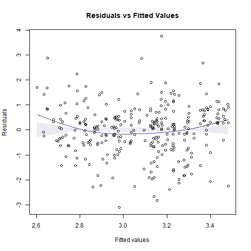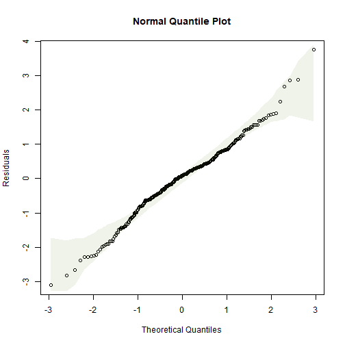

```r
 summary(ft_logsnow)
#> 
#> Call:
#> lm(formula = logFlow ~ elev + snow, data = snowReduced2)
#> 
#> Residuals:
#>      Min       1Q   Median       3Q      Max 
#> -0.90161 -0.15794  0.02338  0.15834  1.08662 
#> 
#> Coefficients:
#>               Estimate Std. Error t value Pr(>|t|)    
#> (Intercept)  3.8805208  0.3193019  12.153  < 2e-16 ***
#> elev         0.0003357  0.0001226   2.739  0.00651 ** 
#> snow        -0.0103172  0.0007551 -13.663  < 2e-16 ***
#> ---
#> Signif. codes:  0 '***' 0.001 '**' 0.01 '*' 0.05 '.' 0.1 ' ' 1
#> 
#> Residual standard error: 0.2909 on 316 degrees of freedom
#> Multiple R-squared:  0.3774,	Adjusted R-squared:  0.3735 
#> F-statistic: 95.78 on 2 and 316 DF,  p-value: < 2.2e-16
 confint(ft_logsnow)
#>                     2.5 %        97.5 %
#> (Intercept)  3.252294e+00  4.5087472418
#> elev         9.457986e-05  0.0005768232
#> snow        -1.180299e-02 -0.0088315037
```

(Note that `plotenvelope` was run with just `99` iterations, to speed up computation time.)

So as snowmelt date increases by 10 days, log(flowering time) decreases by between 0.12 and 0.09 (meaning about a 9-12% decrease).

(Aside: Strictly speaking, `snow` should not be treated as a linear variable because it is a time-of-year variable, so is a cyclical variable with a period of 365. But in this case the values are all focussed over a few months towards the middle of the year so a linear approximation is OK.)


## Exercise 4.10: Bird exclusion and biological control

*Is there an effect of the netting treatment on changes in aphid numbers across the sampling
times?*


```r
data(aphidsBACI)
str(aphidsBACI)
#> 'data.frame':	16 obs. of  5 variables:
#>  $ Plot     : Factor w/ 8 levels "1","2","3","4",..: 1 2 3 4 5 6 7 8 1 2 ...
#>  $ Treatment: Factor w/ 2 levels "excluded","present": 2 2 2 2 1 1 1 1 2 2 ...
#>  $ Time     : Factor w/ 2 levels "X18.06.","X15.07.": 1 1 1 1 1 1 1 1 2 2 ...
#>  $ counts   : int  78 71 122 271 119 152 120 202 60 48 ...
#>  $ logcount : num  4.37 4.28 4.81 5.61 4.79 ...
plot(logcount~interaction(Time,Treatment),data=aphidsBACI)
```

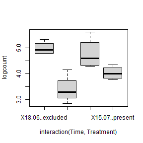

OK log(count) looks fine, different treatments have similar variation.  Eyeballing the data it looks like there is a treatment effect, with many less aphids in the excluded group than in the control...

When building a model, we need to take into account the pairing of the data -- Ingo and friends took repeated measures in each plot, so we include `Plot` as a blocking variable to account for this. This in turn means there is no need for a `Treatment` main effect, because different plots received different treatments.


```r
 par(mfrow=c(1,3),mar=c(3,3,1,1),mgp=c(1.75,0.75,0))
lm_aphids = lm(logcount~Plot+Time+Treatment:Time,data=aphidsBACI)
plotenvelope(lm_aphids,which=1:3, n.sim=99)
```

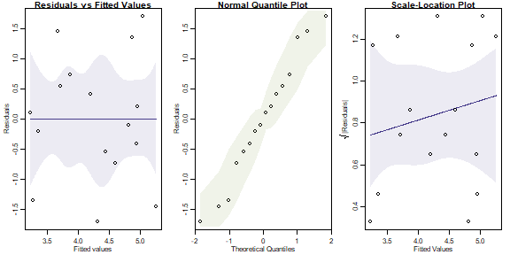

(Note that `plotenvelope` was run with just `99` iterations, to speed up computation time.)

This all looks fine to me. The term if interest is `Treatment:Time`, which tells us if changes in aphids over time varied due to the bird exclusion treatment:


```r
anova(lm_aphids)
#> Analysis of Variance Table
#> 
#> Response: logcount
#>                Df Sum Sq Mean Sq F value   Pr(>F)   
#> Plot            7 0.8986  0.1284  0.4603 0.833357   
#> Time            1 5.4675  5.4675 19.6038 0.004434 **
#> Time:Treatment  1 0.7397  0.7397  2.6522 0.154527   
#> Residuals       6 1.6734  0.2789                    
#> ---
#> Signif. codes:  0 '***' 0.001 '**' 0.01 '*' 0.05 '.' 0.1 ' ' 1
```

There is no evidence of an interaction, meaning there is no evidence of an effect of bird exclusion on aphid numbers. Oh :(

I guess the reason for this is that the levels of replication were low -- there were only eight plots, four in each treatment, so an effect would have to be very strong to be statistically significant.

## Exercise 4.11: Seaweed, snails and three factors


```r
data(seaweed)
str(seaweed)
#> 'data.frame':	57 obs. of  22 variables:
#>  $ Size  : chr  "SMALL" "SMALL" "SMALL" "SMALL" ...
#>  $ Dist  : int  0 0 0 0 0 2 2 2 2 2 ...
#>  $ Time  : int  5 5 5 5 5 5 5 5 5 5 ...
#>  $ Rep   : int  1 2 3 4 5 1 2 3 4 5 ...
#>  $ Wmass : num  15.8 13.1 25.1 29.7 17.4 13.3 4.7 6.8 7.7 14.3 ...
#>  $ Amph  : num  75 16 14 21 55 17 9 11 28 37 ...
#>  $ Cope  : num  0 7 37 37 0 14 6 29 21 83 ...
#>  $ Poly  : num  17 8 2 5 1 2 1 3 6 10 ...
#>  $ Anem  : num  2 0 0 0 0 0 0 1 0 0 ...
#>  $ Iso   : num  0 2 1 1 15 0 12 51 19 56 ...
#>  $ Bival : num  3 2 1 0 0 2 0 4 3 0 ...
#>  $ Gast  : num  6 18 33 9 9 1 10 7 4 15 ...
#>  $ Turb  : num  1 0 0 0 0 0 0 0 0 0 ...
#>  $ Prawn : num  0 0 0 0 5 1 0 0 0 1 ...
#>  $ Urchin: num  0 0 0 0 0 0 0 0 0 0 ...
#>  $ Fish  : num  0 0 0 0 1 0 0 0 0 0 ...
#>  $ Crab  : num  0 1 1 0 0 0 0 1 0 0 ...
#>  $ Caddis: num  0 0 0 0 1 0 0 0 0 0 ...
#>  $ Opi   : num  0 1 0 1 0 0 0 0 0 0 ...
#>  $ Ost   : num  0 0 6 3 0 0 1 1 0 11 ...
#>  $ Bstar : num  0 0 0 0 0 0 0 0 0 1 ...
#>  $ Total : num  6.58 4.2 3.78 2.59 5 ...
seaweed$logTot = log(seaweed$Total)
seaweed$Dist = factor(seaweed$Dist)
par(mar=c(4,7,1,1))
plot(logTot~interaction(Dist,Size,Time),data=seaweed,xlab="",ylab="Total abundance [log scale]",horizontal=TRUE,col=2:4,las=1)
legend("topleft",legend=paste0("Dist=",levels(seaweed$Dist)),pch=15,col=2:4,pt.cex=2)
```

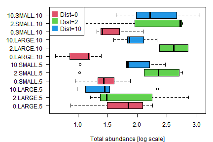

All good so far, no obvious trend, except that `Dist=0` seems to have lower total abundance at most times/sizes. Will analyse as a three-way ANOVA


```r
 par(mfrow=c(1,3),mar=c(3,3,1,1),mgp=c(1.75,0.75,0))
ft_seaweed3 = lm(log(Total)~Size*Time*Dist,data=seaweed)
plotenvelope(ft_seaweed3,which=1:3, n.sim=99)
```

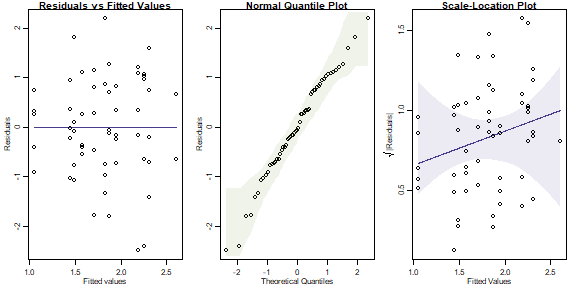

```r
anova(ft_seaweed3)
#> Analysis of Variance Table
#> 
#> Response: log(Total)
#>                Df  Sum Sq Mean Sq F value    Pr(>F)    
#> Size            1  0.9940 0.99399  3.5849 0.0647472 .  
#> Time            1  0.1923 0.19234  0.6937 0.4093064    
#> Dist            2  4.7737 2.38686  8.6084 0.0006829 ***
#> Size:Time       1  0.0605 0.06055  0.2184 0.6425429    
#> Size:Dist       2  0.1800 0.09000  0.3246 0.7244968    
#> Time:Dist       2  1.4117 0.70583  2.5456 0.0896686 .  
#> Size:Time:Dist  2  1.2318 0.61592  2.2214 0.1202189    
#> Residuals      45 12.4772 0.27727                      
#> ---
#> Signif. codes:  0 '***' 0.001 '**' 0.01 '*' 0.05 '.' 0.1 ' ' 1
```

(Note that `plotenvelope` was run with just `99` iterations, to speed up computation time.)

From the plots, we can't see any problems with assumptions.

The ANOVA suggests a main effect of `Dist`, with marginal evidence of an interaction with `Time` (judging from the boxplots, this is probably because of the larger values for `logTot` at `Time=5` in large plots).

We could reanalyse the data including `Wmass` as a covariate, for a three-factor ANCOVA:


```r
ft_seaweedW3 = lm(logTot~Wmass*Size*Time*Dist,data=seaweed)
anova(ft_seaweedW3)
#> Analysis of Variance Table
#> 
#> Response: logTot
#>                      Df Sum Sq Mean Sq F value    Pr(>F)    
#> Wmass                 1 6.7793  6.7793 28.2266 7.328e-06 ***
#> Size                  1 0.7106  0.7106  2.9585  0.094792 .  
#> Time                  1 0.0747  0.0747  0.3109  0.580899    
#> Dist                  2 2.8114  1.4057  5.8529  0.006675 ** 
#> Wmass:Size            1 0.0941  0.0941  0.3917  0.535700    
#> Wmass:Time            1 0.0233  0.0233  0.0970  0.757459    
#> Size:Time             1 0.3501  0.3501  1.4579  0.235849    
#> Wmass:Dist            2 0.1979  0.0990  0.4121  0.665636    
#> Size:Dist             2 0.0886  0.0443  0.1844  0.832475    
#> Time:Dist             2 1.3263  0.6631  2.7611  0.077848 .  
#> Wmass:Size:Time       1 0.0081  0.0081  0.0337  0.855482    
#> Wmass:Size:Dist       2 0.1404  0.0702  0.2924  0.748389    
#> Wmass:Time:Dist       2 0.2767  0.1384  0.5761  0.567645    
#> Size:Time:Dist        2 0.3440  0.1720  0.7162  0.496020    
#> Wmass:Size:Time:Dist  2 0.1701  0.0850  0.3540  0.704475    
#> Residuals            33 7.9257  0.2402                      
#> ---
#> Signif. codes:  0 '***' 0.001 '**' 0.01 '*' 0.05 '.' 0.1 ' ' 1
```

We get pretty much the same results. `Wmass` seems to be an important covariate, but after controlling for it, there is still a strong `Dist` main effect and not much else happening.

