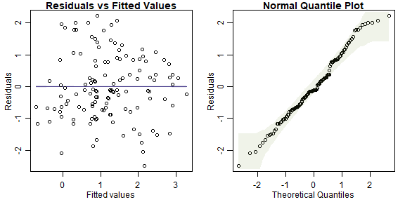

## Exercise 5.1: Plant height and climate

*Which climate variables best explain plant height?*

This question is about which variables best explain patterns in height -- it is not about hypothesis testing or interval estimation, instead we want to compare different possible models for plant height, and so can think of this as a _model selection_ question.

As before, this research question involves several variables: *height* (quantitative) and *climate*. How climate is measured has not been specified here, but it typically involves quantitative measurements of temperature, precipitation and often related variables.

As before we will answer this question using multiple regression, a type of linear model, and the main question is about which predictors to add to this linear model.


## Figures 5.1-5.2: bias-variance trade-off for polynomial models

Here is the code behind Figures 5.1-5.2.  Because of the small sample size, you can get quite different answers on different runs! Hence the seed has been fixed at the values used to generate results in the text.


```r
sigma=1.2
n=20
nDegree=8

seed=61
set.seed(seed)

x = sort( rnorm(2*n) )
y = 3*x-3*x^2 + rnorm(2*n)*sigma
idTrain = sample(1:(2*n),n)
xTest = x[-idTrain]
yTest = y[-idTrain]
x = x[idTrain]
y = y[idTrain]
X = data.frame(x)

err=rep(NA,nDegree)
errTrain = err
whichPlot=c(1,2,4,8)
cols = colorRampPalette(c("red", "blue"))( length(whichPlot) )

par(mar = c(2,1.5,1,1),mgp=c(1.75,0.75,0),mfrow=c(1,length(whichPlot)),las=1,oma=c(1,1,1,1))
dgreen=rgb(0,0.75,0,names="dgreen")
xpred = seq(min(x),max(x),length=500)
for(iDegree in 1:nDegree)
{
  fti=lm(y~poly(x,degree=iDegree,raw=TRUE),data=X)
  err[iDegree] = mean( (yTest - predict(fti,newdata=data.frame(x=xTest)))^2 ) 
  errTrain[iDegree] = mean(fti$residuals^2)
  if(iDegree %in% whichPlot)
  {
    plot(y~x,xaxt="n",yaxt="n",ylab="",xlab="")
    if(iDegree==1)
      mtext("y",2,line=1.5)
    mtext("x",1,line=1.5)
    axis(1,at=-2:1,labels=1:4,cex.axis=0.75)
    axis(2,at=5*(-3:0),labels=1:4,cex.axis=0.75)
    points(yTest~xTest,col=dgreen,pch="*")
    lines(xpred,predict(fti,newdata=data.frame(x=xpred)),col=cols[which(whichPlot==iDegree)])
    mtext(paste("Degree =",iDegree),3,line=0.5)
  }
}
legend("bottomright",c("Training data","Test data"),pch=c("o","*"),col=c("black",dgreen))
```


```r
print(err)
#> [1] 10.566356  1.729799  1.742761  1.945641  5.632565  5.681434  7.815761 10.459043


par(mar = c(2.75,2.75,1,1),mgp=c(1.75,0.75,0),mfrow=c(1,1),las=1)
plot(1:nDegree,errTrain,type="l",ylim=c(0,max(c(err,errTrain))),ylab="Mean squared error",xlab="Degree of polynomial [log scale]",xaxt="n",log="x",yaxt="n")
lines(1:nDegree,err,col=dgreen)
for(iDegree in whichPlot)
  axis(1,iDegree,col.ticks=cols[which(whichPlot==iDegree)],col.axis=cols[which(whichPlot==iDegree)])
axis(2,c(0,2,4,6))
legend("topright",c("Training data","Test data"),lty=1,col=c("black",dgreen))
```


## Code Box 5.1: Using validation for model selection using Angela's plant height data


```r
library(ecostats)
data(globalPlants)
n = dim(globalPlants)[1]
indTrain = sample(n,n^0.75) #select a training sample of size n^0.75:
datTrain = globalPlants[indTrain,]
datTest = globalPlants[-indTrain,]
ft_r = lm(log(height)~rain,dat=datTrain)
ft_rs = lm(log(height)~rain+rain.seas,dat=datTrain)
pr_r = predict(ft_r,newdata=datTest)
pr_rs = predict(ft_rs,newdata=datTest)
rss_r = mean( (log(datTest$height)-pr_r)^2 )
rss_rs = mean( (log(datTest$height)-pr_rs)^2 )
print( c(rss_r,rss_rs) )
#> [1] 2.668369 2.467766
```


## Code Box 5.2: 5-fold cross-validation for the data of Exercise 5.1


```r
library(DAAG)
ft_r = lm(log(height)~rain,dat=globalPlants)
ft_rs = lm(log(height)~rain+rain.seas,dat=globalPlants)
cv_r = cv.lm(data=globalPlants, ft_r, m=5, printit=FALSE) # 5 fold CV
```


```r
cv_rs = cv.lm(data=globalPlants, ft_rs, m=5, printit=FALSE) # 5 fold CV
#> Warning in cv.lm(data = globalPlants, ft_rs, m = 5, printit = FALSE): 
#> 
#>  As there is >1 explanatory variable, cross-validation
#>  predicted values for a fold are not a linear function
#>  of corresponding overall predicted values.  Lines that
#>  are shown for the different folds are approximate
```


```r
print( c( attr(cv_r,"ms"),attr(cv_rs,"ms") ), digits=6 )
#> [1] 2.22541 2.15883

cv_r = cv.lm(data=globalPlants, ft_r, m=5, printit=FALSE,seed=1) # 5 fold CV
```


```r
cv_rs = cv.lm(data=globalPlants, ft_rs, m=5, printit=FALSE,seed=1) # 5 fold CV
#> Warning in cv.lm(data = globalPlants, ft_rs, m = 5, printit = FALSE, seed = 1): 
#> 
#>  As there is >1 explanatory variable, cross-validation
#>  predicted values for a fold are not a linear function
#>  of corresponding overall predicted values.  Lines that
#>  are shown for the different folds are approximate
```


```r
print( c( attr(cv_r,"ms"),attr(cv_rs,"ms") ), digits=6 )
#> [1] 2.21103 2.16553

cv_r = cv.lm(data=globalPlants, ft_r, m=5, printit=FALSE,seed=2) # 5 fold CV
```


```r
cv_rs = cv.lm(data=globalPlants, ft_rs, m=5, printit=FALSE,seed=2) # 5 fold CV
#> Warning in cv.lm(data = globalPlants, ft_rs, m = 5, printit = FALSE, seed = 2): 
#> 
#>  As there is >1 explanatory variable, cross-validation
#>  predicted values for a fold are not a linear function
#>  of corresponding overall predicted values.  Lines that
#>  are shown for the different folds are approximate
```


```r
print( c( attr(cv_r,"ms"),attr(cv_rs,"ms") ), digits=6 )
#> [1] 2.22425 2.14762

cv_r = cv.lm(data=globalPlants, ft_r, m=5, printit=FALSE,seed=3) # 5 fold CV
```


```r
cv_rs = cv.lm(data=globalPlants, ft_rs, m=5, printit=FALSE,seed=3) # 5 fold CV
#> Warning in cv.lm(data = globalPlants, ft_rs, m = 5, printit = FALSE, seed = 3): 
#> 
#>  As there is >1 explanatory variable, cross-validation
#>  predicted values for a fold are not a linear function
#>  of corresponding overall predicted values.  Lines that
#>  are shown for the different folds are approximate
```


```r
print( c( attr(cv_r,"ms"),attr(cv_rs,"ms") ), digits=6 )
#> [1] 2.2783 2.2373
```

## Code Box 5.3: Computing Information Criteria on `R` for Exercise 5.1

```r
ft_r = lm(log(height)~rain,dat=globalPlants)
ft_rs = lm(log(height)~rain+rain.seas,dat=globalPlants)
c( AIC(ft_r), AIC(ft_rs) )
#> [1] 479.6605 475.4343
c( BIC(ft_r), BIC(ft_rs) )
#> [1] 488.2861 486.9351
```

## Code Box 5.4: All subsets selection for the plant height data of 5.1

```r
library(leaps)
fit_heightallsub<-regsubsets(log(height)~temp+rain+rain.wetm+temp.seas,
  data=globalPlants,nbest=2)
cbind(summary(fit_heightallsub)$outmat,summary(fit_heightallsub)$bic)
#>          temp rain rain.wetm temp.seas                    
#> 1  ( 1 ) " "  " "  "*"       " "       "-21.06175277099"  
#> 1  ( 2 ) " "  "*"  " "       " "       "-19.2868231448677"
#> 2  ( 1 ) "*"  "*"  " "       " "       "-24.8920679441895"
#> 2  ( 2 ) "*"  " "  "*"       " "       "-23.9315826810965"
#> 3  ( 1 ) "*"  "*"  " "       "*"       "-20.9786934545272"
#> 3  ( 2 ) "*"  "*"  "*"       " "       "-20.3405400349995"
#> 4  ( 1 ) "*"  "*"  "*"       "*"       "-16.4229239023018"
```

## Code Box 5.5: Stepwise subset selection for the plant height data of 5.1

```r
ft_clim = lm(log(height)~temp+rain+rain.wetm+temp.seas,
   data=globalPlants)
stepClim=step(ft_clim,trace=0)
stepClim$anova
#>          Step Df  Deviance Resid. Df Resid. Dev       AIC
#> 1             NA        NA       126   260.6727 100.13694
#> 2 - rain.wetm  1 0.6363946       127   261.3091  98.45637
#> 3 - temp.seas  1 1.9256333       128   263.2347  97.41819

ft_int = lm(log(height)~1,data=globalPlants)
stepForward <- step(ft_int,scope=formula(ft_clim),direction="forward",
    trace=0)
stepForward$anova
#>          Step Df Deviance Resid. Df Resid. Dev       AIC
#> 1             NA       NA       130   355.9206 132.93585
#> 2 + rain.wetm -1 74.59845       129   281.3221 104.12370
#> 3      + temp -1 16.15030       128   265.1718  98.37867
```

## Simulation code for Figure 5.4

I used `nSim=1000` in the book, but have set it to `50` here so the code doesn't take ages to run...


```r
library(mvtnorm)
nSim = 50 # increase this for a more precise answer 
p=8
n=32

beta = c(1,1,rep(0,p-2))
pTrue=2

rho=0.5
Sigma = diag(rep(1-rho,p))+rho
X=rmvnorm(n,sigma=Sigma)
eta = X %*% beta


resArray = array(0,c(3,3,nSim))
dimnames(resArray)[[1]]=c("AIC","MStrue","propTrue")
dimnames(resArray)[[2]]=c("all","for","back")
counter  = matrix(0,3,3)

for(iSim in 1:nSim)
{
  y = eta + rnorm(n)*2

  # construct matrix of all possible subsets
  allSubs = matrix(NA,2^p,p)
  for(iVar in 1:p)
    allSubs[,iVar] = rep(c(0,1),each=2^(p-iVar),times=2^(iVar-1))

  # define vectors to stor AIC and MS
  aics = rep(NA,2^p)
  ms   = aics
  isTrue=aics

  # intercept first as it will give error
  ft0 = lm(y~1)
  aics[1] = AIC(ft0)
  ms[1] = mean((predict(ft0)-eta)^2)
  isTrue[1] = FALSE

  # now get all subset results
  for(iModel in 2:2^p)
  {
    ft = lm(y~X[,allSubs[iModel,]==1])
    aics[iModel] = AIC(ft)
    ms[iModel] = mean((predict(ft)-eta)^2)
    isTrue[iModel] = allSubs[iModel,1]==1 & allSubs[iModel,2]==1 & sum(allSubs[iModel,])==2
  }

  whichBest = which(aics==min(aics))[1] #if tie take the first one, probably smaller, but whatever this won't happen

  # now backward stepwise
  ftBack = step(lm(y~.,data=data.frame(X)),trace=0,direction="backward")
  aicBack = AIC(ftBack)
  msBack = mean((predict(ftBack)-eta)^2)
  trueBack = length(coef(ftBack))==3 & "X1" %in% names(coef(ftBack)) & "X2" %in% names(coef(ftBack))

  # now forward stepwise
  scopeForm=paste0("X",1:p,collapse="+")
  ftFor = step(lm(y~1,data=data.frame(X)),scope=paste("~",scopeForm),trace=0,direction="forward")
  aicFor = AIC(ftFor)
  msFor = mean((predict(ftFor)-eta)^2)
  trueFor = length(coef(ftFor))==3 & "X1" %in% names(coef(ftFor)) & "X2" %in% names(coef(ftFor))

  counterAdd = matrix(0,3,3)
  resArray[1,,iSim] = c(aics[whichBest],aicFor,aicBack)
  resArray[2,,iSim] = c(ms[whichBest],msFor,msBack)
  resArray[3,,iSim] = c(isTrue[whichBest],trueFor,trueBack)

  eps=1.e-8
  whichAIC = which(resArray[1,,iSim]<min(resArray[1,,iSim])+eps)
  counterAdd[1,whichAIC] = 1
  whichMS = which(resArray[2,,iSim]<min(resArray[2,,iSim])+eps)
  counterAdd[2,whichMS] = 1
  counterAdd[3,] = resArray[3,,iSim]

  counter = counter + counterAdd
}
#end sim

resMean = apply(resArray,c(1,2),mean)
resSD = apply(resArray,c(1,2),sd)/sqrt(nSim)
counter = counter/nSim

print(resMean)
#>                  all         for       back
#> AIC      135.6532644 135.9232694 135.750229
#> MStrue     0.9629137   0.9017192   1.001753
#> propTrue   0.1400000   0.1600000   0.120000

par(mar=c(3,1,1,1),mgp=c(2,0.75,0),mfrow=c(1,2),oma=c(0,4,0,0))
plot(resMean[1,],1:3,ylim=c(0.5,3.5),col="blue",yaxt="n",pch=19,xlab="AIC",ylab="",xlim=range(resMean[1,]-2*resSD[1,],resMean[1,]+2*resSD[1,]))
for(iMethod in 1:3)
  lines(c(resMean[1,iMethod]-resSD[1,iMethod]*2,resMean[1,iMethod]+resSD[1,iMethod]*2),c(iMethod,iMethod),col="blue")
axis(2,at=1:3,labels=c("All subsets","Forward","Backward"),las=1)

plot(resMean[2,],1:3,ylim=c(0.5,3.5),col="blue",yaxt="n",pch=19,xlab=expression(paste("Mean squared error of ",hat(mu))),ylab="",xlim=range(resMean[2,]-2*resSD[2,],resMean[2,]+2*resSD[2,]))
for(iMethod in 1:3)
  lines(c(resMean[2,iMethod]-resSD[2,iMethod]*2,resMean[2,iMethod]+resSD[2,iMethod]*2),c(iMethod,iMethod),col="blue")
axis(2,at=1:3,labels=c(" "," "," "),las=1)
```


## Code Box 5.6: LASSO for plant height data of 5.1

```r
data(globalPlants)
library(glmnet)
X = cbind(globalPlants$temp, globalPlants$rain, globalPlants$rain.wetm,
   globalPlants$temp.seas)
ft_heightcv=cv.glmnet(X,log(globalPlants$height))
plot(ft_heightcv)
```


```r
ft_lasso=glmnet(X,log(globalPlants$height),lambda=ft_heightcv$lambda.min)
ft_lasso$beta
#> 4 x 1 sparse Matrix of class "dgCMatrix"
#>              s0
#> V1 0.0424080540
#> V2 0.0003785307
#> V3 0.0014047575
#> V4 .
```

## Exercise 5.2: Relative importance of climate variables

*How important are the different climate variables in explaining plant height?*

We are asked to quantify variable importance. A couple of techniques are suggested in Code Boxes 5.8-5.9.

## Code Box 5.7: Sequential $R^2$ for variable importance


```r
ft_clim = lm(log(height)~temp+rain+rain.wetm+temp.seas,data=globalPlants)
ft_int = lm(log(height)~1,data=globalPlants)
stepAnova = step(ft_int, scope=formula(ft_clim), direction="forward",
                     trace=0, k=0)$anova
stepAnova$R2 = stepAnova$Deviance/deviance(ft_int)
stepAnova
#>          Step Df  Deviance Resid. Df Resid. Dev       AIC          R2
#> 1             NA        NA       130   355.9206 130.93585          NA
#> 2 + rain.wetm -1 74.598450       129   281.3221 100.12370 0.209592965
#> 3      + temp -1 16.150298       128   265.1718  92.37867 0.045376129
#> 4      + rain -1  2.586703       127   262.5851  91.09452 0.007267641
#> 5 + temp.seas -1  1.912441       126   260.6727  90.13694 0.005373225
```

## Code Box 5.8: Marginal and conditional $R^2$ for variable importance


```r
stepMargin=add1(ft_int,scope=formula(ft_clim))
stepMargin$R2=stepMargin$`Sum of Sq`/deviance(ft_int)
stepMargin
#> Single term additions
#> 
#> Model:
#> log(height) ~ 1
#>           Df Sum of Sq    RSS    AIC      R2
#> <none>                 355.92 132.94        
#> temp       1    66.224 289.70 107.97 0.18607
#> rain       1    70.761 285.16 105.90 0.19881
#> rain.wetm  1    74.598 281.32 104.12 0.20959
#> temp.seas  1    46.401 309.52 116.64 0.13037

leave1out=drop1(ft_clim)
leave1out$R2=leave1out$`Sum of Sq`/deviance(ft_int)
leave1out
#> Single term deletions
#> 
#> Model:
#> log(height) ~ temp + rain + rain.wetm + temp.seas
#>           Df Sum of Sq    RSS     AIC       R2
#> <none>                 260.67 100.137         
#> temp       1   16.0581 276.73 105.968 0.045117
#> rain       1    3.4438 264.12  99.856 0.009676
#> rain.wetm  1    0.6364 261.31  98.456 0.001788
#> temp.seas  1    1.9124 262.58  99.095 0.005373
```

## Code Box 5.9: Standardised coefficients for Angela's height data


```r
# first create a dataset with standardised predictors:
globalPlantStand=globalPlants
whichVars=c("temp","rain","rain.wetm","temp.seas")
globalPlantStand[,whichVars]=scale(globalPlantStand[,whichVars])
# then fit the model:
ft_climStand = lm(log(height)~temp+rain+rain.wetm+temp.seas,
               data=globalPlantStand)
summary(ft_climStand)
#> 
#> Call:
#> lm(formula = log(height) ~ temp + rain + rain.wetm + temp.seas, 
#>     data = globalPlantStand)
#> 
#> Residuals:
#>     Min      1Q  Median      3Q     Max 
#> -2.9649 -1.0454 -0.0122  0.9801  3.4005 
#> 
#> Coefficients:
#>             Estimate Std. Error t value Pr(>|t|)    
#> (Intercept)   1.1947     0.1257   9.507  < 2e-16 ***
#> temp          0.5715     0.2051   2.786  0.00616 ** 
#> rain          0.4185     0.3244   1.290  0.19934    
#> rain.wetm     0.1860     0.3353   0.555  0.58013    
#> temp.seas     0.2090     0.2174   0.961  0.33816    
#> ---
#> Signif. codes:  0 '***' 0.001 '**' 0.01 '*' 0.05 '.' 0.1 ' ' 1
#> 
#> Residual standard error: 1.438 on 126 degrees of freedom
#> Multiple R-squared:  0.2676,	Adjusted R-squared:  0.2444 
#> F-statistic: 11.51 on 4 and 126 DF,  p-value: 5.378e-08
```

## Exercise 5.3: Variable importance output
*Compare the $R^2$ results of Code Boxes 5.7-5.8. Which table(s) do you think Angela should report when describing variable importance?*

This is a tough one -- I guess the main story is that:

1. a rain variable (whether `rain` or `rain.wetm`) explains a big hcunk of variation
2. `temp` explains a fair bit of variation even after rain variables are in the model

The most concise way to make these points would be to show the marginal $R^2$ table to make point 1, and the conditional $R^2$ table to make point 2.

*Now look at the standardised coefficients in Code Box 5.9. Do these coefficients measure marginal or conditional effects? Which of the $R^2$ tables in Code Box 5.8 are they most similar to in relative size (e.g. ranking from largest to smallest)? Is this what you expected?*

The `summary` function tells us about the coefficients in the model, which always measure _conditional_ effects after all other terms have been added to the model. The conditional $R^2$ table gives the most similar answers, with the same ranking of predictors (largest to smallest). The standardised coefficient for`rain.wetm` is larger than I expected, and for `temp` it is smaller than I expected, from looking at the conditional $R^2$ values. I guess this is because of differences in the extent of collinearity across predictors.


## Code Box 5.10: Importance of temperature vs rainfall


```r
ft_onlyTemp = lm(log(height)~temp+temp.seas,data=globalPlants)
tempAn=anova(ft_int,ft_onlyTemp,ft_clim)
tempAn$R2=tempAn$`Sum of Sq`/deviance(ft_int)
tempAn
#> Analysis of Variance Table
#> 
#> Model 1: log(height) ~ 1
#> Model 2: log(height) ~ temp + temp.seas
#> Model 3: log(height) ~ temp + rain + rain.wetm + temp.seas
#>   Res.Df    RSS Df Sum of Sq      F     Pr(>F)       R2
#> 1    130 355.92                                        
#> 2    128 289.00  2    66.917 16.173 0.00000056 0.188011
#> 3    126 260.67  2    28.331  6.847 0.00150359 0.079599

ft_onlyRain = lm(log(height)~rain+rain.wetm,data=globalPlants)
rainAn=anova(ft_int,ft_onlyRain,ft_clim)
rainAn$R2=rainAn$`Sum of Sq`/deviance(ft_int)
rainAn
#> Analysis of Variance Table
#> 
#> Model 1: log(height) ~ 1
#> Model 2: log(height) ~ rain + rain.wetm
#> Model 3: log(height) ~ temp + rain + rain.wetm + temp.seas
#>   Res.Df    RSS Df Sum of Sq       F    Pr(>F)       R2
#> 1    130 355.92                                        
#> 2    128 279.80  2    76.118 18.3964 0.0000001 0.213863
#> 3    126 260.67  2    19.130  4.6233 0.0115445 0.053747
```

# Code for Figure 5.5

```r
par(mgp=c(1.75,0.75,0),mar=c(2.75,0.5,0.5,0))
  
  R2sTemp = c(0,tempAn$R2[2])
  R2sRain = c(rainAn$R2[3],sum(rainAn$R2[2:3]))
  R2error=c(sum(rainAn$R2[2:3]),1)
  darkBlue=rgb(0,0,0.5,alpha=0.9)
  darkRed=rgb(0.5,0,0,alpha=0.9)
  darkYellow=rgb(0.5,0.5,0,alpha=0.9)
  plot(c(0,1),c(0,1),type="n",yaxt="n",xlab=expression(R^2),ylab="",bty="n")
  polygon(c(R2error,R2error[2:1]),c(0,0,1,1),col=rgb(1,1,0,alpha=0.25),lwd=0.25,border=darkYellow)
  polygon(c(R2sTemp,R2sTemp[2:1]),c(0,0,1,1),col=rgb(1,0,0,alpha=0.25),border=darkRed,lwd=1.5)
  polygon(c(R2sRain,R2sRain[2:1]),c(0,0,1,1),col=rgb(0,0,1,alpha=0.25),border=darkBlue,lwd=1.5)
  yText=0.15
  eps=0.008
  text(mean(R2error),0.5,'Unexplained',adj=0.5,col=darkYellow)
  text(eps,yText,'Temperature',adj=0,col=darkRed)
  text(R2sRain[2]-eps,1-yText,'Rainfall',adj=1,col=darkBlue)
```


## Exercise 5.4: Head bobs in lizards -- do their displays change with the environment?

*Terry... wanted to know which environmental features (out of temperature, light and noisiness) were related to head bobbing speed*

This is a model selection question, we want to see which environmental variables are associated with  head-bobbing, so will try a bunch of different models with different predictors to see which one(s) fits best.


```r
data(headbobLizards)
str(headbobLizards)
#> 'data.frame':	14 obs. of  10 variables:
#>  $ LizardID           : Factor w/ 14 levels "6","7","8","9",..: 1 2 3 4 5 6 7 8 9 10 ...
#>  $ Observation        : num  1 1 1 1 1 3.1 1 5 2 1 ...
#>  $ Display            : int  3 1 1 1 1 1 1 2 1 2 ...
#>  $ ObservationDate    : Factor w/ 19 levels "03-07-05","04-07-05",..: 1 2 1 1 1 3 1 2 3 1 ...
#>  $ ObservationTime24hr: Factor w/ 342 levels "10:00","10:03",..: 186 325 205 243 232 173 300 191 305 165 ...
#>  $ TemperatureC       : num  25.7 27.2 26.2 26.2 26 27.6 26.2 27.1 27 28.1 ...
#>  $ AmbientLight       : num  0.47 4.13 2.46 0.31 2.36 ...
#>  $ Bg_noise_max       : num  11.1 16.47 9.32 2.29 7.37 ...
#>  $ Hbspd_max          : num  29.7 54.4 34.6 26.7 28.7 ...
#>  $ time               : POSIXct, format: "2005-07-03 15:44:00" "2005-07-04 09:33:00" "2005-07-03 16:18:00" ...

# try some AIC funny-business
library(MASS)
par(mfrow=c(1,2),mar=c(3,3,1,1),mgp=c(1.75,0.75,0))
plot(Hbspd_max~TemperatureC,data=headbobLizards)
plot(Hbspd_max~Bg_noise_max,data=headbobLizards)
```


```r

# my vote is log-transformation, covers almost a factor of 3 and a bit of right-skew:
plot(Hbspd_max~TemperatureC,data=headbobLizards,log="y")
plot(Hbspd_max~Bg_noise_max,data=headbobLizards,log="y")
```


```r

headbobLizards$bobspeed=log(headbobLizards$Hbspd_max)
ft_headbob=lm(bobspeed~TemperatureC+AmbientLight+Bg_noise_max,data=headbobLizards)
plotenvelope(ft_headbob)
```


```r
stepAIC(ft_headbob)
#> Start:  AIC=-35.58
#> bobspeed ~ TemperatureC + AmbientLight + Bg_noise_max
#> 
#>                Df Sum of Sq     RSS     AIC
#> - Bg_noise_max  1  0.018757 0.64139 -37.164
#> <none>                      0.62264 -35.580
#> - AmbientLight  1  0.113540 0.73618 -35.235
#> - TemperatureC  1  0.193576 0.81621 -33.790
#> 
#> Step:  AIC=-37.16
#> bobspeed ~ TemperatureC + AmbientLight
#> 
#>                Df Sum of Sq     RSS     AIC
#> <none>                      0.64139 -37.164
#> - AmbientLight  1   0.14217 0.78356 -36.361
#> - TemperatureC  1   0.46327 1.10466 -31.553
#> 
#> Call:
#> lm(formula = bobspeed ~ TemperatureC + AmbientLight, data = headbobLizards)
#> 
#> Coefficients:
#>  (Intercept)  TemperatureC  AmbientLight  
#>    -1.930275      0.210716     -0.009144
summary(ft_headbob)
#> 
#> Call:
#> lm(formula = bobspeed ~ TemperatureC + AmbientLight + Bg_noise_max, 
#>     data = headbobLizards)
#> 
#> Residuals:
#>      Min       1Q   Median       3Q      Max 
#> -0.29881 -0.15097 -0.02893  0.07918  0.43165 
#> 
#> Coefficients:
#>               Estimate Std. Error t value Pr(>|t|)
#> (Intercept)  -1.085254   2.581853  -0.420    0.683
#> TemperatureC  0.176014   0.099825   1.763    0.108
#> AmbientLight -0.008383   0.006208  -1.350    0.207
#> Bg_noise_max  0.006418   0.011693   0.549    0.595
#> 
#> Residual standard error: 0.2495 on 10 degrees of freedom
#> Multiple R-squared:  0.4611,	Adjusted R-squared:  0.2994 
#> F-statistic: 2.852 on 3 and 10 DF,  p-value: 0.09115

ft_2=lm(bobspeed~TemperatureC+AmbientLight,data=headbobLizards)
summary(ft_2)
#> 
#> Call:
#> lm(formula = bobspeed ~ TemperatureC + AmbientLight, data = headbobLizards)
#> 
#> Residuals:
#>      Min       1Q   Median       3Q      Max 
#> -0.30317 -0.15088 -0.03001  0.07111  0.45789 
#> 
#> Coefficients:
#>               Estimate Std. Error t value Pr(>|t|)  
#> (Intercept)  -1.930275   2.005678  -0.962   0.3565  
#> TemperatureC  0.210716   0.074756   2.819   0.0167 *
#> AmbientLight -0.009144   0.005856  -1.561   0.1467  
#> ---
#> Signif. codes:  0 '***' 0.001 '**' 0.01 '*' 0.05 '.' 0.1 ' ' 1
#> 
#> Residual standard error: 0.2415 on 11 degrees of freedom
#> Multiple R-squared:  0.4448,	Adjusted R-squared:  0.3439 
#> F-statistic: 4.407 on 2 and 11 DF,  p-value: 0.0393

ft_int=lm(bobspeed~1,data=headbobLizards)
BIC(ft_int,ft_2,ft_headbob)
#>            df       BIC
#> ft_int      2 10.082646
#> ft_2        4  7.122104
#> ft_headbob  5  9.345644
```

There's actually a suggestion of non-linearity here, there are only a few points making that pattern though so I'm not sure. Also not sure if that makes sense, for lizards to get most active at an intermediate temperature, would need to check with Terry on that one...

But in any case, the main story seems to be that noisiness doesn't seem that important, it is more about temperature and light. Some $R^2$ values might help understand variable relative importance:


```r
stepMargin=add1(ft_int,scope=formula(ft_headbob))
stepMargin$R2=stepMargin$`Sum of Sq`/deviance(ft_int)
stepMargin
#> Single term additions
#> 
#> Model:
#> bobspeed ~ 1
#>              Df Sum of Sq     RSS     AIC      R2
#> <none>                    1.15530 -32.926        
#> TemperatureC  1   0.37174 0.78356 -36.361 0.32177
#> AmbientLight  1   0.05064 1.10466 -31.553 0.04384
#> Bg_noise_max  1   0.29569 0.85962 -35.065 0.25594

leave1out=drop1(ft_headbob)
leave1out$R2=leave1out$`Sum of Sq`/deviance(ft_int)
leave1out
#> Single term deletions
#> 
#> Model:
#> bobspeed ~ TemperatureC + AmbientLight + Bg_noise_max
#>              Df Sum of Sq     RSS     AIC       R2
#> <none>                    0.62264 -35.580         
#> TemperatureC  1  0.193576 0.81621 -33.790 0.167555
#> AmbientLight  1  0.113540 0.73618 -35.235 0.098278
#> Bg_noise_max  1  0.018757 0.64139 -37.164 0.016235
```

Well glad we looked at this as well... so temperature and noisiness both seem associated with headbobs, but after adding temp to the model, noisiness doesn't really add anything, whereas the reverse is not true. So it seems there is a fairly strong association with temp (marginally 32%, conditionally still 17%) and some effect of ambient light (marginally 4%, after controlling for temp 10%). The large marginal effect of noisiness is probably due to correlation with temp.


## Exercise 5.5 Plant height data and precipitation

*Find a subset of precipitation variables that optimally predicts plant height*

I'll start with forward selection.  We know temp is important so I will include that in all models

```r
data(globalPlants)
str(globalPlants)
#> 'data.frame':	131 obs. of  33 variables:
#>  $ sort_number     : int  1402 25246 11648 8168 22422 25151 26007 6597 16908 4610 ...
#>  $ site            : int  193 103 54 144 178 27 118 154 106 201 ...
#>  $ Genus_species   : Factor w/ 175 levels "_8324","Abies_veitchii",..: 5 143 67 45 127 142 147 37 96 28 ...
#>  $ Family          : Factor w/ 68 levels "Annonaceae","Asteraceae",..: 60 37 49 12 50 27 55 31 49 5 ...
#>  $ growthform      : Factor w/ 6 levels "Fern","Herb",..: 6 6 2 4 2 4 6 6 2 4 ...
#>  $ height          : num  22.86 45 0.55 0.6 0.152 ...
#>  $ Country         : Factor w/ 37 levels "Argentina","Australia",..: 35 26 2 14 35 2 NA 35 2 8 ...
#>  $ Site            : Factor w/ 127 levels "a-ngau","ab",..: 84 74 41 52 55 66 75 45 44 NA ...
#>  $ lat             : num  44.6 12.2 23.8 32.6 41.6 ...
#>  $ long            : num  -123.3 -70.5 133.8 34.9 -87 ...
#>  $ alt             : int  179 386 553 115 200 157 2 71 2 28 ...
#>  $ temp            : num  10.8 24.5 20.9 19.9 9.7 16.8 27.7 15.5 26.4 5.4 ...
#>  $ diurn.temp      : num  11.8 10.8 16.3 9.7 10.7 10 4.8 11.4 5 6.6 ...
#>  $ isotherm        : num  4.4 7.4 4.8 4.4 2.8 4.8 8.8 3.2 7.4 2.1 ...
#>  $ temp.seas       : num  5.2 0.9 6 4.9 9.7 3.9 0.2 8.6 0.6 8.3 ...
#>  $ temp.max.warm   : num  27 31.2 37 30.7 28.6 26.1 30.6 32.9 29.9 21.2 ...
#>  $ temp.min.cold   : num  0.3 16.7 3.6 8.7 -9.5 5.5 25.2 -2.6 23.2 -9 ...
#>  $ temp.ann.range  : num  26.7 14.5 33.4 22 38.1 20.6 5.4 35.5 6.7 30.2 ...
#>  $ temp.mean.wetqr : num  4.9 25.1 28.1 13.6 21.6 21.2 27.9 15.6 26.8 6.5 ...
#>  $ temp.mean.dryqr : num  17.4 23.2 14.8 25.3 -3.3 12.3 27.5 21.5 25.7 -1.6 ...
#>  $ temp.mean.warmqr: num  17.6 25.3 28.1 25.7 21.6 21.4 27.9 26.1 27.1 16.1 ...
#>  $ temp.mean.coldqr: num  4.5 23.1 12.8 13.6 -3.3 11.5 27.5 3.8 25.5 -5 ...
#>  $ rain            : int  1208 3015 278 598 976 1283 2585 1262 1704 664 ...
#>  $ rain.wetm       : int  217 416 37 159 104 157 300 129 309 77 ...
#>  $ rain.drym       : int  13 99 9 0 44 63 82 66 16 31 ...
#>  $ rain.seas       : int  69 45 42 115 23 29 34 18 66 28 ...
#>  $ rain.wetqr      : int  601 1177 109 408 299 450 870 382 806 220 ...
#>  $ rain.dryqr      : int  68 340 35 0 165 208 305 249 92 106 ...
#>  $ rain.warmqr     : int  75 928 109 2 299 385 855 268 659 191 ...
#>  $ rain.coldqr     : int  560 359 42 408 165 279 405 325 135 137 ...
#>  $ LAI             : num  2.51 4.26 1.32 1.01 3.26 4.14 NA 3.14 4.51 3.07 ...
#>  $ NPP             : int  572 1405 756 359 1131 1563 NA 1266 2296 536 ...
#>  $ hemisphere      : int  1 -1 -1 1 1 -1 1 1 -1 1 ...
globalPlants$logHt = log(globalPlants$height)
ft_temp = lm(logHt~temp, data=globalPlants)
ft_tempRain = lm(logHt~temp+rain+rain.wetm+rain.drym+rain.seas+rain.wetqr+rain.dryqr+rain.warmqr+rain.coldqr, data=globalPlants)
par(mfrow=c(1,2),mar=c(3,3,1,1),mgp=c(1.75,0.75,0))
plotenvelope(ft_tempRain)
```



```r
ft_step = step(ft_temp, scope=formula(ft_tempRain), direction="forward")
#> Start:  AIC=107.97
#> logHt ~ temp
#> 
#>               Df Sum of Sq    RSS     AIC
#> + rain.wetqr   1   26.7393 262.96  97.280
#> + rain         1   26.4615 263.24  97.418
#> + rain.wetm    1   24.5243 265.17  98.379
#> + rain.coldqr  1   20.3413 269.36 100.429
#> + rain.dryqr   1   11.2099 278.49 104.796
#> + rain.warmqr  1    9.4721 280.22 105.611
#> + rain.drym    1    9.2552 280.44 105.713
#> <none>                     289.70 107.966
#> + rain.seas    1    0.0632 289.63 109.938
#> 
#> Step:  AIC=97.28
#> logHt ~ temp + rain.wetqr
#> 
#>               Df Sum of Sq    RSS    AIC
#> + rain.coldqr  1    4.0676 258.89 97.238
#> <none>                     262.96 97.280
#> + rain.wetm    1    1.5701 261.39 98.495
#> + rain         1    1.1733 261.78 98.694
#> + rain.dryqr   1    0.7535 262.20 98.904
#> + rain.warmqr  1    0.5071 262.45 99.027
#> + rain.drym    1    0.4799 262.48 99.041
#> + rain.seas    1    0.0841 262.87 99.238
#> 
#> Step:  AIC=97.24
#> logHt ~ temp + rain.wetqr + rain.coldqr
#> 
#>               Df Sum of Sq    RSS    AIC
#> <none>                     258.89 97.238
#> + rain.wetm    1   1.33741 257.55 98.559
#> + rain.seas    1   0.12668 258.76 99.174
#> + rain.warmqr  1   0.01663 258.87 99.229
#> + rain         1   0.01150 258.88 99.232
#> + rain.dryqr   1   0.00406 258.88 99.236
#> + rain.drym    1   0.00005 258.89 99.238
```

So forward selection suggests adding rainfall in the wettest and coldest quarters to the model.

How about LASSO...


```r
XtempRain=with(globalPlants,cbind(temp,rain,rain.wetm,rain.drym,rain.seas,rain.wetqr,rain.dryqr,rain.wetqr,rain.dryqr))
library(glmnet)
lasso_rain=cv.glmnet(XtempRain,globalPlants$logHt,penalty.factor=c(0,rep(1,8)))
plot(lasso_rain)
```


```r
ft_lasso=glmnet(XtempRain,globalPlants$logHt,lambda=lasso_rain$lambda.min)
ft_lasso$beta
#> 9 x 1 sparse Matrix of class "dgCMatrix"
#>                      s0
#> temp       0.0396005806
#> rain       0.0006377051
#> rain.wetm  .           
#> rain.drym  .           
#> rain.seas  0.0055999469
#> rain.wetqr .           
#> rain.dryqr .           
#> rain.wetqr .           
#> rain.dryqr .
```

This time we are going with two rainfall variables again, but different ones -- total precipitation and seasonality. (This actually provides similar information to what you would get from `rain.wetqr` and `rain.dryqr`, which jointly tell you about both total rainfall and variability/seasonality.)

*Any issues with multi-collinearity amongst the precipitation variables? Try to address any multi-collinearity by culling one or two of the main culprits. Does this affect your previous model selection results?*


```r
library(car)
vif(ft_tempRain)
#>        temp        rain   rain.wetm   rain.drym   rain.seas  rain.wetqr  rain.dryqr 
#>      1.7730    111.0600     85.4340    110.1600      5.5247    130.5800    144.5700 
#> rain.warmqr rain.coldqr 
#>      9.5778      6.4369
cor(XtempRain)
#>                 temp        rain rain.wetm  rain.drym   rain.seas rain.wetqr rain.dryqr
#> temp       1.0000000  0.47869648 0.5552163  0.1923458  0.37764956  0.5530709  0.1959310
#> rain       0.4786965  1.00000000 0.9170080  0.7540378 -0.03914991  0.9276384  0.7811679
#> rain.wetm  0.5552163  0.91700800 1.0000000  0.4730420  0.30626819  0.9935421  0.5030374
#> rain.drym  0.1923458  0.75403779 0.4730420  1.0000000 -0.53128346  0.4907095  0.9933645
#> rain.seas  0.3776496 -0.03914991 0.3062682 -0.5312835  1.00000000  0.2893864 -0.5243323
#> rain.wetqr 0.5530709  0.92763843 0.9935421  0.4907095  0.28938641  1.0000000  0.5187558
#> rain.dryqr 0.1959310  0.78116788 0.5030374  0.9933645 -0.52433232  0.5187558  1.0000000
#> rain.wetqr 0.5530709  0.92763843 0.9935421  0.4907095  0.28938641  1.0000000  0.5187558
#> rain.dryqr 0.1959310  0.78116788 0.5030374  0.9933645 -0.52433232  0.5187558  1.0000000
#>            rain.wetqr rain.dryqr
#> temp        0.5530709  0.1959310
#> rain        0.9276384  0.7811679
#> rain.wetm   0.9935421  0.5030374
#> rain.drym   0.4907095  0.9933645
#> rain.seas   0.2893864 -0.5243323
#> rain.wetqr  1.0000000  0.5187558
#> rain.dryqr  0.5187558  1.0000000
#> rain.wetqr  1.0000000  0.5187558
#> rain.dryqr  0.5187558  1.0000000
```

A bunch of high VIF's, looking at correlations, `rain.wetm` looks like one of the main culprits, it is quite understandable that rainfall in the wettest month should be highly correlated with total rainfall, and with rainfall in the wettest quarter! Will also remove `rain.drym` because there is high redundancy between this variable and `rain.dryqr`.


```r
ft_tempLessRain = lm(logHt~temp+rain+rain.seas+rain.wetqr+rain.dryqr+rain.warmqr+rain.coldqr, data=globalPlants)
ft_Lstep = step(ft_temp, scope=formula(ft_tempLessRain), direction="forward")
#> Start:  AIC=107.97
#> logHt ~ temp
#> 
#>               Df Sum of Sq    RSS     AIC
#> + rain.wetqr   1   26.7393 262.96  97.280
#> + rain         1   26.4615 263.24  97.418
#> + rain.coldqr  1   20.3413 269.36 100.429
#> + rain.dryqr   1   11.2099 278.49 104.796
#> + rain.warmqr  1    9.4721 280.22 105.611
#> <none>                     289.70 107.966
#> + rain.seas    1    0.0632 289.63 109.938
#> 
#> Step:  AIC=97.28
#> logHt ~ temp + rain.wetqr
#> 
#>               Df Sum of Sq    RSS    AIC
#> + rain.coldqr  1    4.0676 258.89 97.238
#> <none>                     262.96 97.280
#> + rain         1    1.1733 261.78 98.694
#> + rain.dryqr   1    0.7535 262.20 98.904
#> + rain.warmqr  1    0.5071 262.45 99.027
#> + rain.seas    1    0.0841 262.87 99.238
#> 
#> Step:  AIC=97.24
#> logHt ~ temp + rain.wetqr + rain.coldqr
#> 
#>               Df Sum of Sq    RSS    AIC
#> <none>                     258.89 97.238
#> + rain.seas    1  0.126684 258.76 99.174
#> + rain.warmqr  1  0.016626 258.87 99.229
#> + rain         1  0.011498 258.88 99.232
#> + rain.dryqr   1  0.004059 258.88 99.236

XlessRain=model.matrix(ft_tempLessRain)[,-1]
lasso_Lrain=cv.glmnet(XlessRain,globalPlants$logHt,penalty.factor=c(0,rep(1,6)))
plot(lasso_Lrain)
```


```r
ft_Llasso=glmnet(XlessRain,globalPlants$logHt,lambda=lasso_Lrain$lambda.min)
ft_Llasso$beta
#> 7 x 1 sparse Matrix of class "dgCMatrix"
#>                       s0
#> temp        4.188268e-02
#> rain        5.333291e-05
#> rain.seas   .           
#> rain.wetqr  1.030699e-03
#> rain.dryqr  .           
#> rain.warmqr .           
#> rain.coldqr 6.719062e-04
```

Forward selection is unchanged, not a big surprise because the forward path stopped before any deleted variables were considered. This time LASSO gave a similar model, also picking `rain.wetqr` and `rain.coldqr`, it also added a small term for `rain` too. Note that the precise solution you get depends on randomness in the assignment of observations to validation groups, so your run may come out a little differently to this.
