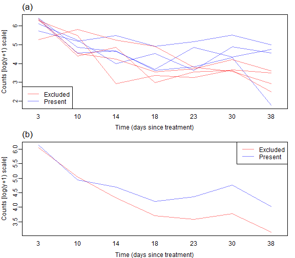
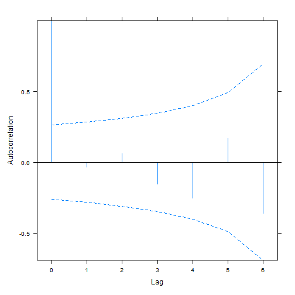
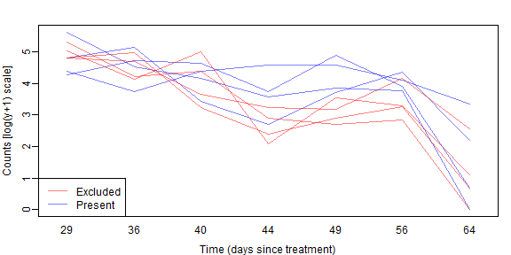
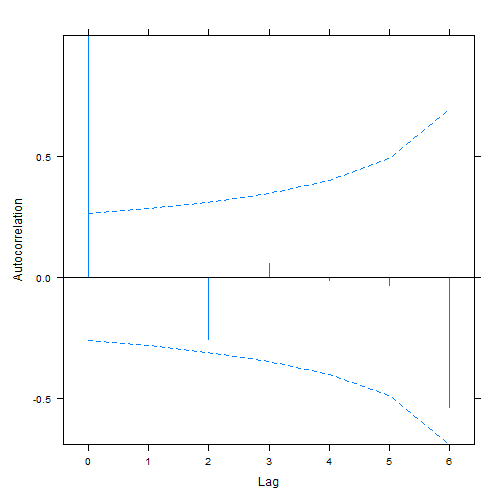
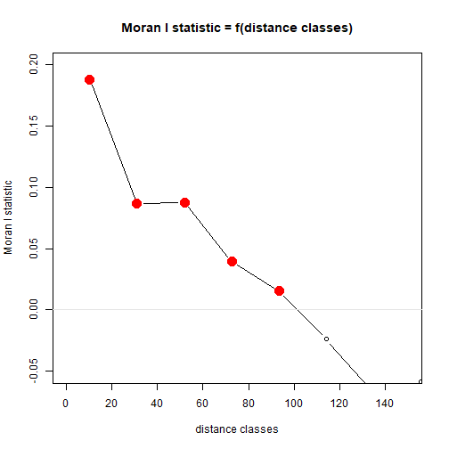
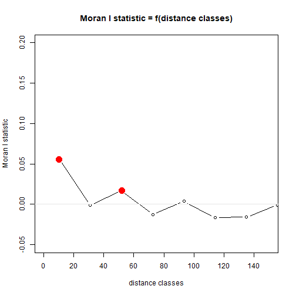
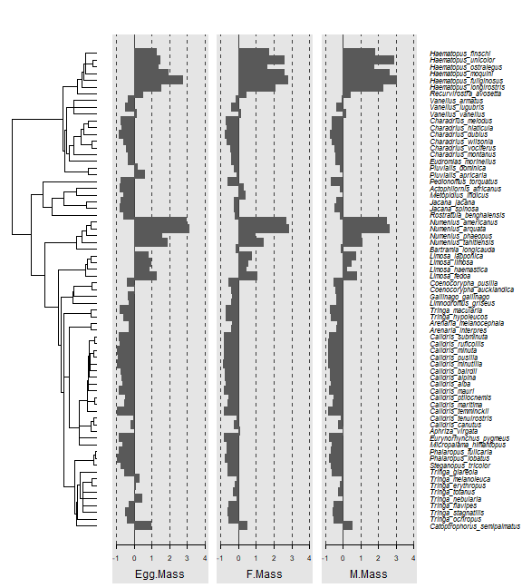
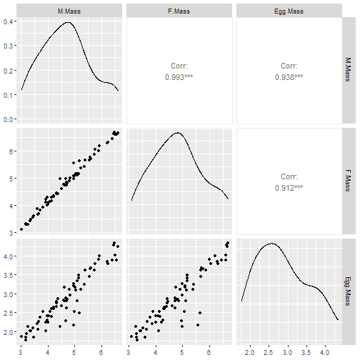

## Exercise 7.1: Biological control of aphids over time

_Is there an effect of the netting treatment on changes in aphid numbers across the sampling times?_

_What sort of model is appropriate here?_

Because we now have repeated measures in time, we have longitudinal data and should consider the methods of Section 7.1.1.

## Code Box 7.1: R code to produce Figure 7.2.


```r
library(ecostats)
data(aphids)
cols=c(rgb(1,0,0,alpha=0.5),rgb(0,0,1,alpha=0.5)) #transparent colours
par(mfrow=c(2,1),mar=c(3,3,1.5,1),mgp=c(2,0.5,0),oma=c(0,0,0.5,0))
with(aphids$oat, interaction.plot(Time,Plot,logcount,legend=FALSE,
  col=cols[Treatment], lty=1, ylab="Counts [log(y+1) scale]",
  xlab="Time (days since treatment)") )
legend("bottomleft",c("Excluded","Present"),col=cols,lty=1)
mtext("(a)",3,adj=0,line=0.5,cex=1.4)
with(aphids$oat, interaction.plot(Time,Treatment,logcount, col=cols,
  lty=1, legend=FALSE, ylab="Counts [log(y+1) scale]",
  xlab="Time (days since treatment)"))
legend("topright",c("Excluded","Present"),col=cols,lty=1)
mtext("(b)",3,adj=0,line=0.5,cex=1.4)
```



## Code Box 7.2: Choosing a longitudinal model for the aphid data


```r
library(lme4)
aphid_int = lmer(logcount~Treatment*Time+Treatment*I(Time^2)+(1|Plot),
    data=aphids$oat,REML=FALSE) # random intercepts model
aphid_slope = lmer(logcount~Treatment*Time+Treatment*I(Time^2)+(Time|Plot),
    data=aphids$oat, REML=FALSE) # random slopes model
#> Warning in checkConv(attr(opt, "derivs"), opt$par, ctrl = control$checkConv, : Model failed to converge with max|grad| =
#> 0.00715391 (tol = 0.002, component 1)
library(nlme) # refit random intercepts model in nlme to get a ACF:
aphid_int2 = lme(logcount~Treatment*Time+Treatment*I(Time^2),
    random=~1|Plot, data=aphids$oat, method="ML")
plot(ACF(aphid_int2),alpha=0.05) # only works for nlme-fitted mixed models
```



```r
# now try a model with a temporally structured random effect:
aphid_CAR1 = update(aphid_int2,correlation=corCAR1(,form=~Time|Plot))
BIC(aphid_int,aphid_int2,aphid_slope,aphid_CAR1)
#>             df      BIC
#> aphid_int    8 144.5429
#> aphid_int2   8 144.5429
#> aphid_slope 10 147.4244
#> aphid_CAR1   9 148.1673
```


## Code Box 7.3: Exploring the random intercept fit to the aphids data


```r
print(aphid_int)
#> Linear mixed model fit by maximum likelihood  ['lmerMod']
#> Formula: logcount ~ Treatment * Time + Treatment * I(Time^2) + (1 | Plot)
#>    Data: aphids$oat
#>      AIC      BIC   logLik deviance df.resid 
#> 128.3401 144.5429 -56.1701 112.3401       48 
#> Random effects:
#>  Groups   Name        Std.Dev.
#>  Plot     (Intercept) 0.202   
#>  Residual             0.635   
#> Number of obs: 56, groups:  Plot, 8
#> Fixed Effects:
#>                (Intercept)            Treatmentpresent                        Time                   I(Time^2)  
#>                  6.5703718                  -0.2379806                  -0.1943256                   0.0028708  
#>      Treatmentpresent:Time  Treatmentpresent:I(Time^2)  
#>                  0.0495183                  -0.0004498
anova(aphid_int)
#> Analysis of Variance Table
#>                     npar  Sum Sq Mean Sq F value
#> Treatment              1  2.0410  2.0410  5.0619
#> Time                   1 24.7533 24.7533 61.3917
#> I(Time^2)              1  5.7141  5.7141 14.1717
#> Treatment:Time         1  1.6408  1.6408  4.0693
#> Treatment:I(Time^2)    1  0.0413  0.0413  0.1024
aphid_noTreat = lmer(logcount~Time+I(Time^2)+(1|Plot),
   data=aphids$oat, REML=FALSE)
anova(aphid_noTreat,aphid_int)
#> Data: aphids$oat
#> Models:
#> aphid_noTreat: logcount ~ Time + I(Time^2) + (1 | Plot)
#> aphid_int: logcount ~ Treatment * Time + Treatment * I(Time^2) + (1 | Plot)
#>               npar    AIC    BIC  logLik deviance  Chisq Df Pr(>Chisq)  
#> aphid_noTreat    5 130.26 140.39 -60.131   120.26                       
#> aphid_int        8 128.34 144.54 -56.170   112.34 7.9224  3    0.04764 *
#> ---
#> Signif. codes:  0 '***' 0.001 '**' 0.01 '*' 0.05 '.' 0.1 ' ' 1
```

## Code Box 7.4: Exploring the random slopes fit to the aphids data


```r
print(aphid_slope)
#> Linear mixed model fit by maximum likelihood  ['lmerMod']
#> Formula: logcount ~ Treatment * Time + Treatment * I(Time^2) + (Time |      Plot)
#>    Data: aphids$oat
#>      AIC      BIC   logLik deviance df.resid 
#> 127.1708 147.4244 -53.5854 107.1708       46 
#> Random effects:
#>  Groups   Name        Std.Dev. Corr 
#>  Plot     (Intercept) 0.11684       
#>           Time        0.01907  -1.00
#>  Residual             0.57877       
#> Number of obs: 56, groups:  Plot, 8
#> Fixed Effects:
#>                (Intercept)            Treatmentpresent                        Time                   I(Time^2)  
#>                  6.5703718                  -0.2379806                  -0.1943256                   0.0028708  
#>      Treatmentpresent:Time  Treatmentpresent:I(Time^2)  
#>                  0.0495183                  -0.0004498  
#> optimizer (nloptwrap) convergence code: 0 (OK) ; 0 optimizer warnings; 1 lme4 warnings
anova(aphid_slope)
#> Analysis of Variance Table
#>                     npar  Sum Sq Mean Sq F value
#> Treatment              1  0.7467  0.7467  2.2291
#> Time                   1 12.8040 12.8040 38.2239
#> I(Time^2)              1  5.7141  5.7141 17.0582
#> Treatment:Time         1  0.8487  0.8487  2.5337
#> Treatment:I(Time^2)    1  0.0413  0.0413  0.1232
aphid_noTreatS = lmer(logcount~Time+I(Time^2)+(Time|Plot),
    data=aphids$oat, REML=FALSE)
#> boundary (singular) fit: see help('isSingular')
anova(aphid_noTreatS,aphid_slope)
#> Data: aphids$oat
#> Models:
#> aphid_noTreatS: logcount ~ Time + I(Time^2) + (Time | Plot)
#> aphid_slope: logcount ~ Treatment * Time + Treatment * I(Time^2) + (Time | Plot)
#>                npar    AIC    BIC  logLik deviance  Chisq Df Pr(>Chisq)
#> aphid_noTreatS    7 125.04 139.22 -55.519   111.04                     
#> aphid_slope      10 127.17 147.42 -53.585   107.17 3.8666  3     0.2762
```

## Exercise 7.2: Biological control of aphids in a wheat field
*Repeat the above longitudinal analyses for data from the wheat field. Which longitudinal model better handles repeated measures in this case?*


```r
data(aphids)
cols=c(rgb(1,0,0,alpha=0.5),rgb(0,0,1,alpha=0.5)) #transparent colours
par(mar=c(3,3,1.5,1),mgp=c(2,0.5,0),oma=c(0,0,0.5,0))
with(aphids$wheat, interaction.plot(Time,Plot,logcount,legend=FALSE,
  col=cols[Treatment], lty=1, ylab="Counts [log(y+1) scale]",
  xlab="Time (days since treatment)") )
legend("bottomleft",c("Excluded","Present"),col=cols,lty=1)
```



As before we don't see a lot of lines crossing over so expect some correlation. We also see a similar pattern with aphid counts reducing over time, but possibly being higher without bird exclusion 2-5 weeks into the trial. 


```r
library(lme4)
aphidw_int = lmer(logcount~Treatment*Time+Treatment*I(Time^2)+(1|Plot),
    data=aphids$wheat,REML=FALSE) # random intercepts model
#> Warning: Some predictor variables are on very different scales: consider rescaling
#> boundary (singular) fit: see help('isSingular')
aphidw_slope = lmer(logcount~Treatment*Time+Treatment*I(Time^2)+(Time|Plot),
    data=aphids$wheat, REML=FALSE) # random slopes model
#> Warning: Some predictor variables are on very different scales: consider rescaling
#> boundary (singular) fit: see help('isSingular')
library(nlme) # refit random intercepts model in nlme to get a ACF:
aphidw_int2 = lme(logcount~Treatment*Time+Treatment*I(Time^2),
    random=~1|Plot, data=aphids$wheat, method="ML")
plot(ACF(aphidw_int2),alpha=0.05) # only works for nlme-fitted mixed models
```



```r
# now try a model with a temporally structured random effect:
# for some reason this one returns non-convergence unless I make Tiem a (numerical) factor:
aphidsTimenFac=glmmTMB::numFactor(aphids$wheat$Time) 
aphidw_CAR1 = update(aphidw_int2,correlation=corCAR1(,form=~aphidsTimenFac|Plot))

BIC(aphidw_int,aphidw_int2,aphidw_slope,aphidw_CAR1)
#>              df      BIC
#> aphidw_int    8 165.5916
#> aphidw_int2   8 165.5916
#> aphidw_slope 10 170.1048
#> aphidw_CAR1   9 169.6170
```

As before the random intercept model seems to be favoured.

*Is there evidence that bird exclusion improves biological control of aphids?*


```r
aphidw_noTr = lmer(logcount~Time+I(Time^2)+(1|Plot),
    data=aphids$wheat,REML=FALSE) # random intercepts model
#> Warning: Some predictor variables are on very different scales: consider rescaling
#> boundary (singular) fit: see help('isSingular')
anova(aphidw_noTr,aphidw_int)
#> Data: aphids$wheat
#> Models:
#> aphidw_noTr: logcount ~ Time + I(Time^2) + (1 | Plot)
#> aphidw_int: logcount ~ Treatment * Time + Treatment * I(Time^2) + (1 | Plot)
#>             npar    AIC    BIC  logLik deviance  Chisq Df Pr(>Chisq)  
#> aphidw_noTr    5 151.02 161.15 -70.511   141.02                       
#> aphidw_int     8 149.39 165.59 -66.694   133.39 7.6327  3    0.05424 .
#> ---
#> Signif. codes:  0 '***' 0.001 '**' 0.01 '*' 0.05 '.' 0.1 ' ' 1
```

There is marginal evidence of a treatment effect.


## Exercise 7.3: Biological control of aphids across both fields!
*Construct a single, larger model to test for an effect of biological exclusion, and to check if this effect differs across fields.*


```r
aphids$oat$field   = "oat"
aphids$wheat$field = "wheat"
aphids$wheat$Plot=paste0("W",aphids$wheat$Plot) #making sure we have different names for different Plots across fields
aphids$all         = rbind(aphids$oat,aphids$wheat)
aphids$all$field   = factor(aphids$all$field)
str(aphids$all)
#> 'data.frame':	112 obs. of  6 variables:
#>  $ Plot     : Factor w/ 16 levels "1","2","3","4",..: 1 2 3 4 5 6 7 8 1 2 ...
#>  $ Treatment: Factor w/ 2 levels "excluded","present": 2 2 2 2 1 1 1 1 2 2 ...
#>  $ Time     : num  3 3 3 3 3 3 3 3 10 10 ...
#>  $ counts   : int  449 547 597 304 520 587 545 192 185 93 ...
#>  $ logcount : num  6.11 6.31 6.39 5.72 6.26 ...
#>  $ field    : Factor w/ 2 levels "oat","wheat": 1 1 1 1 1 1 1 1 1 1 ...
```

We will need a mixed model that allows effects to be different across fields (and times)

```r
aphida_int = lmer(logcount~field*Time*Treatment+field*I(Time^2)*Treatment+(1|Plot),
    data=aphids$all,REML=FALSE) # random intercepts model
#> Warning: Some predictor variables are on very different scales: consider rescaling
#> boundary (singular) fit: see help('isSingular')
aphida_noTr = lmer(logcount~field*Time+field*I(Time^2)+(1|Plot),
    data=aphids$all,REML=FALSE) # random intercepts model
#> Warning: Some predictor variables are on very different scales: consider rescaling
anova(aphida_noTr,aphida_int)
#> Data: aphids$all
#> Models:
#> aphida_noTr: logcount ~ field * Time + field * I(Time^2) + (1 | Plot)
#> aphida_int: logcount ~ field * Time * Treatment + field * I(Time^2) * Treatment + (1 | Plot)
#>             npar    AIC    BIC  logLik deviance  Chisq Df Pr(>Chisq)  
#> aphida_noTr    8 280.88 302.63 -132.44   264.88                       
#> aphida_int    14 276.61 314.67 -124.30   248.61 16.273  6    0.01236 *
#> ---
#> Signif. codes:  0 '***' 0.001 '**' 0.01 '*' 0.05 '.' 0.1 ' ' 1
```

In the combined model there is some evidence of a treatment effect.


## Exercise 7.4: Eucalypt richness as a function of the environment
*Ian wanted to know: how does \emph{Myrtaceae} species richness vary from one area to the next, and what are the main environmental correlates of richness?... Plotting richness against spatial location, he found spatial clusters of high or low species richness (Fig. 7.3)... What sort of analysis method should Ian consider using?*

He should be looking at fitting a spatial model, along the lines of Code Box 7.5.

## Code Box 7.5: Model selection to choose predictors, and a spatial model, for Ian's richness data


```r
data(Myrtaceae)
Myrtaceae$logrich=log(Myrtaceae$richness+1)
ft_rich = lm(logrich~soil+poly(TMP_MAX,TMP_MIN,RAIN_ANN,degree=2),
     data=Myrtaceae)
ft_richAdd = lm(logrich~soil+poly(TMP_MAX,degree=2)+
     poly(TMP_MIN,degree=2)+poly(RAIN_ANN,degree=2), data=Myrtaceae)
BIC(ft_rich,ft_richAdd)
#>            df      BIC
#> ft_rich    19 1014.686
#> ft_richAdd 16 1002.806
```

_(The below code chunk takes several minutes to evaluate.)_

```r
library(nlme)
richForm = logrich~soil+poly(TMP_MAX,degree=2)+poly(TMP_MIN,degree=2)+
       poly(RAIN_ANN,degree=2)
ft_richExp = gls(richForm,data=Myrtaceae,correlation=corExp(form=~X+Y))
ft_richNugg = gls(richForm,data=Myrtaceae,
         correlation=corExp(form=~X+Y,nugget=TRUE))
BIC(ft_richExp,ft_richNugg)
#>             df       BIC
#> ft_richExp  17 1036.2154
#> ft_richNugg 18  979.5212
```


## Code Box 7.6: Inferences from spatial and non-spatial models for Ian's richness data


```r
ft_richNugg
anova(ft_richAdd)
anova(ft_richNugg)
```


## Code Box 7.7: Spatial correlogram for Ian's species richness data


```r
library(pgirmess)
corRich = with(Myrtaceae,correlog(cbind(X,Y),logrich))
plot(corRich,xlim=c(0,150),ylim=c(-0.05,0.2))
abline(h=0,col="grey90")
```



```r

Myrtaceae$resid = residuals(ft_richAdd)
corRichResid = with(Myrtaceae,correlog(cbind(X,Y),resid))
plot(corRichResid,xlim=c(0,150),ylim=c(-0.05,0.2))
abline(h=0,col="grey90")
```




## Exercise 7.5: Egg size when Dads incubate
*Terje wondered whether egg size was specifically limited by male body size. So he collected data on 71 species of shorebird where the male incubates the egg, measuring egg size, and size of adult males and females... What sort of model might be appropriate here?*

We could try a linear model for egg size as a function of female and male bird size. 

*Can see you see any potential problems satisfying independence assumptions?*

A potential issue is that there is a phylogenetic signal in many traits: if shorebird species are more closely related, we can expect their egg sizes to be more similar.

## Code Box 7.8: Phylogenetic tree of 71 shorebird species


```r
library(caper)
data(shorebird)
shore4d=phylobase::phylo4d(shorebird.tree,shorebird.data)
library(phylosignal)
barplot.phylo4d(shore4d,c("Egg.Mass","F.Mass","M.Mass"))
#> Warning in asMethod(object): trees with unknown order may be unsafe in ape
```




## Code Box 7.9: Exploratory analysis of egg size data}\label{code:eggEDA}


```r
library(GGally)
ggpairs(log(shorebird.data[,2:4]))
```



## Code Box 7.10: Comparative analysis of egg size data


```r
library(caper)
shorebird = comparative.data(shorebird.tree, shorebird.data,
                   Species, vcv=TRUE)
pgls_egg = pgls(log(Egg.Mass) ~ log(F.Mass)+log(M.Mass),
                data=shorebird)
summary(pgls_egg)
#> 
#> Call:
#> pgls(formula = log(Egg.Mass) ~ log(F.Mass) + log(M.Mass), data = shorebird)
#> 
#> Residuals:
#>       Min        1Q    Median        3Q       Max 
#> -0.097840 -0.027594  0.000748  0.018561  0.063632 
#> 
#> Branch length transformations:
#> 
#> kappa  [Fix]  : 1.000
#> lambda [Fix]  : 1.000
#> delta  [Fix]  : 1.000
#> 
#> Coefficients:
#>             Estimate Std. Error t value Pr(>|t|)    
#> (Intercept) -0.37902    0.23172 -1.6357 0.106520    
#> log(F.Mass) -0.22255    0.22081 -1.0079 0.317077    
#> log(M.Mass)  0.89708    0.22246  4.0325 0.000142 ***
#> ---
#> Signif. codes:  0 '***' 0.001 '**' 0.01 '*' 0.05 '.' 0.1 ' ' 1
#> 
#> Residual standard error: 0.03343 on 68 degrees of freedom
#> Multiple R-squared: 0.8476,	Adjusted R-squared: 0.8431 
#> F-statistic: 189.1 on 2 and 68 DF,  p-value: < 2.2e-16
```

## Code Box 7.11: Residual diagnostics for egg size data

_The below code chunk takes several minutes to evaluate so it has not been run_

```r
par(mfrow=c(2,2))
plot(pgls_egg)
res.df = data.frame(Species = shorebird.data$Species,
                res = residuals(pgls_egg))
res4d = phylobase::phylo4d(shorebird.tree,res.df)
res.pg = phyloCorrelogram(res4d,trait="res")
plot(res.pg)
```


## Exercise 7.6: Comparative analysis of egg size data revisited

*Refit the model allowing $\lambda$ to be estimated from the data (using `lambda="ML"`), or allowing $\delta$ to be estimated from the data.*


```r
pgls_eggL = pgls(log(Egg.Mass) ~ log(F.Mass)+log(M.Mass), lambda="ML",
                data=shorebird)
summary(pgls_eggL)
#> 
#> Call:
#> pgls(formula = log(Egg.Mass) ~ log(F.Mass) + log(M.Mass), data = shorebird, 
#>     lambda = "ML")
#> 
#> Residuals:
#>       Min        1Q    Median        3Q       Max 
#> -0.072175 -0.015738  0.001073  0.017126  0.057342 
#> 
#> Branch length transformations:
#> 
#> kappa  [Fix]  : 1.000
#> lambda [ ML]  : 0.947
#>    lower bound : 0.000, p = 1.1224e-13
#>    upper bound : 1.000, p = 0.033109
#>    95.0% CI   : (0.839, 0.997)
#> delta  [Fix]  : 1.000
#> 
#> Coefficients:
#>             Estimate Std. Error t value  Pr(>|t|)    
#> (Intercept) -0.43469    0.20689 -2.1011   0.03934 *  
#> log(F.Mass) -0.28756    0.22202 -1.2952   0.19963    
#> log(M.Mass)  0.97556    0.22304  4.3740 4.293e-05 ***
#> ---
#> Signif. codes:  0 '***' 0.001 '**' 0.01 '*' 0.05 '.' 0.1 ' ' 1
#> 
#> Residual standard error: 0.02841 on 68 degrees of freedom
#> Multiple R-squared: 0.8709,	Adjusted R-squared: 0.8671 
#> F-statistic: 229.3 on 2 and 68 DF,  p-value: < 2.2e-16
```

*Does this change results and their interpretation?*

Nope -- results are pretty much the same as previously.

*Now fit a linear model ignoring phylogeny, via `lm`. What happens here?*

```r
lm_egg = lm(log(Egg.Mass) ~ log(F.Mass)+log(M.Mass), data=shorebird.data)
summary(lm_egg)
#> 
#> Call:
#> lm(formula = log(Egg.Mass) ~ log(F.Mass) + log(M.Mass), data = shorebird.data)
#> 
#> Residuals:
#>     Min      1Q  Median      3Q     Max 
#> -0.5843 -0.1104  0.0257  0.1338  0.4347 
#> 
#> Coefficients:
#>             Estimate Std. Error t value Pr(>|t|)    
#> (Intercept)  -0.2105     0.1296  -1.624    0.109    
#> log(F.Mass)  -1.0605     0.2261  -4.691 1.36e-05 ***
#> log(M.Mass)   1.7433     0.2283   7.635 1.01e-10 ***
#> ---
#> Signif. codes:  0 '***' 0.001 '**' 0.01 '*' 0.05 '.' 0.1 ' ' 1
#> 
#> Residual standard error: 0.2113 on 68 degrees of freedom
#> Multiple R-squared:  0.9089,	Adjusted R-squared:  0.9063 
#> F-statistic: 339.3 on 2 and 68 DF,  p-value: < 2.2e-16
```

The slopes move further from zero and everything becomes more significant. In particular, while there was no effect of female mass previously, now it is strongly significant.


*Is this what you would expect?*

Yes this is expected because phylogenetic relatedness introduces positive dependence, leading to under-estimation of uncertainty and a higher chance of false positives.

*Look at the log-likelihood (using the `logLik` function) to help decide which of these models is a better fit to the data.*


```r
logLik(lm_egg)
#> 'log Lik.' 11.1658 (df=4)
logLik(pgls_eggL)
#> 'log Lik.' 38.73639 (df=3)
```

Something seems to be wrong with the `df` calculation in the `pgls` model, but the main thing to see here is that the log-likelihood is substantially higher for the `pgls` model, suggesting it is a much better fit to the data.
