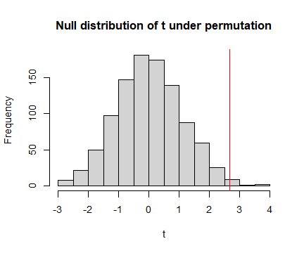
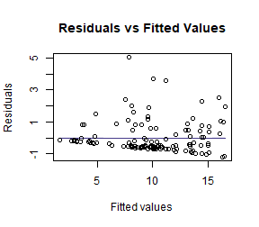
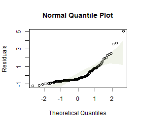
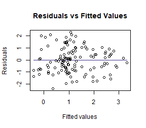
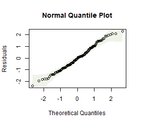
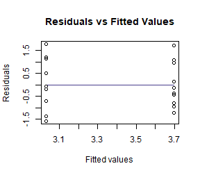
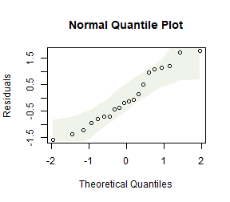
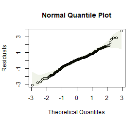

## Exercise 9.1: Smoking in pregnancy
*Consider again the guinea pig experiment... How can we make inferences about the treatment effect, without assuming normality?*

Design-based inference allows us to relax distributional assumptions. Specifically, if we use a permutation test as in Code Box 9.1, or a bootstrap test as in Code Box 9.3, we do not assume normality.

## Exercise 9.2: Three example permutations of treatment labels in the guinea pig data

*Does the observed statistic of 2.67 seem large compared to these values? What does this tell you?*

The three statistics obtained by permuting data were 0.76, -2.09 and -1.08. These are all smaller than 2.67, suggesting that 2.67 is unusually large compared to what we would expect if there were no treatment effect. However, to say something more precise about how unusual this is we should do many more permutations...


## Code behind Figure 9.1


```r
library(ecostats)
data(guineapig)
ft_guinea = lm(errors~treatment,data=guineapig)
tObs = summary(ft_guinea)$coef[2,3] #store observed t-statistic

nPerm = 1000
tStats = rep(NA,nPerm)
tStats[1] = tObs
for(iPerm in 2:nPerm)
{
  guineapig$treatPerm = sample(guineapig$treatment) #permute treatment labels
  ft_guineaPerm = lm(errors~treatPerm,data=guineapig) #re-fit model
  tStats[iPerm] = summary(ft_guineaPerm)$coef[2,3] #store t-stat
}
par(cex=1.2,lwd=1.5)
hist(tStats,main="Null distribution of t under permutation",xlab="t")
abline(v=tObs,col="red") #put a red line on plot for observed t-stat
```



```r
p = mean( tStats >= tObs ) #compute P-value
print(p)
#> [1] 0.01
```

## Code Box 9.1: A permutation test for the guinea pig data using `mvabund`


```r
library(mvabund)
data(guineapig)
ft_guinea = manylm(errors~treatment,data=guineapig)
anova(ft_guinea)
#> Analysis of Variance Table
#> 
#> Model: manylm(formula = errors ~ treatment, data = guineapig)
#> 
#> Overall test for all response variables
#> Test statistics:
#>             Res.Df Df.diff val(F) Pr(>F)  
#> (Intercept)     19                        
#> treatment       18       1  7.134  0.016 *
#> ---
#> Signif. codes:  0 '***' 0.001 '**' 0.01 '*' 0.05 '.' 0.1 ' ' 1
#> Arguments: P-value calculated using 999 iterations via residual (without replacement) resampling.
```


## Code Box 9.2: Permutation test for a relationship between latitude and plant height


```r
data(globalPlants)
ft_height = manylm(height~lat, data=globalPlants)
anova(ft_height)
#> Analysis of Variance Table
#> 
#> Model: manylm(formula = height ~ lat, data = globalPlants)
#> 
#> Overall test for all response variables
#> Test statistics:
#>             Res.Df Df.diff val(F) Pr(>F)   
#> (Intercept)    130                         
#> lat            129       1  9.271  0.007 **
#> ---
#> Signif. codes:  0 '***' 0.001 '**' 0.01 '*' 0.05 '.' 0.1 ' ' 1
#> Arguments: P-value calculated using 999 iterations via residual (without replacement) resampling.
```


## Code Box 9.3: Using the `mvabund` package for a bootstrap test of guinea pig data


```r
library(mvabund)
ft_guinea = manylm(errors~treatment, data=guineapig)
anova(ft_guinea, resamp="residual")
#> Analysis of Variance Table
#> 
#> Model: manylm(formula = errors ~ treatment, data = guineapig)
#> 
#> Overall test for all response variables
#> Test statistics:
#>             Res.Df Df.diff val(F) Pr(>F)  
#> (Intercept)     19                        
#> treatment       18       1  7.134  0.013 *
#> ---
#> Signif. codes:  0 '***' 0.001 '**' 0.01 '*' 0.05 '.' 0.1 ' ' 1
#> Arguments: P-value calculated using 999 iterations via residual resampling.
```


## Exercise 9.3: Case resampling in the guinea pig data

*We can... resample cases... Below are three examples.*

C  N  N  N  C  N  N  C  N  N  C  C  N  N  C  C  N  N  N  N
10 33 28 33 47 66 33 26 63 66 36 20 38 28 35 15 66 33 43 26

N  N  N  N  C  N  N  N  N  N  C  C  C  C  N  C  C  C  N  C
33 89 34 89 35 43 38 33 23 63 10 26 11 10 43 47 10 19 66 35

N  N  C  C  N  N  N  C  N  C  N  C  N  N  N  C  C  C  C  C
66 66 19 47 63 43 43 20 33 15 28 26 89 38 43 47 20 20 11 20

*Count the number of Controls in each case resampled dataset. Did you get the number you expected to?*

OK so the first one has 8 Control sites, second one has 9 Control sites, third has 10 Control sites. This is not expected in the sense that the original study was planned with 10 Control and 10 Treatment guinea pigs, so we have messed with the design by doing case resampling :(


## Exercise 9.4: Global plant height -- does rainfall explain latitude effect?
*She wants to know: Does latitude explain any variation in plant height beyond that due to rainfall?*

*What is the model that should be fitted under the null hypothesis? Does it include any predictor variables?*

The model under the null hypothesis, as in Code Box, includes rainfall:

```r
ft_heightR=lm(height~rain, data=globalPlants)
```

and we want to see if there is significant additional variation in plant height that is explained by latitude, beyond that explained by rainfall.


## Code Box 9.4: Residual resampling using `mvabund` for Exercise 9.4.


```r
ft_heightRL=manylm(height~rain+lat, data=globalPlants)
anova(ft_heightRL, resamp="perm.resid")
#> Analysis of Variance Table
#> 
#> Model: manylm(formula = height ~ rain + lat, data = globalPlants)
#> 
#> Overall test for all response variables
#> Test statistics:
#>             Res.Df Df.diff val(F) Pr(>F)   
#> (Intercept)    130                         
#> rain           129       1 20.983  0.002 **
#> lat            128       1  0.429  0.515   
#> ---
#> Signif. codes:  0 '***' 0.001 '**' 0.01 '*' 0.05 '.' 0.1 ' ' 1
#> Arguments: P-value calculated using 999 iterations via residual (without replacement) resampling.
```


## Code Box 9.5: Plant height data -- checking assumptions


```r
ft_heightRLlm = lm(height~lat, data=globalPlants)
plotenvelope(ft_heightRLlm, n.sim=99)
```



(Note that `plotenvelope` was run on just `99` iterations to save on compilation time)

## Exercise 9.5: Plant height data -- log transformation

Refit the linear model to the plant height data, available as the `globalPlants` dataset in the `ecostats` package, using a log-transformation of the response. Use residual resampling to test for an effect of latitude after controlling for the effect of rainfall.

```r
globalPlants$loght = log(globalPlants$height)
ft_loghtRL=manylm(loght~rain+lat, data=globalPlants)
anova(ft_loghtRL, resamp="perm.resid")
#> Analysis of Variance Table
#> 
#> Model: manylm(formula = loght ~ rain + lat, data = globalPlants)
#> 
#> Overall test for all response variables
#> Test statistics:
#>             Res.Df Df.diff val(F) Pr(>F)   
#> (Intercept)    130                         
#> rain           129       1  32.01  0.002 **
#> lat            128       1   9.62  0.002 **
#> ---
#> Signif. codes:  0 '***' 0.001 '**' 0.01 '*' 0.05 '.' 0.1 ' ' 1
#> Arguments: P-value calculated using 999 iterations via residual (without replacement) resampling.
ft_loghtRLlm = lm(loght~rain+lat, data=globalPlants)
plotenvelope(ft_loghtRLlm, n.sim=99)
```



*How do results compare to the analysis without a log-transformation?*

Now the test statistics are larger and more significant (which I guess because we can better see the signal in data when we are closer to satisfying our assumptions).

*How do results compare to what you would have got if you used model-based inference, by applying `anova` to the `lm` function? Is this what you expected?*


```r
anova(ft_loghtRLlm)
#> Analysis of Variance Table
#> 
#> Response: loght
#>            Df  Sum Sq Mean Sq F value    Pr(>F)    
#> rain        1  70.761  70.761 34.1497 3.989e-08 ***
#> lat         1  19.934  19.934  9.6203  0.002368 ** 
#> Residuals 128 265.226   2.072                      
#> ---
#> Signif. codes:  0 '***' 0.001 '**' 0.01 '*' 0.05 '.' 0.1 ' ' 1
```

Results are nearly identical, which is as expected, because there weren't any violations of distributional assumptions that might have warranted resampling.


## Exercise 9.6: Guinea pig data -- log transformation
*Log-transform number of errors and check assumptions. Does this better satisfy assumptions than the model on untransformed data?*


```r
data(guineapig)
guineapig$logErrors = log(guineapig$errors)
ft_guineaLog = lm(logErrors~treatment,data=guineapig)
plotenvelope(ft_guineaLog, n.sim=99)
```



```r
by(guineapig$logErrors,guineapig$treatment,sd)
#> guineapig$treatment: C
#> [1] 0.521912
#> ---------------------------------------------------------------------- 
#> guineapig$treatment: N
#> [1] 0.445521
```

This looks a *lot* better. Standard deviations are similar now, no obvious non-normal trend on quantile plot.


*Repeat the permutation test of Code Box 9.2 on log-transformed data.*


```r
library(mvabund)
ftMany_guineaLog = manylm(logErrors~treatment,data=guineapig)
anova(ftMany_guineaLog)
#> Analysis of Variance Table
#> 
#> Model: manylm(formula = logErrors ~ treatment, data = guineapig)
#> 
#> Overall test for all response variables
#> Test statistics:
#>             Res.Df Df.diff val(F) Pr(>F)   
#> (Intercept)     19                         
#> treatment       18       1  9.434  0.006 **
#> ---
#> Signif. codes:  0 '***' 0.001 '**' 0.01 '*' 0.05 '.' 0.1 ' ' 1
#> Arguments: P-value calculated using 999 iterations via residual (without replacement) resampling.
```

*How do results compare to the analysis without a log-transformation? Is this what you expected to happen?*

Results are similar, but the test statistic is slightly larger and slightly more significant. This is expected because by fitting a model for the data that is closer to satisfying assumptions, it will work better and more clearly see any signal in the data.


## Exercise 9.7: Revisiting linear models past

*Go back to a couple of linear models (with fixed effects terms only) you have previously fitted, e.g. in the exercises of Chapter 4, and reanalyse using (residual) resampling for inference.*

### Repeating Exercise 4.9:

```r
 data(snowmelt)
 snowmelt$logFlow = log(snowmelt$flow)
 snowmelt$logFlow[snowmelt$logFlow==-Inf]=NA
 snowReduced = na.omit(snowmelt[,c("logFlow","snow","elev")]) #this line not normally needed, lm can handle NA's, but seems needed because of a weird conflict with MCMCglmm code in Chapter 11 solutions
 ft_logsnow = lm(logFlow~elev+snow, data=snowReduced)
 plotenvelope(ft_logsnow, n.sim=99)
```



```r
 summary(ft_logsnow)
#> 
#> Call:
#> lm(formula = logFlow ~ elev + snow, data = snowReduced)
#> 
#> Residuals:
#>      Min       1Q   Median       3Q      Max 
#> -0.90161 -0.15794  0.02338  0.15834  1.08662 
#> 
#> Coefficients:
#>               Estimate Std. Error t value Pr(>|t|)    
#> (Intercept)  3.8805208  0.3193019  12.153  < 2e-16 ***
#> elev         0.0003357  0.0001226   2.739  0.00651 ** 
#> snow        -0.0103172  0.0007551 -13.663  < 2e-16 ***
#> ---
#> Signif. codes:  0 '***' 0.001 '**' 0.01 '*' 0.05 '.' 0.1 ' ' 1
#> 
#> Residual standard error: 0.2909 on 316 degrees of freedom
#> Multiple R-squared:  0.3774,	Adjusted R-squared:  0.3735 
#> F-statistic: 95.78 on 2 and 316 DF,  p-value: < 2.2e-16
 confint(ft_logsnow)
#>                     2.5 %        97.5 %
#> (Intercept)  3.252294e+00  4.5087472418
#> elev         9.457986e-05  0.0005768232
#> snow        -1.180299e-02 -0.0088315037
```

Repeating using resampling:

```r
library(mvabund)
mft_logsnow = manylm(logFlow~elev+snow, data=snowReduced)
summary(mft_logsnow)
#> 
#> Test statistics:
#>             F value Pr(>F)    
#> (Intercept) 147.699  0.001 ***
#> elev          7.503  0.007 ** 
#> snow        186.668  0.001 ***
#> --- 
#> Signif. codes:  0 '***' 0.001 '**' 0.01 '*' 0.05 '.' 0.1 ' ' 1 
#> Arguments: with 999 resampling iterations using residual resampling and response assumed to be uncorrelated 
#> 
#> Hooper's R-squared: 0.3774 
#> 
#> Lawley-Hotelling trace statistic:  95.78, p-value: 0.001 
#> Arguments: with 999 resampling iterations using residual resampling and response assumed to be uncorrelated
confint(mft_logsnow)
#>                             2.5 %        97.5 %
#> logFlow:(Intercept)  3.252294e+00  4.5087472418
#> logFlow:elev         9.457986e-05  0.0005768232
#> logFlow:snow        -1.180299e-02 -0.0088315037
```

*Did results work out differently? Is this what you expected? (Think about sample size and the normality assumption.)*

*P*-values are pretty much the same, which is expected, because we didn't have concerns about normality and the sample size was big enough for CLT to deal with such concerns anyway.

The confidence intervals are identical, because they are computed in the same way irrespective of resampling.


### Now repeating Exercise 4.10:

```r
data(aphidsBACI)
lm_aphids = lm(logcount~Plot+Time+Treatment:Time,data=aphidsBACI)
anova(lm_aphids)
#> Analysis of Variance Table
#> 
#> Response: logcount
#>                Df Sum Sq Mean Sq F value   Pr(>F)   
#> Plot            7 0.8986  0.1284  0.4603 0.833357   
#> Time            1 5.4675  5.4675 19.6038 0.004434 **
#> Time:Treatment  1 0.7397  0.7397  2.6522 0.154527   
#> Residuals       6 1.6734  0.2789                    
#> ---
#> Signif. codes:  0 '***' 0.001 '**' 0.01 '*' 0.05 '.' 0.1 ' ' 1
```


```r
mlm_aphids = manylm(logcount~Plot+Time+Treatment:Time,data=aphidsBACI)
anova(mlm_aphids)
#> Analysis of Variance Table
#> 
#> Model: manylm(formula = logcount ~ Plot + Time + Treatment:Time, data = aphidsBACI)
#> 
#> Overall test for all response variables
#> Test statistics:
#>                Res.Df Df.diff val(F) Pr(>F)   
#> (Intercept)        15                         
#> Plot                8       7  0.130  0.989   
#> Time                7       1 15.860  0.010 **
#> Time:Treatment      6       2  1.105  0.166   
#> ---
#> Signif. codes:  0 '***' 0.001 '**' 0.01 '*' 0.05 '.' 0.1 ' ' 1
#> Arguments: P-value calculated using 999 iterations via residual (without replacement) resampling.
```

This looks fairly similar, the test statistic is a bit different (but equivalent) and significance levels generally similar. There is slightly more movement in *P*-values than last time, which may be related to the sample size being smaller (in fact the residual degrees of freedom is only `6`.)

## Code Box 9.6: Block resampling using `mvabund` for estuary data


```r
  data(estuaries)
  ft_estLM = manylm(Total~Mod,data=estuaries)
  anova(ft_estLM,resamp="case",block=estuaries$Estuary)
#> Using block resampling...
#> Analysis of Variance Table
#> 
#> Model: manylm(formula = Total ~ Mod, data = estuaries)
#> 
#> Overall test for all response variables
#> Test statistics:
#>             Res.Df Df.diff val(F) Pr(>F)
#> (Intercept)     41                      
#> Mod             40       1  9.916  0.454
#> Arguments: P-value calculated using 999 iterations via case block resampling.
```


## Code Box 9.7: Block resampling using `permute` for raven data


```r
data(ravens)
crowGun = ravens[ravens$treatment == 1,]
library(reshape2)
crowLong = melt(crowGun,measure.vars = c("Before","After"),
    variable.name="time",value.name="ravens")

library(permute)
CTRL = how(blocks=crowLong$site)
permIDs = shuffleSet(24,nset=999,control=CTRL)
#> Set of permutations < 'minperm'. Generating entire set.
ravenlm = manylm(ravens~site+time,data=crowLong)
anova(ravenlm,bootID=permIDs)
#> Using <int> bootID matrix from input.
#> Analysis of Variance Table
#> 
#> Model: manylm(formula = ravens ~ site + time, data = crowLong)
#> 
#> Overall test for all response variables
#> Test statistics:
#>             Res.Df Df.diff val(F) Pr(>F)  
#> (Intercept)     23                        
#> site            12      11   3.27  0.991  
#> time            11       1   6.76  0.021 *
#> ---
#> Signif. codes:  0 '***' 0.001 '**' 0.01 '*' 0.05 '.' 0.1 ' ' 1
#> Arguments: P-value calculated using 999 iterations via residual (without replacement) resampling.
```

*How do results compare to what we got previously (Code Box 4.2), using model-based inference?*


```r
ravenlm = lm(ravens~site+time,data=crowLong)
anova(ravenlm)
#> Analysis of Variance Table
#> 
#> Response: ravens
#>           Df Sum Sq Mean Sq F value   Pr(>F)   
#> site      11 55.458  5.0417    4.84 0.007294 **
#> time       1  7.042  7.0417    6.76 0.024694 * 
#> Residuals 11 11.458  1.0417                    
#> ---
#> Signif. codes:  0 '***' 0.001 '**' 0.01 '*' 0.05 '.' 0.1 ' ' 1
```

We are getting almost the same *P*-value for the `time` effect. Interestingly, we get a very different *P*-value for the `site` effect. This is because the resampling strategy we used permuted data within sites but did not permute data across sites -- this does not give a valid test for a `site` effect, hence the site *P*-value from the permutation test is not valid.


## Code Box 9.8: Moving block bootstrap test for species richness modelling

```r
data(Myrtaceae)
# fit a lm:
Myrtaceae$logrich=log(Myrtaceae$richness+1)
mft_richAdd = manylm(logrich~soil+poly(TMP_MAX,degree=2)+
                      poly(TMP_MIN,degree=2)+poly(RAIN_ANN,degree=2),
                                         data=Myrtaceae)
                                         
# construct a boot ID matrix: 
BootID = BlockBootID(x = Myrtaceae$X, y = Myrtaceae$Y, block_L = 20,
             nBoot = 99, Grid_space = 5)
anova(mft_richAdd,resamp="case",bootID=BootID)
#> Using <int> bootID matrix from input.
#> Analysis of Variance Table
#> 
#> Model: manylm(formula = logrich ~ soil + poly(TMP_MAX, degree = 2) + 
#> Model:     poly(TMP_MIN, degree = 2) + poly(RAIN_ANN, degree = 2), data = Myrtaceae)
#> 
#> Overall test for all response variables
#> Test statistics:
#>                            Res.Df Df.diff val(F) Pr(>F)   
#> (Intercept)                   999                         
#> soil                          991       8 11.971   0.63   
#> poly(TMP_MAX, degree = 2)     989       2 18.244   0.01 **
#> poly(TMP_MIN, degree = 2)     987       2 17.533   0.46   
#> poly(RAIN_ANN, degree = 2)    985       2  8.208   0.99   
#> ---
#> Signif. codes:  0 '***' 0.001 '**' 0.01 '*' 0.05 '.' 0.1 ' ' 1
#> Arguments: P-value calculated using 99 iterations via case resampling.
```

(Note that `BlockBootID` was set to only generate `99` bootstrap samples to save on compilation time, but you should use more in practice.)


*How does this compare to what you would get if you just used model-based inference, using the `lm` function?*


```r
ft_richAdd = lm(logrich~soil+poly(TMP_MAX,degree=2)+
                      poly(TMP_MIN,degree=2)+poly(RAIN_ANN,degree=2),
                                         data=Myrtaceae)
anova(ft_richAdd)
#> Analysis of Variance Table
#> 
#> Response: logrich
#>                             Df  Sum Sq Mean Sq F value    Pr(>F)    
#> soil                         8  15.075 1.88438 12.9887 < 2.2e-16 ***
#> poly(TMP_MAX, degree = 2)    2   5.551 2.77533 19.1299 7.068e-09 ***
#> poly(TMP_MIN, degree = 2)    2   5.162 2.58082 17.7892 2.573e-08 ***
#> poly(RAIN_ANN, degree = 2)   2   2.382 1.19081  8.2081 0.0002915 ***
#> Residuals                  985 142.902 0.14508                      
#> ---
#> Signif. codes:  0 '***' 0.001 '**' 0.01 '*' 0.05 '.' 0.1 ' ' 1
```

Everything is highly significant here, but much less so when using the moving block bootstrap. This is probably partly because the data are spatially autocorrelated, so we are seeing false significance in the `lm` results because dependence of observations hasn't been accounted for. But the difference in results is quite extreme (when considering that the spatial signal wasn't super-strong) so the moving block bootstrap maybe is being overly conservative here too.


## Code Box 9.9: Moving block bootstrap standard errors for species richness predictions

```r
ft_richAdd = lm(logrich~soil+poly(TMP_MAX,degree=2)+
          poly(TMP_MIN,degree=2)+poly(RAIN_ANN,degree=2),
          data=Myrtaceae)
nBoot=nrow(BootID)
predMat = matrix(NA,length(Myrtaceae$logrich),nBoot)
for(iBoot in 1:nBoot)
{
   ids = BootID[iBoot,]
   ft_i = update(ft_richAdd,data=Myrtaceae[ids,])
   predMat[ids,iBoot] = predict(ft_i)
 }
bootSEs = apply(predMat,1,sd,na.rm=TRUE)
lmSEs   = predict(ft_richAdd,se.fit=TRUE)$se.fit
cbind(bootSEs,lmSEs)[1:10,]
#>          bootSEs      lmSEs
#>  [1,] 0.04082675 0.02982530
#>  [2,] 0.03986889 0.02396074
#>  [3,] 0.04403786 0.02853756
#>  [4,] 0.05468778 0.03348368
#>  [5,] 0.06589231 0.06279115
#>  [6,] 0.03676736 0.03413518
#>  [7,] 0.05445444 0.02808283
#>  [8,] 0.07245802 0.08272950
#>  [9,] 0.03751627 0.02759009
#> [10,] 0.05979565 0.06622908
```

*Is this what you expected to see?*

The bootstrapped standard errors account for spatial autocorrelation in the data, whereas the `lm` standard errors are not. The effect of ignoring spatial autocorrelation tends to be to have false confidence in your results -- *P*-values and standard errors too small. *P*-values were too small in Code Box 9.8, and here we see standard errors tend to be too small (although a couple are bigger). On average, they are about 25% bigger (which is less than I expected given what happened to the *P*-values).


## Exercise 9.8: Does block length matter?
*For Ian's species richness data, compute standard errors using a few different block sizes (say 5km, 10km, 20km, 40km) and compare.*


This will take a while to run -- the first three lines will take about three times as long as the relevant line from Code Box 9.8 did :(


```r
bootSEall = matrix(NA,length(bootSEs),4)
block_Ls=c(5,10,20,40)
colnames(bootSEall)=block_Ls
bootSEall[,3]=bootSEs #we already did block length 20 in Code Box 9.9
for (iLength in c(1,2,4))
{
  BootIDi = BlockBootID(x = Myrtaceae$X, y = Myrtaceae$Y, block_L = block_Ls[iLength],
             nBoot = 99, Grid_space = 5)
  predMat = matrix(NA,length(Myrtaceae$logrich),nBoot)
  for(iBoot in 1:nBoot)
  {
     ids = BootIDi[iBoot,]
     ft_i = update(ft_richAdd,data=Myrtaceae[ids,])
     predMat[ids,iBoot] = predict(ft_i)
   }
  bootSEall[,iLength] = apply(predMat,1,sd,na.rm=TRUE)
}
head(bootSEall)
#>               5         10         20         40
#> [1,] 0.03136087 0.03698810 0.04082675 0.03107856
#> [2,] 0.02522205 0.02535885 0.03986889 0.03010555
#> [3,] 0.03652481 0.04242889 0.04403786 0.04725079
#> [4,] 0.03222793 0.03755962 0.05468778 0.05101881
#> [5,] 0.07821894 0.08720262 0.06589231 0.07060333
#> [6,] 0.03289217 0.03984379 0.03676736 0.03969544
```

*Did results change, as you changed block size?*

Yep, and standard errors tend to be getting a bit bigger as block size increases

*Compute the mean of the standard errors at each block size. Is there a trend?*

```r
apply(bootSEall,2,mean,na.rm=TRUE)
#>          5         10         20         40 
#> 0.04553464 0.04883025 0.05420780 0.05147955
```

The mean of the standard errors of predictions tends to be getting bigger as block size increases. This makes sense because increasing block size effectively reducing sample size, by reducng the number of units in the spatial domain that are considered as independent.

